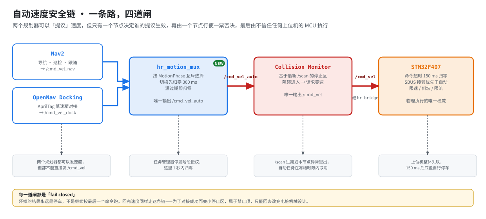
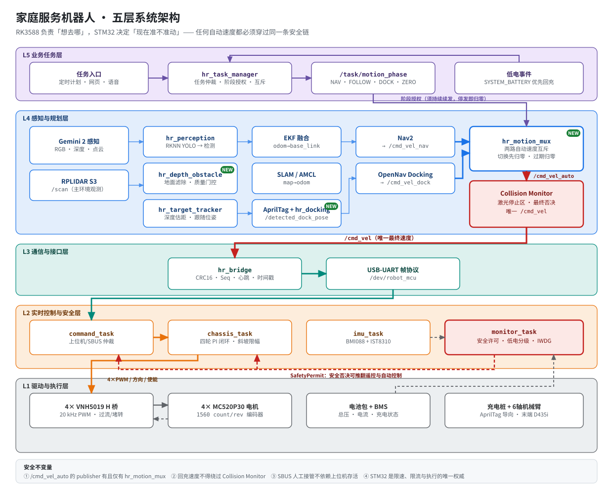
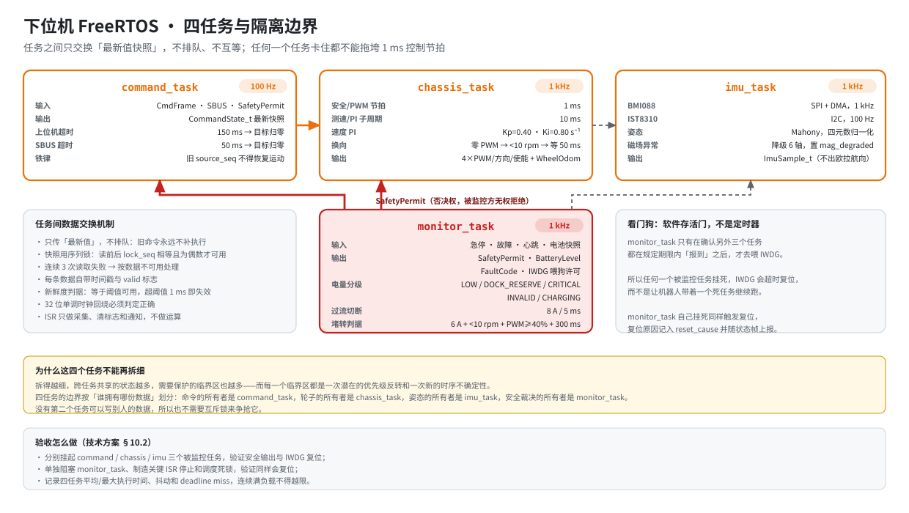
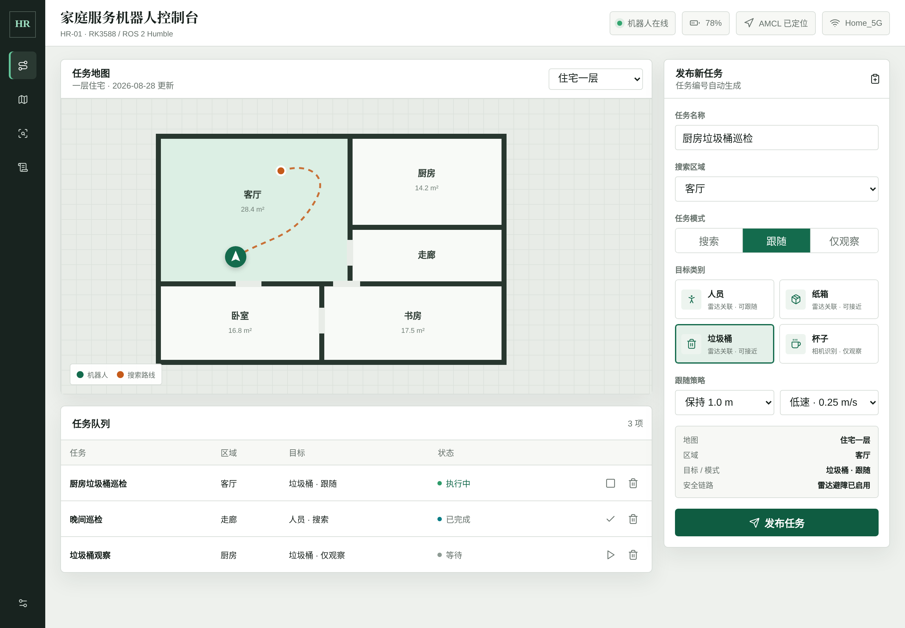
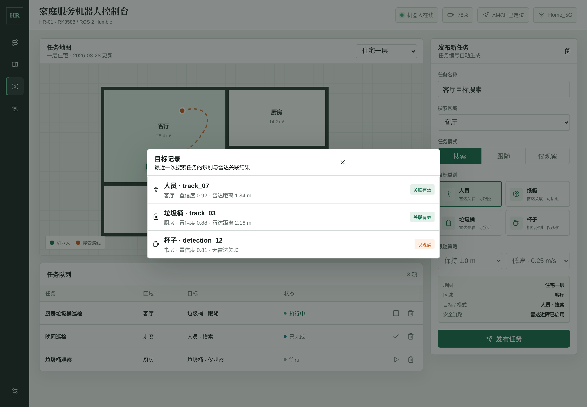
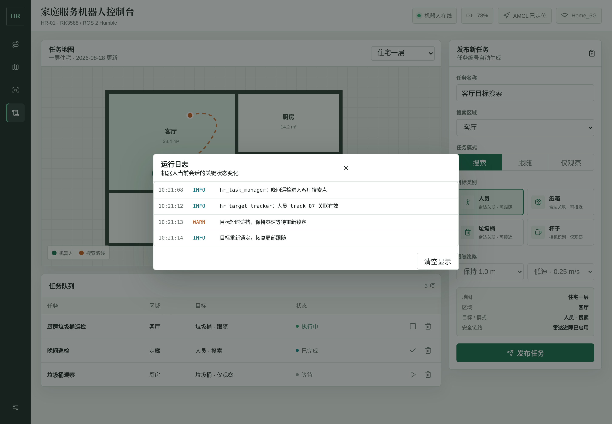
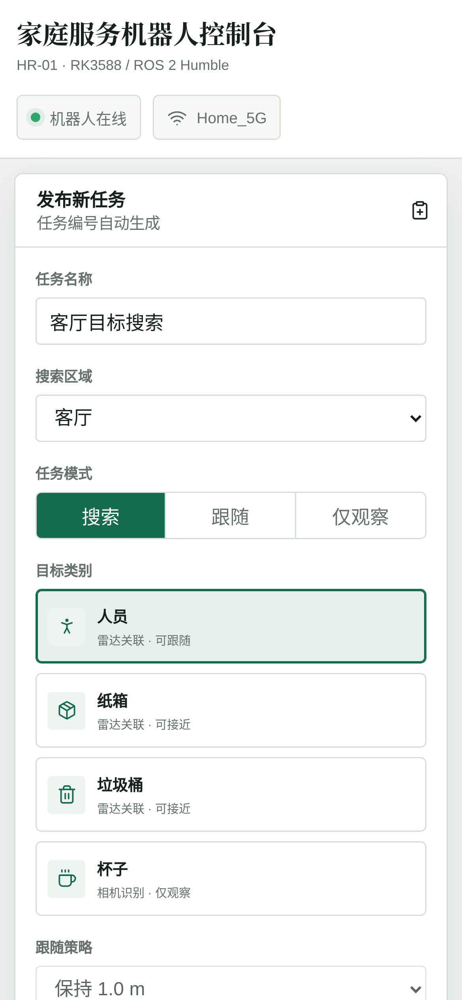
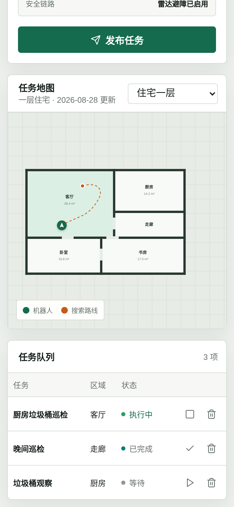
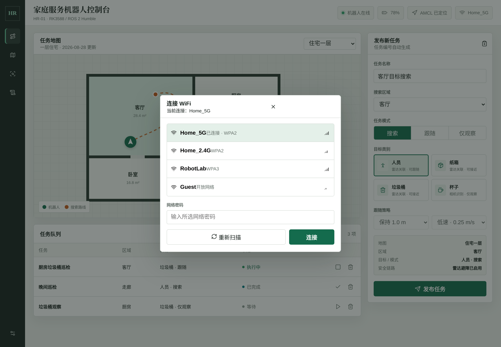
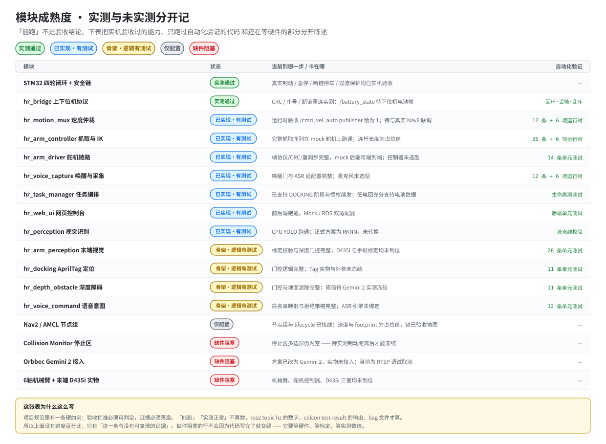

<div align="center">

# 家庭服务机器人 · Home Robot

**RK3588 + STM32F407 双控分层架构 · ROS 2 Humble · 四轮差速底盘 · 自主导航与回充**

[](https://docs.ros.org/en/humble/)
[](https://releases.ubuntu.com/22.04/)
[](https://www.python.org/)
[](https://www.st.com/)
[](https://navigation.ros.org/)
[](LICENSE)

<sub>22 个 ROS 2 包 · 148 条安全规则单元测试 · 41 项运行时验收 · 下位机四路闭环与安全链已实机验收</sub>

</div>

---

## 这个项目在解决什么问题

家用移动机器人最容易出事的地方，不是路径规划不够聪明，而是**没人说得清「谁有权让轮子转」**。

一个节点崩了，最后一条速度命令还留在总线上；两个规划器同时发速度，底盘收到交替命令；
为了让机器人顺利对上充电桩，有人把避障停止区关小了——这三件事都足以让机器在家里撞到人。

所以这个项目的主线不是「跑得多快」，而是：

> **让任何一条自动速度都只有一条路可走，且这条路上每一道闸坏掉时都朝停车的方向失效。**

<div align="center">
  
</div>

上位机负责「想去哪」，下位机负责「现在准不准动」。
`hr_motion_mux` 是唯一决定「哪个规划器的提议生效」的节点，Collision Monitor 行使一票否决，
而 STM32 对这两者都不信任——上位机整体失联 150 ms 后，它会自己把车停住。

---

## 系统架构

<div align="center">
  
</div>

分层的判据是**职责能不能被抢走**：
上位机可以崩、可以卡、可以被 Wi-Fi 断开，但都不能影响 SBUS 人工接管和硬件急停；
底盘的限速、限流和 H 桥输出只由 STM32 决定，ROS 侧任何节点都改不了。

### 硬件基线

| 类别 | 选型 | 接口 | 职责 |
|---|---|---|---|
| 上位机 | 野火鲁班猫 5（RK3588，8 GB + 64 GB） | USB 3.0 / USB-UART / 以太网 | 视觉、SLAM、导航、任务编排 |
| 深度相机 | Orbbec Gemini 2 | USB 3.0 Type-C | RGB + 深度 + 点云 + IMU；目标三维距离、高低障碍、AprilTag |
| 2D 激光雷达 | RPLIDAR S3 | USB 转串口 | SLAM、定位、二维避障、Collision Monitor 主观测 |
| 下位机 | STM32F407VET6 + FreeRTOS | USB-UART | 实时控制、编码器采集、状态估计、安全监控 |
| 执行器 | 4× MC520P30_12V 有刷减速编码器电机 | AB 相 → TIM 编码器模式 | 30:1、1560 count/rev（四倍频） |
| 功率级 | 4× VNH5019A-E 独立全桥 | PWM + INA/INB + ENA/ENB | 20 kHz PWM、过流/过温硬件保护 |
| 底盘 IMU | BMI088 + IST8310 | SPI / I2C | 姿态、角速度、航向辅助 |
| 人工接管 | 亚博 HT-10A + SBUS 接收机 | SBUS → STM32 | **不经过上位机**的人工接管与急停 |
| 电池与回充 | 带 BMS 成品电池包 + AprilTag 充电桩 | ADC / 充电触点 | 低电分级、自主回充、充电真实性确认 |
| 机械臂 | 6 轴舵机臂 + 夹爪 + 末端 D435i | 独立舵机控制器 | 固定工作位的近距离抓取 |

> 功率级按每路 4 A 连续、8 A/100 ms 峰值降额设计，软件 8 A/5 ms 切断。
> VNH5019 数据手册上的 30 A 是绝对最大额定，不是四路廉价模块的可用工作电流——这一点在设计时就明确区分了。

---

## 下位机：四个任务，和它们拒绝共享的东西

<div align="center">
  
</div>

任务边界按**「谁拥有哪份数据」**划分，而不是按功能大小：
命令归 `command_task`，轮子归 `chassis_task`，姿态归 `imu_task`，安全裁决归 `monitor_task`。
没有第二个任务能写别人的数据，所以也不需要互斥锁去争它。

看门狗在这里是**软件存活门**而不是定时器：`monitor_task` 只有确认另外三个任务都按期报到，
才去喂 IWDG。任何一个被监控任务挂死，结果是复位，而不是带着一个死任务继续跑。

---

## 网页控制台

局域网内手机和电脑都能用。设计边界很硬：**网页只能创建和取消离散任务，不提供任何摇杆或速度直通接口。**
远程遥控一个看不见的机器人是危险的，所以这条路径从一开始就没有留。

<div align="center">
  
  <br><sub>发布一个「厨房垃圾桶巡检 · 跟随」任务后，任务队列实时转为「执行中」</sub>
</div>

<table>
<tr>
<td width="50%"><br><sub align="center">目标记录：置信度与雷达关联距离；无雷达关联的目标只能「仅观察」，不能跟随</sub></td>
<td width="50%"><br><sub>运行日志：任务与安全事件可追溯</sub></td>
</tr>
</table>

<table>
<tr>
<td width="33%"><br><sub>移动端 · 任务发布</sub></td>
<td width="33%"><br><sub>移动端 · 任务队列</sub></td>
<td width="33%"><br><sub>Wi-Fi 配网</sub></td>
</tr>
</table>

```bash
python3 web_control/backend/app.py --host 0.0.0.0 --port 8080              # 纯网页演示（Mock）
python3 web_control/backend/app.py --adapter ros --host 0.0.0.0 --port 8080  # 接真实 ExecuteTask Action
```

---

## 现在到哪一步了

<div align="center">
  
</div>

这张表没有进度百分比，只有「这一条有没有可复现的证据」。
项目规范里有一条硬约束：**验收标准必须可判定，证据必须落盘**——
「能跑」「实测正常」不算数，`ros2 topic hz` 的数字、`colcon test-result` 的输出、bag 文件才算。

这么做是有回报的。**目前为止，每一个真正危险的缺陷都是「跑起来」而不是「读代码」发现的**：

| 缺陷 | 怎么暴露的 |
|---|---|
| 任务管理器只发一次阶段授权，导航 1 秒后底盘被归零 | `hr_motion_mux` 运行时验收 |
| 底盘停稳判据读了不存在的字段，「没数据」被当成「已停稳」 | 写机械臂运行时验收脚本时 |
| 逆运动学符号配对写反，返回镜像姿态——不报错，只是抓空 | FK→IK 往返测试 |
| `apriltag_msgs` 根本不含位姿，原实现假设的字段不存在 | 装上 `apriltag_ros` 之后首次运行 |
| TF 缓存让相机看不见 Tag 之后仍返回旧位姿 | 改用 TF 后的失效注入 |
| 停止区多边形写成字符串，节点 configure 直接失败 | 真的去启动它的时候 |

全部过程记录在 [`docs/acceptance/`](docs/acceptance/)。

---

## 快速开始

```bash
# 依赖：Ubuntu 22.04 + ROS 2 Humble
cd upper
source /opt/ros/humble/setup.bash
colcon build
source install/setup.bash

# 安全 Mock 总入口：不连接硬件，不发布任何速度
ros2 launch hr_bringup mock.launch.py

# 全部单元测试（148 条）
cd .. && python3 -m pytest upper/src/*/test tests -q

# 机械臂全链（mock 舵机控制器，PC 上即可跑通完整抓取序列）
ros2 run hr_arm_driver arm_driver --ros-args -p transport:=mock &
ros2 run hr_arm_controller arm_controller

# 语音链（text 适配器顶替麦克风）
ros2 run hr_voice_capture voice_capture --ros-args -p asr_adapter:=text -p wake_word:=小家 &
ros2 topic pub --once /voice/text_in std_msgs/String "data: '小家'"
ros2 topic pub --once /voice/text_in std_msgs/String "data: '去客厅|0.93'"
```

上游依赖（Nav2 节点组、AprilTag、OpenNav Docking、vision_msgs 等）先装齐：

```bash
./scripts/install_deps.sh all     # 或 core / docking / hardware / python
```

### 工作空间结构

```text
Home_robot/
├─ 家庭服务机器人技术方案.md     # 项目权威技术基线（约 2200 行）
├─ docs/
│  ├─ features/                  # 功能设计文档（写代码前必须先过评审）
│  ├─ acceptance/                # 验收步骤与实测证据
│  ├─ protocol/                  # 上下位机协议数据字典
│  ├─ hardware/                  # 引脚、接线、坐标系、急停
│  └─ images/                    # 架构图与界面截图（可由 tools/diagrams/ 重新生成）
├─ upper/src/                    # RK3588 · ROS 2 Humble · 22 个包
├─ lower/                        # STM32F407VET6 · FreeRTOS
├─ web_control/                  # 网页控制台前端与后端
├─ tools/diagrams/               # 架构图生成脚本
└─ tests/                        # 跨端协议与集成测试
```

### 上位机包一览

| 包 | 职责 |
|---|---|
| `hr_bringup` | 全系统启动、模式选择、生命周期编排 |
| `hr_interfaces` | 项目自定义 msg / action 的唯一来源 |
| `hr_bridge` | ROS 2 ↔ STM32 的唯一业务通信边界（CRC16 / Seq / 心跳） |
| `hr_camera` | Gemini 2 RGB / 深度 / 点云接入，不承担识别 |
| `hr_perception` | YOLO 二维识别与事件门控 |
| `hr_depth_obstacle` | 深度点云质量门控、地面滤除 |
| `hr_target_tracker` | RGB 检测与深度距离关联、S3 交叉验证 |
| `hr_localization` | EKF、SLAM Toolbox、AMCL、地图 |
| `hr_navigation` | Nav2 规划控制与 Collision Monitor |
| `hr_docking` | AprilTag 充电桩定位与 OpenNav Docking 集成 |
| `hr_motion_mux` | **自动速度源唯一仲裁点**，唯一发布 `/cmd_vel_auto` |
| `hr_task_manager` | 唯一业务任务仲裁器与状态机 |
| `hr_web_ui` | 局域网任务入口（禁止发布速度） |
| `hr_arm_controller` | 抓取状态机、六轴逆运动学、`/arm/execute` Action |
| `hr_arm_perception` | 末端 D435i RGB-D、手眼标定校验、抓取候选 |
| `hr_arm_driver` | 舵机控制器帧协议；`transport=mock` 可在 PC 跑通全链 |
| `hr_voice_capture` / `hr_voice_command` | 唤醒门 + 可替换 ASR；白名单意图映射 |
| `hr_description` · `hr_simulation` · `hr_local_motion` | 模型、Mock 系统、PC 联调替身 |

---

## 工程方法

AI 写代码的成本趋近于零，成本转移到了「凭什么相信这段代码是对的」。这个项目用三根支柱回答：

| 支柱 | 回答的问题 | 载体 |
|---|---|---|
| 基准文档 | 它*应该*是什么样 | `家庭服务机器人技术方案.md` |
| 验证证据 | 它*实际*是什么样 | 自动化测试输出 + `docs/acceptance/` |
| 一致性机制 | 两者有没有分叉 | 追溯表 + 代码内 `# @spec` 回指标记 |

几条自己给自己定的硬规矩：

- **没有设计文档不许写代码。** 新功能先出 [`docs/features/`](docs/features/) 设计文档，
  把接口、行为规则和**可判定的验收标准**写清楚，评审通过才开工。
- **先改基准文档再改代码。** 顺序反了，一致性检查就成了橡皮图章。
- **同一问题连续 3 次修不好就停手找根因。** 不允许连打补丁。
- **不把估算值当实测值。** 厂家没有可追溯资料的参数（比如电机堵转电流），
  文档里只写项目运行上限，绝不在简历或答辩中冒充实测结论。

单元测试写的是**规则**而不是实现：每条测试对应设计文档里一条编号规则
（`MUX-1`…`MUX-8`、`DOCK-1`…`DOCK-7`、`ARM-1`…`ARM-6`、`V-1`…`V-6`），
边界一律按「等于阈值可用、超阈值一个单位即失效」验证。

---

## 文档索引

| 文档 | 内容 |
|---|---|
| [家庭服务机器人技术方案.md](家庭服务机器人技术方案.md) | 权威技术基线：硬件、分层、模块、时序、协议、验收 |
| [docs/ROS节点与技术方案对应表.md](docs/ROS节点与技术方案对应表.md) | 代码与方案的逐条对应及成熟度 |
| [docs/features/](docs/features/) | 各功能模块设计文档与验收标准 |
| [docs/acceptance/](docs/acceptance/) | 验收步骤与实测证据（速度仲裁、机械臂链路、语音链路） |
| [docs/项目任务清单.md](docs/项目任务清单.md) | 阶段依赖与阻塞状态 |
| [upper/README-framework.md](upper/README-framework.md) | ROS 2 框架说明 |
| [lower/README.md](lower/README.md) | STM32 下位机框架 |
| [web_control/backend/README.md](web_control/backend/README.md) | 网页后端接口说明 |

---

<div align="center">
<sub>架构图由 <a href="tools/diagrams/">tools/diagrams/</a> 下的脚本生成，可随方案更新一键重绘。</sub>
</div>
