# 家庭服务机器人技术方案

> 文档状态：架构、下位机四任务、电池监测与 AprilTag 自主回充基线  
> 实测基线声明：以下正式能力均按项目实机测试结果作为当前实现基线：STM32F407VET6 正式底盘固件、MC520P30+VNH5019 四轮闭环、RPLIDAR S3 实机导航、Gemini 2 深度与标定、带 BMS 电池状态与充电闭环、AprilTag/OpenNav Docking 自动回充，以及真实制动、急停、断链停车和过流保护。未在本文写出具体数值的参数，以对应实测记录和配置文件为准，不以估算值替代。  
> 参考资料：`满分大神居家机器人方案资料(1).pdf`  
> 硬件差异：参考方案的 Jetson Xavier AGX 替换为 **野火鲁班猫 5（RK3588，8 GB RAM + 64 GB eMMC）**；环境感知采用 **RPLIDAR S3 二维激光雷达 + Orbbec Gemini 2 主动双目深度相机**。  
> 控制边界：RK3588 负责感知、规划和业务决策；普通控制板 **STM32F407VET6 + FreeRTOS** 负责实时控制、编码器采集、四路有刷电机闭环和安全保护。底盘功率级采用四路独立 VNH5019 H 桥，不使用带现成运动算法的电调。

---

## 目录

- [一、项目硬件基线](#一项目硬件基线)
- [二、项目分层与主架构](#二项目分层与主架构)
- [三、各层模块具体实现](#三各层模块具体实现)
- [四、下位机 FreeRTOS 四任务划分](#四下位机-freertos-四任务划分)
- [五、任务间低耦合设计](#五任务间低耦合设计)
- [六、状态反馈、安全监控与看门狗](#六状态反馈安全监控与看门狗)
- [七、主架构完整数据流时序](#七主架构完整数据流时序)
- [八、上下位机接口契约](#八上下位机接口契约)
- [九、建议代码分层](#九建议代码分层)
- [十、实施与验收](#十实施与验收)

---

## 一、项目硬件基线

| 类别 | 本项目选型 | 接口 | 主要职责 |
|---|---|---|---|
| 上位机 | 野火鲁班猫 5，RK3588，8 GB + 64 GB，Ubuntu 22.04 + ROS 2 Humble | USB 3.0、USB-UART、以太网、外接 Wi-Fi | 视觉识别、SLAM、导航、任务编排、日志 |
| 无线局域网 | MT7601U USB 2.0 Wi-Fi 网卡（2.4 GHz，802.11n，单天线） | USB → 鲁班猫 5 | 手机/电脑网页的 HTTP/WebSocket 接入；不承载底盘实时控制或安全链路 |
| 深度相机 | Orbbec Gemini 2 | USB 3.0 Type-C → RK3588 USB 3.0 | 前向 RGB、深度图、IR、IMU 与三维点云；用于目标三维距离、前方高低障碍检测和视觉任务 |
| 2D 激光雷达 | RPLIDAR S3 | 原厂 USB 转串口适配器 → RK3588 USB | 360°水平扫描、SLAM、定位、二维局部避障与 Collision Monitor 主观测 |
| 下位机 | 普通 STM32F407VET6 控制板，FreeRTOS | USB-UART ↔ 鲁班猫 5；GPIO/TIM/ADC ↔ 底盘驱动与传感器 | 实时控制、编码器采集、状态估计、安全监控 |
| 底盘执行器 | 4×MC520P30_12V 有刷直流减速编码器电机；12 V、30:1、13 线 AB 相霍尔编码器 | 4×AB 相 → STM32 定时器编码器模式；4×PWM/INA/INB/ENA/ENB → H 桥 | 四轮差速底盘驱动及反馈；同侧前后轮目标同向、每轮独立闭环；采用用户已选型资料中的空载转速 `360±20 rpm`、额定转矩 `1.5 kg·cm` 与单相输出 `390 PPR`；四倍频后冻结为 `1560 count/rev` |
| 底盘功率驱动 | 4×VNH5019A-E 独立全桥通道 | STM32 3.3 V PWM/INA/INB/ENA/ENB；电流反馈 → ADC；DIAG/EN → GPIO/EXTI | 有刷电机调速、正反转、制动/滑行、过流/过温等硬件保护；只作为功率级，不包含运动控制算法；项目按每路 4 A 连续、8 A/100 ms峰值降额设计 |
| 机械臂/末端执行器 | 6轴舵机机械臂 + 夹爪；D435i安装于末端 | 独立舵机控制器；D435i USB 3.0 → RK3588 | 近距离目标识别、抓取、放置和回零；机械臂与底盘安全互锁 |
| 语音交互 | 简单唤醒词 + 有限指令集 | USB麦克风/麦克风阵列 → RK3588 | 将语音转换为受控任务，不直接发布速度或舵机脉冲 |
| 底盘 IMU | BMI088 + IST8310（均确认安装） | SPI/I2C → STM32 | 姿态、角速度、航向辅助 |
| 遥控器与接收机 | 亚博智能 HT-10A + SBUS 接收机（推荐选型，待采购与实测冻结） | SBUS/UART → STM32 | 低成本人工接管、模式切换、急停请求 |
| 电池与电量监测 | 购买带保护 BMS 的成品电池包；STM32 独立采集电池总压，并采集智能 BMS 或独立双向电流/充电状态信号 | 电池主电源；总压分压→独立 ADC；BMS/电流传感器接口待选型冻结 | BMS 负责过充、过放、过流、短路和温度保护；STM32 负责数据新鲜度、低电分级、本地降额和状态上报；仅有总压时不得伪造精确 SOC |
| 自主充电 | 前向对接充电桩：`tag36h11` AprilTag + 漏斗形机械导向 + 宽弹簧触点 + 与电池/BMS 匹配的成品充电器；保留人工充电接口 | Gemini 2 RGB→AprilTag；Nav2 到预停靠点；`opennav_docking` 精对接；充电触点→BMS 充电口 | 低电量触发系统回充任务；只有持续充电电流或经验证的充电状态成立后才进入 `CHARGING`；自动对接失败仍可人工充电 |

> 本项目底盘已经确认为四轮差速，车体控制量为前向速度 `vx` 和角速度 `wz`，不支持横向速度 `vy`；底盘控制器冻结为普通 STM32F407VET6，执行器路线冻结为 4×MC520P30_12V 有刷减速编码器电机与 4×VNH5019 独立 H 桥，不使用大疆 C 板、M3508/C620 或其他带现成运动控制算法的电调。四轮闭环、RPLIDAR S3 导航、Gemini 2 深度/标定、BMS 电量与充电、AprilTag 自动回充以及制动/急停/断链/过流保护均已完成实机测试，具体参数以实测记录和当前配置为准。新增 6 轴舵机机械臂及末端 D435i 仅用于近距离抓取，不替代 Gemini 2 的主导航感知；语音只产生离散任务，不进入实时运动链。当前不采用无线充电、自动换电或自动插头机构，也不采用 SC4336P/Hi3516 链路、三维激光雷达、云台、GM6020、ML307 Cat.1 和 micro-ROS。上下位机已冻结为 USB-UART；BMI088、IST8310 与 HT-10A 接口均按实测接线和保护策略使用。

---

## 二、项目分层与主架构

### 2.1 五层项目分层

| 层级 | 运行载体 | 核心职责 | 向下输出 | 明确不负责 |
|---|---|---|---|---|
| L5 业务任务层 | RK3588 | 自主移动、巡检、指定地图/区域目标搜索、目标跟随和低电回充任务编排 | 任务目标、导航/回充目标、识别类别、跟随与对接模式 | 电机 PWM、方向和 H 桥控制 |
| L4 感知与规划层 | RK3588 / ROS 2 | S3/Gemini 2 驱动、二维视觉识别、AprilTag、深度障碍处理、目标跟踪、EKF、SLAM、Nav2/DWB、OpenNav Docking、自动速度仲裁、Collision Monitor | `/odometry/filtered`、`/cmd_vel`、目标/充电桩位姿、定位与对接状态 | 硬实时闭环和物理速度/加减速度/电流限制 |
| L3 通信与接口层 | RK3588 + STM32 | `hr_bridge`、帧协议、CRC、序号、时间戳、心跳、电池与充电状态映射 | 已校验控制帧、状态帧和 `/battery_state` | 运动学、PID、业务决策 |
| L2 实时控制与安全层 | STM32F407VET6 / FreeRTOS | 控制权仲裁、底盘、IMU、电池采样/低电分级、四路编码器测速、轮速正解、物理限速/斜坡/限流和监控 | 四路 PWM/方向/使能、原始轮式观测、电池/充电状态、RobotStatus | 复杂视觉、全局规划和最终位姿融合 |
| L1 驱动与执行层 | STM32 板、VNH5019、MC520、电池/BMS 与充电桩 | UART/SPI/I2C/DMA、TIM 编码器/PWM、ADC、GPIO/EXTI、有刷电机、充电触点 | 编码器/电流/电池/充电/故障反馈并执行 H 桥与充电保护 | 跨模块业务逻辑和速度闭环算法 |

分层原则：上位机输出“期望运动”，下位机决定“当前是否允许执行”；任何自动或人工命令都必须经过下位机的模式仲裁、数据新鲜度检查、限幅和安全许可。

### 2.2 简化主架构图

主架构图按 §2.1 的**五层项目分层**组织：L5 只放业务任务入口；视觉识别、AprilTag、目标跟踪、EKF、SLAM/AMCL、Nav2、OpenNav Docking 和速度安全属于 L4；上下位机协议属于 L3；STM32 四个 FreeRTOS 任务属于 L2；传感器、H 桥、电机、电池/BMS 和充电触点属于 L1。每个主节点都标出主要输入和输出。EKF 单独作为定位融合模块；新增 `hr_motion_mux` 只在 `NAV/FOLLOW` 与 `DOCK` 两个自动速度源之间互斥切换，切换先归零并检查命令新鲜度，唯一输出 `/cmd_vel_auto` 后进入 Collision Monitor。它不改变 STM32 对安全否决、物理限速和最终执行的权威。

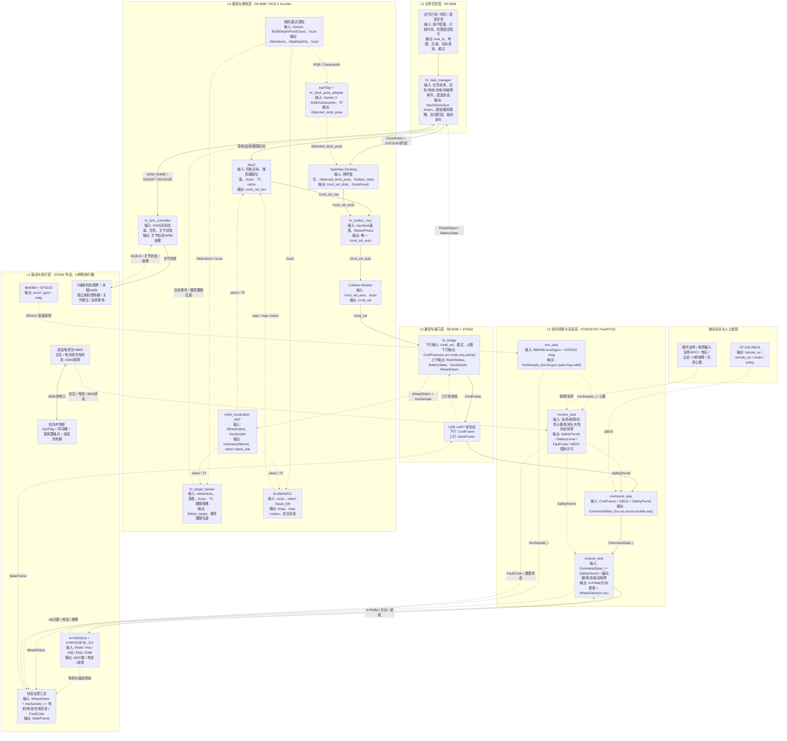

主逻辑按以下顺序理解：

1. **任务触发**：定时计划和网页请求都先进入任务管理器，由任务管理器决定导航目标和任务步骤，不能直接控制电机。
2. **视觉识别、深度障碍与跟随**：Gemini 2 的 RGB 图像负责目标类别、二维框和充电桩 AprilTag 检测，深度图/点云提供经有效性门控的前方高低障碍和目标三维距离；`hr_target_tracker` 优先使用同帧深度估距，深度无效时才用 S3 同方向角窗/点簇交叉验证。深度相机不参与二维 SLAM 定位，也不替代激光安全扫描。
	3. **自主导航、跟随与回充**：RPLIDAR S3 为 SLAM、定位、Nav2 二维局部代价地图和 Collision Monitor 提供主环境数据；Gemini 2 的通过地面滤除与新鲜度检查的前向点云可作为 Nav2 局部代价地图的辅助障碍观测。搜索/巡检/跟随由 Nav2 输出 `/cmd_vel_nav`；回充先由 Nav2到达预停靠位，再由 OpenNav Docking 根据 `/detected_dock_pose` 输出 `/cmd_vel_dock`。`hr_motion_mux` 根据任务管理器发布的阶段只选择一个新鲜自动速度源，切换先归零，唯一输出 `/cmd_vel_auto`；之后仍由 Collision Monitor 作最后否决，以 `/cmd_vel` 经 `hr_bridge` 发往 STM32。上位机不配置 Velocity Smoother。
4. **控制与安全**：STM32 负责控制源仲裁和底盘实时闭环。SBUS 遥控直接进入 STM32，优先级高于 ROS 2 自动控制；硬件急停和故障保护仍可否决遥控与自动控制。
5. **状态反馈**：电机、原始轮式观测、IMU、电池、充电和故障状态经 USB-UART 返回 ROS 2；`hr_bridge` 同时发布 `/battery_state`，回充成功必须由持续充电电流或经验证的 BMS/充电器状态确认，不能仅凭位姿或触点距离宣告成功。RK3588 的 EKF 融合轮式 `vx/wz` 与 IMU `gyro_z`，可选使用 IST8310 辅助航向观测。

### 2.3 硬件连接与通信架构

下图只表达硬件之间的数据和控制通信，不表达电源树、保险、接地、隔离和急停回路；这些电气安全内容需要在硬件接口评审中另行冻结。

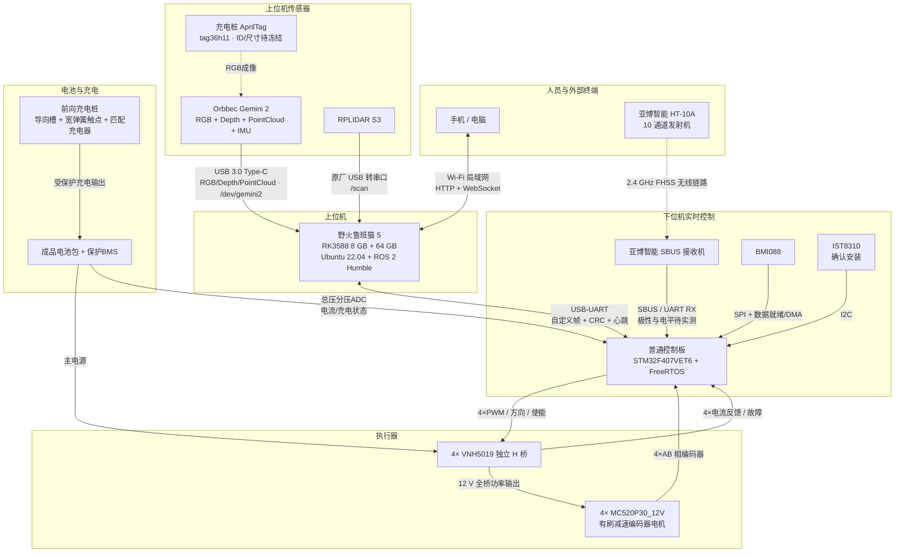

| 硬件链路 | 通信方式 | 方向 | 当前状态与约束 |
|---|---|---|---|
| 手机/电脑 ↔ 鲁班猫 5 | MT7601U USB 2.0 Wi-Fi 网卡组成的 2.4 GHz 局域网；HTTP/WebSocket | 双向 | 网页仅发送离散任务和读取状态，不远程直通 `/cmd_vel`；Wi-Fi 不承载实时控制或安全链路；天线须远离 HT-10A SBUS 接收机及电机线束，Ethernet 不作为日常上位机入口 |
| Orbbec Gemini 2 → 鲁班猫 5 | USB 3.0 Type-C | 主要上行 | Orbbec SDK/ROS 2 驱动发布 RGB、深度、点云、`CameraInfo` 与相机 IMU；通过 udev 固定设备名 `/dev/gemini2`。RGB/深度帧的分辨率、帧率、同步误差与USB带宽必须实物验收。 |
| 充电桩 AprilTag → Gemini 2 | 被动视觉标志 | 上行 | 使用 `tag36h11` 专用 ID；Tag 实际边长、安装高度/姿态、最远/最近识别距离、照度和遮挡边界须实测冻结；检测只提供精对接位姿，不代表已经接触或正在充电 |
| RPLIDAR S3 → RK3588 | 原厂 USB 转串口适配器 | 主要上行 | RK3588 侧使用持久化设备名 `/dev/rplidar`，避免与 STM32 的 USB-UART 串口混淆；数据统一发布为 `/scan`（二维 `LaserScan`） |
| 鲁班猫 5 ↔ STM32F407VET6 | USB-UART | 双向 | RK3588 侧持久化设备名为 `/dev/robot_mcu`；承载运动/模式/心跳下行和原始轮式观测/IMU/状态/故障上行，不使用 micro-ROS |
| HT-10A → SBUS 接收机 | 2.4 GHz FHSS | 无线单向控制 | 配对、通道方向和失控保护必须实测 |
| SBUS 接收机 → STM32 | SBUS，经 UART RX + 固定 25 字节 DMA 接收完成中断 | 单向 | 每帧收满 25 字节后由 DMA 完成中断更新最新帧槽并通知 `command_task`；需验证反相、电平、100 kbit/s 帧格式、失控位和断帧超时；人工接管不依赖 RK3588 |
| BMI088 → STM32 | SPI + DMA/数据就绪 | 主要上行 | 底盘与安全姿态源；RGB 相机不提供底盘姿态 |
| IST8310 → STM32 | I2C | 主要上行 | 已确认安装，用作低频航向参考；初始化失败、数据过期或磁场异常时停止磁力计校正并上报降级状态 |
| STM32 → 4×VNH5019 | PWM + INA/INB + ENA/ENB | 主要下行 | 四个电机独立控制；TIM8提供20 kHz PWM；INA/INB决定方向或制动；ENA/ENB均采用开漏方式，外接3.3 V上拉，低电平关断、释放后作为故障诊断输入 |
| 4×VNH5019 → STM32 | 电流反馈 + DIAG/EN GPIO/EXTI | 主要上行 | ADC1分别采集四路电流；每路软件上限固定为 `2 A` 连续目标、`6 A/100 ms` 峰值、`8 A/5 ms` 过流切断；堵转为 `I≥6 A`、`|n|≤10 rpm`、`PWM≥40%`、持续 `300 ms` 的联合条件 |
| 4×MC520P30 → STM32 | AB 相霍尔编码器 | 上行 | 编码器统一3.3 V供电；A/B信号进入四个定时器编码器模式；以用户选型资料的13线与30:1为准，四倍频轮端计数冻结为 `1560 count/rev` |
| 电池包/BMS → STM32 | 总压分压 ADC；智能 BMS 或独立双向电流/充电状态接口待选型 | 上行 | 购买带保护 BMS 的成品电池包；总压通道与四路电机电流通道独立；STM32 本地判定 `NORMAL/LOW/DOCK_RESERVE/CRITICAL/INVALID/CHARGING` 并上报新鲜度与故障；BMS 硬件保护不得由软件替代 |
| 充电桩 → 电池 BMS 充电口 | 漏斗形导向 + 宽弹簧触点 + 匹配成品充电器 | 主要下行 | 前向低速接触；具备防反接、防短路、保险和限流；只有充电电流或经验证的 BMS/充电器状态持续满足阈值才算回充成功；保留人工充电接口 |

#### 2.2.1 STM32F407VET6 底盘资源冻结

下表以 **STM32F407VET6 LQFP100裸芯片/最小系统板** 为目标；若采购的是把这些引脚另作占用的成品板，必须换板而不是私自改动本表。保留 SWD（PA13/PA14），关闭JTAG以释放 PB3/PB4；所有编码器输出必须使用3.3 V供电，禁止把不明5 V输出直接接至MCU。

| 功能 | 外设/引脚 | 分配 |
|---|---|---|
| 左前/左后/右前/右后编码器 | TIM1 PA8/PA9；TIM2 PA0/PA1；TIM3 PB4/PB5；TIM4 PB6/PB7 | CH1/CH2编码器模式、四倍频；轮序固定为 LF/LR/RF/RR |
| 四路PWM | TIM8 CH1/CH2/CH3/CH4：PC6/PC7/PC8/PC9 | 20 kHz、0–100%占空比；更新事件触发ADC采样 |
| VNH5019方向和使能/诊断 | PD0…PD15 | 每台按 `INA, INB, ENA/DIAGA, ENB/DIAGB` 连续占用4脚；ENA/ENB配置开漏输出+输入读取，外接10 kΩ上拉至3.3 V |
| 四路电流采样 | ADC1 IN10/11/12/13：PC0/PC1/PC2/PC3 | 定时器触发的四通道扫描，DMA2 Stream4 Channel0循环双缓冲；每路CS采用1.0 kΩ采样电阻并预留RC滤波 |
| 电池总压与充电确认 | 已按成品 BMS、电流/充电状态接口和独立 ADC 通道完成实测 | 不复用 PC0～PC3 的四路电机电流采样；采用已标定分压和充电确认链，充电确认不得仅依赖总压瞬时上升 |
| 上位机USB-UART | USART3 TX/RX：PC10/PC11 | DMA1 Stream3 Channel4发送、Stream1 Channel4接收 |
| SBUS接收 | USART1 RX：PA10 | 外置反相/电平转换后输入；DMA2 Stream2 Channel4固定25字节接收 |
| BMI088 / IST8310 | SPI1 PA5/PA6/PA7，CS PA4；I2C1 PB8/PB9 | BMI088 SPI+DREQ，IST8310 I2C；均不与底盘资源复用 |

VNH5019A-E芯片的 `30 A` 是绝对最大连续输出额定，不是四路廉价模块的可用工作电流；芯片允许最高20 kHz PWM，且数据手册给出的模式切换延迟最大为1.6 ms。因此本项目按每路 `4 A` 连续、`8 A/100 ms` 峰值进行功率级降额，并用软件 `8 A/5 ms` 切断；四路同时运行30 min后，功率板测点温度不得超过80 °C，任一DIAG故障即禁能四路。 

---

## 三、各层模块具体实现

本章按照参考 PDF 的范式，对每个模块统一给出：**模块定位、输入、输出、对应软件/硬件、具体实现步骤、异常处理和模块流程图**。

### 3.1 RK3588 上位机 / Host 模块

| 项目 | 内容 |
|---|---|
| 模块定位 | 非硬实时计算核心，负责感知、规划、决策和系统管理 |
| 输入 | Gemini 2 RGB/深度/点云、RPLIDAR S3 扫描、定时计划、网页任务请求、STM32 上传的原始轮式观测/IMU/状态 |
| 输出 | `/cmd_vel`、`/detections`、任务模式、配置和心跳 |
| 对应软件 | Ubuntu 22.04、ROS 2 Humble、`hr_bringup`、`hr_task_manager`、`hr_target_tracker` |
| 通信方式 | ROS 2 Topic/Action/Service；Gemini 2 USB 3.0；S3 USB-串口；USB-UART；Ethernet；MT7601U USB Wi-Fi |

具体实现步骤：

1. `systemd` 启动 ROS 2 bringup，按依赖顺序拉起 bridge、相机、雷达、EKF、定位、导航、感知、目标跟踪、AprilTag/Docking、`hr_motion_mux` 和 Collision Monitor。
2. CPU 大核优先运行 SLAM/Nav2，小核承担设备驱动、bridge 和后台服务，NPU 运行 RKNN INT8 视觉模型。
3. 业务层接收定时计划或网页任务请求，由 `hr_task_manager` 的任务状态机统一发布地图/区域搜索目标、视觉识别类别、跟随模式和任务取消请求；Nav2 内部行为树只负责单次导航的规划、控制、恢复和取消执行，不承担跨导航、视觉搜索与跟随步骤的业务编排。
4. 上位机只向下位机输出底盘速度和模式目标，不直接发送单轮PWM、方向、H桥使能或电流保护参数。
5. 64 GB 存储采用日志轮转；rosbag 必须配置容量上限或写入扩展存储。

异常处理：ROS 2 节点退出由 `systemd`/launch 重启；感知或定位失效时取消自动任务并发布零速；bridge 失联由 STM32 独立超时停车。

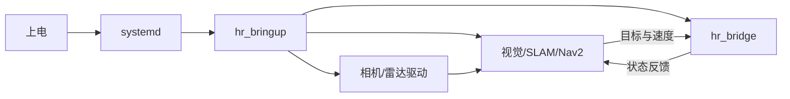

#### 3.1.1 任务触发方式与控制优先级

本项目采用“业务任务触发”和“实时运动接管”分离的设计。定时自动巡检、手机/电脑网页和系统低电事件均进入 RK3588 的 `hr_task_manager`；长耗时、可反馈、可取消的运动任务统一使用 ROS 2 Action：网页/计划侧通过 `ExecuteTask` Action 请求任务，低电事件创建内部 `SYSTEM_BATTERY` 回充任务，`hr_task_manager` 再调用 Nav2 的 `NavigateToPose`、`FollowWaypoints` 及 OpenNav Docking 的 `DockRobot` Action。ROS 2 Service 仅用于短时同步操作，不承载巡检、导航、搜索、跟随或回充等运动任务。网页、计划器和电池节点均不得直接发布速度。HT-10A 的 SBUS 接收机直接进入 STM32 `command_task`，人工接管不依赖网页、ROS 2 或上位机链路存活。

| 触发方式 | 入口与执行位置 | 允许操作 | 失效或冲突处理 |
|---|---|---|---|
| 定时自动巡检 | `hr_task_manager` 内的计划调度器读取持久化巡检计划 | 按路线依次发送 Nav2 导航目标，执行到点停留/观察；可在指定区域内启用目标搜索和观察记录，完成后返回待机点或后续指定点 | 定位无效、传感器故障、已有高优先级任务或人工接管时不得启动；运行中被接管则取消当前 Nav2 目标并保存任务结果，不自动恢复 |
| 手机或电脑网页 | 局域网网页前端 → `hr_web_ui` 后端 → `hr_task_manager` | 选择已验收地图、房间/区域、目标类别和任务模式（巡检、搜索、跟随、仅观察）；只发送离散任务请求 | 页面断开不产生新命令；已接受任务按任务策略继续，只有显式取消、人工接管、目标丢失超时或安全故障才中止；重复请求用 `task_id` 去重 |
| 系统低电回充 | `/battery_state` 与 `/robot_status` → `hr_task_manager` | 在 `LOW` 阈值持续满足后取消当前非关键任务，创建唯一 `SYSTEM_BATTERY` 回充任务；Nav2 到预停靠位，AprilTag 精定位后调用 `DockRobot` | 仅在电量高于 `CRITICAL`、地图/定位/雷达/Gemini 2/STM32/充电桩配置均有效时启动；失败按冻结次数退回重试，耗尽重试或进入 `CRITICAL` 后停车告警，不继续搜索 |
| HT-10A 遥控器主动接管 | SBUS → `command_task` 控制源仲裁 | 异常场景下直接控制底盘，切换自动/人工模式并请求急停 | 有效接管请求立即覆盖定时和网页任务；遥控失联时目标归零并保持人工/安全态，禁止自动回退到上位机控制 |

任务来源统一记录为 `TaskSource{SCHEDULE, WEB, SYSTEM_BATTERY}`，并携带唯一 `task_id`、创建时间、`map_id`、`area_id/dock_id`、目标类别、任务模式、路线/预停靠位、跟随或对接策略、超时、重试和取消状态。这里的 `source` 只是任务审计和优先级判断字段，不表示速度控制源。Nav2 与 Docking 的速度分别进入 `hr_motion_mux`，由任务阶段互斥选择后经过 Collision Monitor 输出到下位机。网页是人机交互入口，不允许提供绕过 `hr_motion_mux`、Collision Monitor 和下位机仲裁的远程摇杆控制。

`schedules.yaml` 是 RK3588 本地保存的定时计划配置文件，网页可以作为它的配置入口：用户在网页上新增、启用、停用或修改计划后，由 `hr_web_ui` 后端校验并写入该文件或等价的持久化配置；`hr_task_manager` 启动时读取它，运行中也可通过受控接口重新加载。首版实现也允许工程人员直接编辑该文件，但最终执行前仍必须经过统一校验和任务准入检查。

`PRECHECK` 指 `hr_task_manager` 内部的任务准入检查，不是任务队列。定时计划或网页请求先生成“候选任务”，只有在地图/区域合法、定位新鲜、Nav2 就绪、雷达/IMU/STM32 状态正常、没有活动运动任务、没有 HT-10A 人工接管且安全状态允许时，候选任务才会变成正在执行的活动任务；不满足条件时直接拒绝、跳过或记录错过，不在后台堆积等待执行。

控制优先级固定为：

1. **安全否决**：硬件急停、安全故障、机械/电流限位和 `monitor_task` 的 `safe_stop`；任何来源均不得绕过。
2. **HT-10A 遥控器人工接管**：在所有运动控制源中优先级最高，覆盖定时巡检、网页任务及其他自动任务。
3. **系统低电回充任务**：属于自动控制源，但优先于普通定时/网页任务；进入 `LOW` 后可取消当前非关键自动任务并创建唯一回充任务，不能覆盖安全否决或人工接管。
4. **普通上位机自动任务**：定时巡检与网页任务由 `hr_task_manager` 串行仲裁，同一时刻只允许一个活动运动任务；默认不互相抢占，冲突请求返回“忙”。
5. **无有效控制源**：底盘目标归零并进入安全保持状态。

遥控器从自动切入人工时，`command_task` 先将自动目标置无效，进入 `REMOTE_ARMING` 并确认摇杆回中后才接受新的人工速度；STM32 同时通过 `Robot_Status_t` 上报接管状态，RK3588 收到后取消 Nav2 Action。遥控器退出人工模式后不得恢复旧速度，必须确认摇杆回中、遥控数据有效、安全状态允许，并等待新的上位机命令序号；业务任务由 `hr_task_manager` 重新创建。

自主回充只在电池/BMS 数据有效且处于 `LOW` 或 `DOCK_RESERVE` 时允许：`LOW` 拒绝新的普通任务并触发回充，`DOCK_RESERVE` 只允许回充与受安全约束的人工接管，`CRITICAL` 立即取消回充并安全停车。回充成功必须同时满足机械对接条件和持续充电电流或经验证的充电状态；仅识别到 AprilTag、到达目标位姿或检测到瞬时电压上升均不得宣告成功。阈值、滞回、持续时间、最远路径能耗、重试次数和恢复条件均采用已实测冻结值。

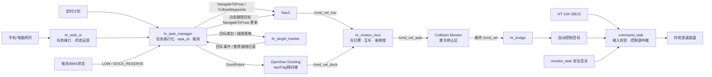

#### 3.1.1.1 定时计划模块

| 项目 | 内容 |
|---|---|
| 模块定位 | L5 业务任务入口之一，在 RK3588 本地按持久化计划生成自动任务请求 |
| 输入 | `schedules.yaml`、当前时间、地图/区域/路线配置、`/robot_status`、`/odometry/filtered`、任务状态 |
| 输出 | 带唯一 `task_id` 的内部任务事件或 `/task/execute` Action 请求；拒绝/错过/启动记录 |
| 对应软件 | `hr_task_manager/src/scheduler/`、`hr_task_manager/config/schedules.yaml`、`task_policy.yaml` |
| 明确不负责 | 不发布 `/cmd_vel`，不直接调用下位机，不绕过任务互斥和前置检查 |

定时计划由 `hr_task_manager` 进程内部的 scheduler 子模块实现，首版不单独拆成一个 ROS 2 节点。推荐实现为 `hr_task_manager/src/scheduler/` 下的 `ScheduleManager` 或等价 C++ 类，由 `hr_task_manager` 主节点创建并持有；它负责读取配置、计算下一次触发时间、生成候选任务事件，候选任务再交给 `hr_task_manager` 的统一任务状态机做准入检查和执行编排。

`schedules.yaml` 定义为 RK3588 上定时计划模块的持久化配置文件，存放“什么时候、在哪张地图、到哪个区域或路线、执行哪类业务任务”。它不是 STM32 的硬件定时器配置，也不是 FreeRTOS 任务配置；STM32 不读取该文件。网页端只负责提供可视化配置入口，真正的计划触发、任务准入和任务执行仍由 `hr_task_manager` 完成。

文件职责固定如下：

| 内容 | 说明 |
|---|---|
| 保存位置 | `hr_task_manager/config/schedules.yaml`，随 RK3588 上位机程序部署 |
| 写入来源 | 首版允许工程人员离线编辑；网页配置功能完成后，由 `hr_web_ui` 后端校验后写入 |
| 读取者 | `hr_task_manager` 内部 scheduler 子模块，启动时加载，运行中通过受控 Reload 接口重新加载 |
| 触发者 | scheduler 子模块根据系统日历时间触发，不依赖 Linux `cron`，也不依赖 STM32 定时中断 |
| 执行者 | `hr_task_manager` 任务状态机执行任务准入、Nav2 Action 调用、感知策略切换和任务结束处理 |
| 表达内容 | 计划启停、触发时间、地图/区域/路线、目标类别、任务模式、超时、错过策略 |
| 不表达内容 | 不保存实时速度，不保存电机参数，不保存下位机 PID，不保存遥控器控制状态 |

推荐字段如下，具体枚举值以后以 `hr_interfaces` 和地图配置文件为准：

```yaml
schedules:
  - schedule_id: morning_patrol
    enabled: true
    timezone: Asia/Shanghai
    trigger:
      type: daily
      time: "09:00"
    task:
      type: patrol
      map_id: home_v1
      route_id: living_room_route
      area_id: living_room
      target_class: person
      mode: search_then_observe
    policy:
      max_duration_s: 900
      miss_policy: skip
      conflict_policy: reject_when_busy
```

字段含义：

| 字段 | 含义 |
|---|---|
| `schedule_id` | 计划编号，用于生成 `task_id`、日志查询和网页显示 |
| `enabled` | 是否启用该计划，关闭后不触发候选任务 |
| `timezone` | 日历触发使用的时区，首版固定为 `Asia/Shanghai` |
| `trigger` | 触发规则，可先支持每天固定时间，后续再扩展每周/间隔触发 |
| `task` | 业务任务参数，对应网页手动创建任务时选择的地图、区域、路线、目标类别和模式 |
| `policy` | 执行策略，包含最大执行时长、错过策略和冲突策略 |

网页修改定时计划时不直接让机器人运动，而是走“配置写入”流程：前端提交计划参数，`hr_web_ui` 后端校验字段和地图/区域合法性，写入临时文件后原子替换 `schedules.yaml`，再通知 `hr_task_manager` 重新加载。重新加载只影响后续触发；已经被接受并正在执行的任务不因配置文件变化而中途改目标，除非用户显式取消当前任务后重新创建。

具体实现步骤：

1. 启动时从 `schedules.yaml` 读取启用的计划项，字段至少包含 `schedule_id`、时区、触发时间或周期、`map_id`、`area_id/route_id`、`target_class`、`mode`、错过策略和最大执行时长。
2. 调度器使用单调时钟和系统时间双重记录：系统时间用于日历触发，单调时钟用于运行超时和防重复触发。
3. 计划到时后先生成候选任务，候选任务进入 `hr_task_manager` 的统一任务准入检查（`PRECHECK`），检查地图/区域有效、定位新鲜、Nav2 就绪、雷达/IMU/STM32 状态正常、当前没有活动运动任务、未被 HT-10A 接管。
4. 前置检查通过后创建 `task_id = schedule_id + planned_time + sequence`，进入 `ACCEPTED/RUNNING`，再由 `hr_task_manager` 调用 Nav2 Action 和感知/跟踪策略。
5. 前置检查失败、任务冲突或处于人工接管时不排队强行执行；按错过策略记录为 `SKIPPED/REJECTED/MISSED`，并通过 `/task/status` 和网页状态上报。
6. 每次计划触发、拒绝、开始、取消、完成都写入任务日志，记录原始计划时间、实际处理时间、任务参数、拒绝原因和最终结果。

异常处理：系统时间跳变时不补跑大量历史计划，只按 `miss_policy` 处理最近一次触发；配置文件损坏或字段非法时禁用对应计划并上报诊断；运行中的计划任务被遥控接管、安全故障或定位失效中断后，不自动恢复旧任务，下一次计划触发重新创建新任务。

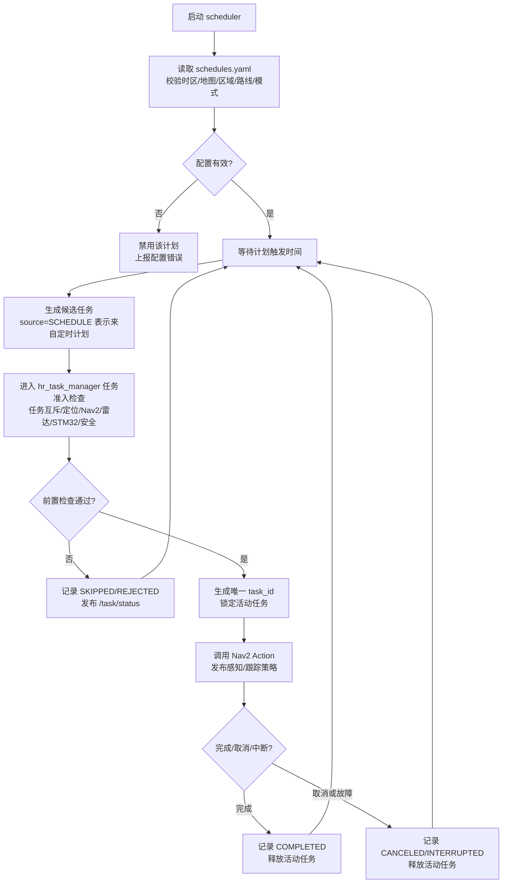

#### 3.1.1.2 `hr_web_ui` 网页任务模块

| 项目 | 内容 |
|---|---|
| 模块定位 | L5 人机交互入口，提供局域网任务创建、取消、状态查看和基础配置选择 |
| 输入 | 手机/电脑 HTTP 请求、WebSocket 连接、用户选择的地图/区域/目标类别/模式、ROS 2 状态 Topic |
| 输出 | 作为 `/task/execute` 的 Action Client 发送 Goal/Cancel、网页状态、参数校验错误、操作审计记录 |
| 对应软件 | `hr_web_ui` 前端与后端、`hr_interfaces/action/ExecuteTask`、`hr_interfaces/msg/TaskStatus` |
| 明确不负责 | 不发布 `/cmd_vel`，不提供首版远程摇杆，不直接写 STM32 协议帧，不绕过 Collision Monitor |

具体实现步骤：

1. 网页启动后通过 HTTP 获取地图列表、区域列表、路线列表、可识别目标类别、当前任务状态、控制源、安全状态和故障状态。
2. 用户创建任务时，前端只允许选择已验收地图、区域/路线、目标类别和任务模式；后端再次校验参数合法性，生成客户端请求 ID，防止刷新页面重复提交。
3. 后端作为 `/task/execute` 的 Action Client，将合法请求转换为 `ExecuteTask.Goal` 目标数据并发送给 `hr_task_manager`；Goal 字段至少包含 `task_id/source/type/map_id/area_id/location_or_route/target_class/mode/options`。网页任务的 `source=WEB`，定时任务的 `source=SCHEDULE`，二者都只是任务来源标记。
4. 任务执行中通过 WebSocket 推送 `/task/status`、`/robot_status`、定位状态、目标锁定状态和失败原因；页面只显示状态，不参与实时速度闭环。
5. 用户点击取消时，后端调用 `/task/execute` Cancel；`hr_task_manager` 负责取消 Nav2 Goal、禁用感知/跟随策略并等待系统进入安全状态。
6. 页面断开或刷新不自动取消已接受任务，也不重新创建任务；同一请求 ID 重复提交时返回已有任务状态。

异常处理：鉴权失败、参数非法、地图/区域未验收、任务忙、定位或安全状态不满足时，后端拒绝创建任务并返回明确原因；WebSocket 断开只影响显示，不影响已接受任务；如果后端进程重启，必须从 ROS 2 当前 `/task/status` 和任务日志恢复页面状态，不补发旧 Goal。

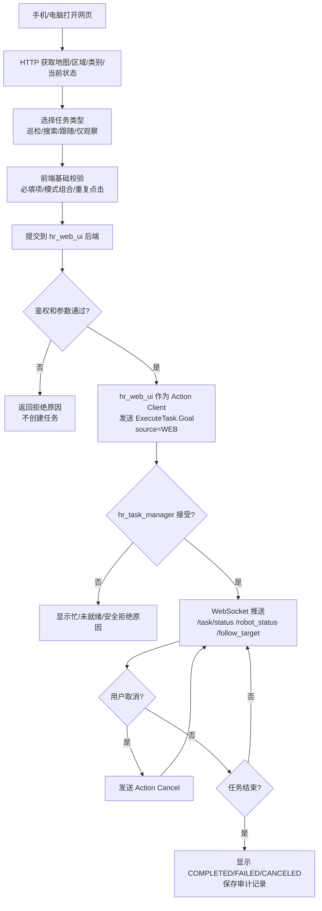

#### 3.1.1.3 主架构模块展开索引

主架构图中的模块必须在后文存在对应展开说明，并配套模块流程图或数据时序图；首版按下表维护一致性：

| 主架构模块 | 对应展开位置 | 说明 |
|---|---|---|
| 定时计划 | §3.1.1.1 | 本地计划读取、触发、错过策略和任务创建 |
| 网页任务 / `hr_web_ui` | §3.1.1.2、§3.1.2 | 局域网任务入口、状态显示、取消和参数校验 |
| `hr_task_manager` | §3.1.1、§3.1.2 | 任务互斥、状态机、Nav2 Action、感知/跟踪策略 |
| 相机/雷达感知 | §3.2、§3.3、§3.4 | Gemini RGB/深度/点云、S3 扫描和 RKNN YOLO |
| `hr_target_tracker` | §3.4.1 | 深度目标距离、S3 交叉验证/降级、目标锁定和推荐跟随位姿 |
| `robot_localization` EKF | §3.1.3、§3.5 | 轮式观测和 IMU 融合，唯一输出 `odom→base_link` |
| SLAM/AMCL | §3.1.3、§3.5 | 建图/定位互斥，唯一输出 `map→odom` |
| Nav2 | §3.1.2、§3.5 | 搜索、巡检和目标跟随的统一运动执行 |
| AprilTag / OpenNav Docking | §3.1.2、§3.1.4 | 充电桩视觉位姿、预停靠导航、近距离精对接、接触/充电确认与重试 |
| `hr_motion_mux` | §3.1.2、§3.1.3、§3.1.4 | Nav2 与 Docking 自动速度源互斥、切换先归零和命令新鲜度检查 |
| Collision Monitor | §3.1.3、§3.5、§6 | 上位机速度安全门，输出最终 `/cmd_vel` |
| `hr_bridge` / USB-UART | §3.6、§8 | ROS 2 与 STM32 帧协议边界 |
| `command_task` | §3.10、§4 | 上位机命令、SBUS 和安全许可仲裁 |
| `chassis_task` | §3.9、§4 | 差速解算、四路编码器测速、PID、PWM/H桥输出和轮速正解 |
| `imu_task` | §3.10.1、§4 | BMI088/IST8310 采样、Mahony 和 IMU 快照 |
| `monitor_task` | §3.11、§4、§6 | 安全状态、任务心跳、故障码和 IWDG |
| HT-10A SBUS | §3.10.2、§4 | 人工接管通道、失控检测和命令仲裁输入 |
| 硬件急停 / 故障输入 | §3.11、§6 | 安全否决、故障锁存和恢复条件 |
| BMI088 + IST8310 | §3.10.1 | 原始采样、标定、Mahony 和磁力计降级 |
| MC520/VNH5019 与状态反馈 | §3.9、§3.11、§8 | 有刷电机执行、AB相/电流/故障反馈汇总和上行状态帧 |

#### 3.1.2 上位机 ROS 2 节点与连接关系

`hr_bringup` 是启动与参数编排包，不承担业务逻辑。`systemd` 启动 `hr_bringup` 后，由 ROS 2 launch 按依赖顺序拉起设备、TF、通信、定位、导航、感知、AprilTag/Docking、自动速度仲裁、安全、任务和网页节点。建图模式与加载已有地图的导航模式互斥；两种模式不得同时发布 `map→odom`。

| 节点/节点组 | 所属包 | 主要输入 | 主要输出 | 责任边界 |
|---|---|---|---|---|
| `/camera/gemini2` | Orbbec ROS 2 驱动 | `/dev/gemini2` RGB/Depth/IMU 数据 | `/camera/color/image_raw`、`/camera/depth/image_raw`、`/camera/depth/points`、`CameraInfo`、相机诊断 | 只负责传感器采集、同步、时间戳和设备诊断，不做目标识别或速度输出 |
| `/lidar/sllidar_node` | `sllidar_ros2`（S3 配置） | RPLIDAR S3 扫描 | `/scan` | 使用与 S3 固件匹配的启动配置，只发布二维扫描和设备诊断 |
| `/robot_state_publisher` | `robot_state_publisher` | URDF | `base_link→camera_link/laser_frame/imu_link` 等静态 TF | 相机固定安装，不存在云台动态关节；不发布 `map→odom` 和 `odom→base_link` |
| `/hr_bridge` | `hr_bridge` | 最终 `/cmd_vel`、任务模式；STM32 上行帧 | `/wheel/odom_raw`、`/imu/data`、`/battery_state`、`/robot_status`、`/diagnostics` | ROS 2 与 STM32 的唯一业务通信边界；映射电池/充电状态，不进行位姿融合且不发布里程计 TF；视觉识别结果不下发 STM32 |
| `/ekf_filter_node` | `robot_localization` | `/wheel/odom_raw`、`/imu/data` | `/odometry/filtered`、`odom→base_link` | `two_d_mode=true`；融合轮式 `vx/wz` 与 IMU `gyro_z`，IST8310 航向作为可选观测；唯一发布 `odom→base_link` |
| `/slam_toolbox` | `slam_toolbox` | `/scan`、TF | `/map`、`map→odom` | 建图模式启用；通过 TF 获取 `odom→base_link`，不要求订阅名为 `/odom` 的话题 |
| `/map_server` + `/amcl` | Nav2 | 已保存地图、`/scan`、TF | `/map`、定位位姿、`map→odom` | 已知地图定位模式启用；通过 TF 获取运动关系，与建图模式的 `map→odom` 发布者互斥 |
| Nav2 导航节点组 | `nav2_*` | `/map`、`/scan`、`/odometry/filtered`、TF、导航/跟随/预停靠目标 | 路径、恢复结果、`/cmd_vel_nav` | 包含 `planner_server`、`controller_server(DWB)`、`bt_navigator`、`behavior_server`、`waypoint_follower` 和生命周期管理器；负责正常导航及到达充电桩预停靠位，不直接接收网页速度 |
| `/apriltag` | ROS 2 `apriltag_ros` | `/camera/color/image_raw`、对应 `CameraInfo` | AprilTag 检测与 Tag TF | 只识别冻结的充电桩 Tag ID；Tag 尺寸、相机内参和时间戳必须有效；不发布速度，也不以检测结果直接判定充电成功 |
| `/hr_dock_pose_adapter` | `hr_docking` | AprilTag 检测、`base_link→camera_link` 静态 TF、充电桩配置 | `/detected_dock_pose`、检测有效/过期诊断 | 将 Tag 位姿转换为 Docking 所需充电桩位姿并应用经实测冻结的 Tag—触点偏置；旧位姿超时即失效 |
| `/docking_server` | Humble 分支 `opennav_docking` | 充电桩数据库、`/detected_dock_pose`、`/battery_state`、TF、里程计和代价地图 | `DockRobot/UndockRobot` Action、`/cmd_vel_dock`、对接结果 | 从预停靠位执行低速精对接、有限重试和充电确认；不得直接发布最终 `/cmd_vel` |
| `/hr_motion_mux` | `hr_motion_mux` | `/cmd_vel_nav`、`/cmd_vel_dock`、`/task/motion_phase`、源时间戳 | 唯一 `/cmd_vel_auto` | 只允许 `NAVIGATING/FOLLOWING` 选择 Nav2、`DOCKING` 选择 Docking；切换先归零，任一输入过期归零；不覆盖 Collision Monitor 或 STM32 安全限制 |
| `/hr_perception` | `hr_perception` | `/camera/color/image_raw`、`CameraInfo`、目标类别/识别开关 | `/detections`、目标事件、视觉诊断 | 完成 RKNN YOLO 二维检测和事件门控；输出类别、置信度和二维框，不独立输出速度 |
| `/hr_depth_obstacle` | `hr_depth_obstacle` | `/camera/depth/points`、TF、深度诊断 | 清理后的前方障碍点云、诊断 | 地面滤除、质量门控和点云投影；仅作为 Nav2 辅助障碍观测 |
| `/hr_target_tracker` | `hr_target_tracker` | `/detections`、`/camera/depth/image_raw`、`/scan`、`CameraInfo`、TF、任务目标类别和跟随策略 | `/follow_target`、目标锁定/丢失事件、推荐跟随位姿、跟踪诊断 | 以有效深度提供目标三维距离；S3 角窗用于交叉验证或深度退化时降级，不把二维框直接当作三维位置 |
| `/collision_monitor` | `nav2_collision_monitor` | `/cmd_vel_auto`、`/scan` | 最终 `/cmd_vel` | 对导航、跟随和回充速度统一实施激光安全否决；充电桩机械设计必须使触点在桩体进入停止区前接通，禁止为完成对接而直接关闭安全链 |
| `/hr_task_manager` | `hr_task_manager` | 定时计划、网页 `ExecuteTask`、电池事件、`/robot_status`、Nav2/Docking/感知/跟踪结果 | Nav2/Dock Action、目标类别/识别开关、跟随/对接策略、`/task/motion_phase`、`/task/status`、取消请求 | 系统唯一业务任务仲裁器；普通任务互斥，低电回充可按策略取消非关键普通任务；负责导航、感知、跟随、回充和充电阶段切换 |
| `/hr_web_ui` | `hr_web_ui` | 手机/电脑 HTTP/WebSocket 请求、ROS 2 状态 | `ExecuteTask` Action 请求、状态页面 | 只做鉴权、地图/区域/目标/模式选择、参数校验和状态转换，不发布 `/cmd_vel` 或跟随速度 |
| `/diagnostics_aggregator` | `diagnostic_aggregator` | 各节点 `/diagnostics` | 汇总诊断 | 汇总显示和记录，不参与控制仲裁 |

**`hr_task_manager` 业务状态机：**

`hr_task_manager` 是 RK3588 上的业务任务状态机节点，只负责任务编排、Action 调用、阶段切换和状态发布，不直接发布速度。巡检、搜索、跟随和回充任务必须经过前置检查；人工接管、安全故障、定位/Nav2/Docking/STM32 失效会中断当前任务，旧任务不得自动恢复。

`hr_task_manager` 使用的 ROS 2 接口建议冻结为：

| 接口方向 | 本节点 ROS 2 实体 | 接口名 | 接口类型定义 | 对端节点身份 | 用途 |
|---|---|---|---|---|---|
| 接收任务 | Action Server | `Action: /task/execute` | `hr_interfaces/action/ExecuteTask` | `/hr_web_ui` 为 Action Client；计划调度器和低电监视器为节点内部事件源 | 接收网页/计划创建的普通任务及系统创建的低电回充任务；支持反馈、结果和取消 |
| 调用导航 | Action Client | `Action: /navigate_to_pose` | `nav2_msgs/action/NavigateToPose` | Nav2 `bt_navigator` 为 Action Server | 发送单个搜索区、观察点或待机点目标，并接收反馈/结果 |
| 调用巡检路线 | Action Client | `Action: /follow_waypoints` | `nav2_msgs/action/FollowWaypoints` | Nav2 `waypoint_follower` 为 Action Server | 发送有序巡检点，任务管理器负责到点后的观察、搜索和阶段切换 |
| 调用回充 | Action Client | `Action: /dock_robot` | `opennav_docking_msgs/action/DockRobot` | `/docking_server` 为 Action Server | 到达预停靠位后启动 AprilTag 精对接，接收重试、接触、充电确认和结果 |
| 订阅安全状态 | Topic Subscriber | `Topic: /robot_status` | `hr_interfaces/msg/RobotStatus` | `/hr_bridge` 为 Topic Publisher | 判断 STM32 链路、控制源、遥控接管、安全故障、看门狗健康状态 |
| 订阅电池状态 | Topic Subscriber | `Topic: /battery_state` | `sensor_msgs/msg/BatteryState` | `/hr_bridge` 为 Topic Publisher | 判断电量级别、充电电流、充电状态和数据新鲜度；百分比未可靠测量时为未知 |
| 订阅定位状态 | Topic Subscriber | `Topic: /odometry/filtered` | `nav_msgs/msg/Odometry` | `/ekf_filter_node` 为 Topic Publisher | 判断定位/里程计新鲜度，并作为任务前置条件和运行中依赖 |
| 订阅目标状态 | Topic Subscriber | `Topic: /follow_target` | `hr_interfaces/msg/FollowTarget` | `/hr_target_tracker` 为 Topic Publisher | 获取目标锁定、丢失、距离、方位和雷达关联状态 |
| 发布任务状态 | Topic Publisher | `Topic: /task/status` | `hr_interfaces/msg/TaskStatus` | `/hr_web_ui`、日志、诊断为 Topic Subscriber | 发布任务阶段、进度、结果、失败原因、接管和取消原因 |
| 控制视觉搜索 | Topic Publisher | `Topic: /task/perception_control` | `hr_interfaces/msg/PerceptionControl` | `/hr_perception` 为 Topic Subscriber | 发布目标类别、识别启停、搜索/观察阶段门控 |
| 控制目标关联 | Topic Publisher | `Topic: /task/tracker_policy` | `hr_interfaces/msg/TrackerPolicy` | `/hr_target_tracker` 为 Topic Subscriber | 发布目标类别、搜索区域、关联窗口和目标丢失策略 |
| 控制跟随策略 | Topic Publisher | `Topic: /task/follow_policy` | `hr_interfaces/msg/FollowPolicy` | `/hr_target_tracker` 为 Topic Subscriber | 发布是否允许跟随、期望距离、角度误差、丢失超时和禁用命令；目标跟随后续仍由 Nav2 执行 |
| 控制自动阶段 | Topic Publisher | `Topic: /task/motion_phase` | `hr_interfaces/msg/MotionPhase` | `hr_motion_mux`、Nav2 生命周期管理、`hr_target_tracker`、Docking | 发布 `NAVIGATING/FOLLOWING/DOCKING/ZERO` 及源序号、原因和归零要求；由 `hr_motion_mux` 选择唯一自动速度源 |

接口名称本身不能可靠判断它是 Topic、Action 还是 Service，必须同时看“接口种类”和 `.msg/.action/.srv` 类型定义。`/task/execute`、`/task/status` 中的 `/task` 是 ROS 2 接口命名空间前缀，用来把业务任务相关接口归到同一组；它不是单独的节点，也不是必须存在的 Topic。首版也可按节点私有命名空间写成 `/hr_task_manager/execute`、`/hr_task_manager/status`，但全项目必须统一一种命名方式。本文推荐 `/task/*`，含义是“业务任务接口族”。

**正常任务执行时序：**

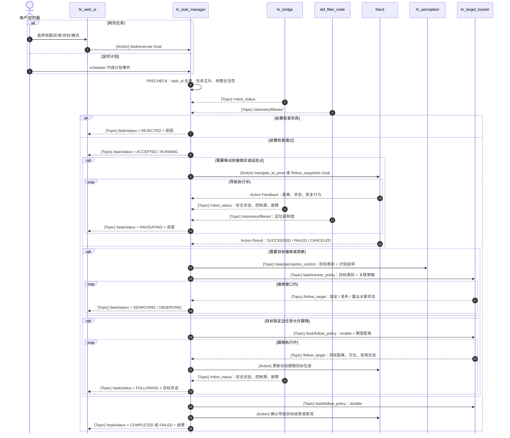

**低电自主回充时序：**

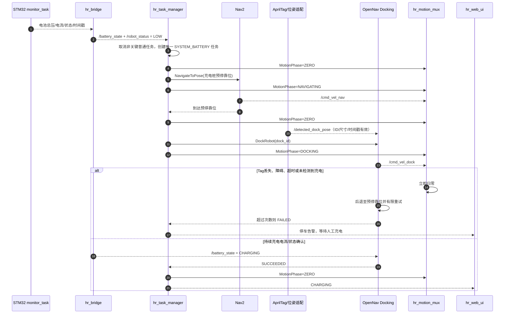

**取消与中断处理：**

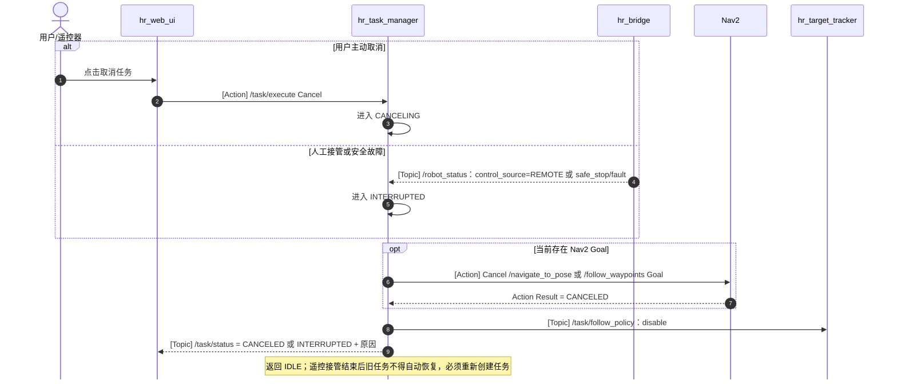

状态机执行约束：

1. `IDLE` 之外同一时刻只允许一个活动运动任务；普通任务冲突返回“忙”。`SYSTEM_BATTERY` 回充任务可按冻结策略取消一个非关键普通任务，但不能抢占人工接管或覆盖安全否决。
2. `PRECHECK` 必须检查地图/区域或充电桩配置、定位状态、Nav2/Docking 生命周期、雷达、Gemini 2、AprilTag 标定、EKF、STM32 `/robot_status`、电池状态、安全状态和任务参数合法性；`CRITICAL` 或电池数据无效时不得尝试回充。
3. `NAVIGATING` 只调用 Nav2 Action，不发布速度；Nav2 发布 `/cmd_vel_nav`，经 `hr_motion_mux` 选择后形成 `/cmd_vel_auto`，再经 Collision Monitor → `hr_bridge` 链路产生最终速度。
4. `SEARCHING` 只控制目标类别、识别开关和搜索策略；视觉结果不得绕过 `hr_target_tracker` 与安全速度链。
5. `FOLLOWING` 不直接发布速度；`hr_target_tracker` 输出 `/follow_target` 和推荐跟随位姿，`hr_task_manager` 按新鲜度和跳变门限更新 Nav2 动态目标，自动速度来自 Nav2。
6. `DOCKING` 只允许 OpenNav Docking 的新鲜 `/cmd_vel_dock` 被 `hr_motion_mux` 选择；Tag 位姿过期、充电桩 ID 不匹配、碰撞链失效或对接状态异常时立即归零。重试必须先后退至冻结的安全位置，最大次数耗尽后停车告警。
7. `CHARGING` 必须保持自动速度为零；只有持续充电电流或经验证的 BMS/充电器状态成立才可进入。充电完成、充电中断、温度/电池故障和人工拔离均须记录。
8. `CANCELING` 和 `INTERRUPTED` 必须取消 Nav2 与 Docking Goal、禁用跟随策略、令 `hr_motion_mux` 进入 `ZERO` 并发布明确原因；遥控接管结束后旧任务不得自动续跑。

上位机节点按“启动就绪”和“任务执行”两条时序说明，避免把持续数据流与单次任务请求混在一张连线图中。

**启动与就绪时序：**

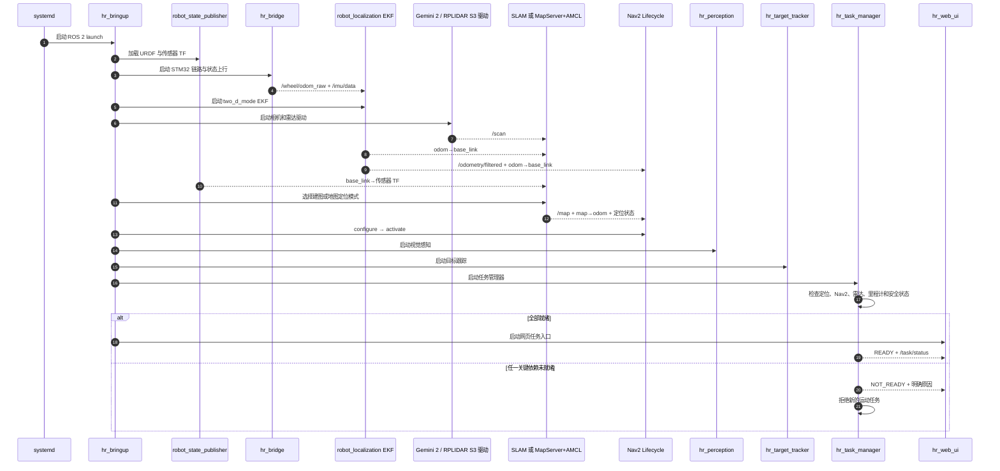

**导航/巡检任务执行时序：**

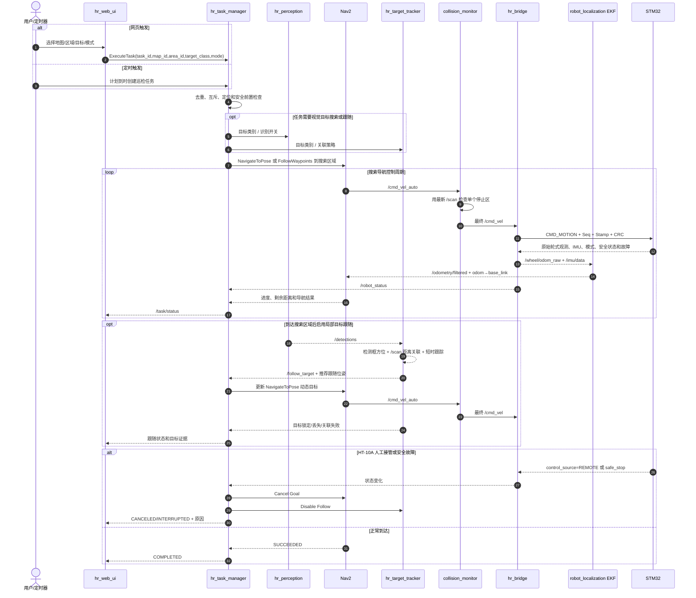

关键 ROS 2 接口建议冻结为：

| 接口 | 类型 | 生产者 → 消费者 | 用途与约束 |
|---|---|---|---|
| `/scan` | `sensor_msgs/msg/LaserScan` Topic | 雷达驱动 → 定位、Nav2、Collision Monitor | 保留设备时间戳和 `laser_frame`；过期后自动导航无效 |
| `/wheel/odom_raw` | `nav_msgs/msg/Odometry` Topic | `hr_bridge` → EKF、诊断 | 承载 STM32 轮速正解得到的 `vx/wz` 及协方差、独立时间戳和有效标志；不代表最终融合位姿，不发布 TF |
| `/imu/data` | `sensor_msgs/msg/Imu` Topic | `hr_bridge` → EKF、诊断 | 承载 BMI088 `accel/gyro`、Mahony 四元数和 IST8310 `mag[3]` 对应状态；必须携带独立时间戳、协方差和有效/降级状态 |
| `/odometry/filtered` | `nav_msgs/msg/Odometry` Topic | EKF → Nav2、任务、网页、诊断 | `robot_localization` 默认融合结果；`frame_id=odom`，`child_frame_id=base_link`。本项目不重映射为 `/odom` |
| `/detections` | `vision_msgs/msg/Detection2DArray` Topic | `hr_perception` → `hr_target_tracker`、`hr_task_manager`、网页、日志 | 包含类别、置信度、二维框和时间戳；仅表达 RGB 图像检测结果，不单独代表目标距离或地图位置 |
| `/camera/depth/points` | `sensor_msgs/msg/PointCloud2` Topic | Gemini 2 驱动 → `hr_depth_obstacle`、`hr_target_tracker`、诊断 | 前向三维点云；必须携带时间戳、`camera_link` 坐标系和有效性诊断，不能作为 S3 `/scan` 的替代品 |
| `/camera/color/image_rect` | `sensor_msgs/msg/Image` Topic | Gemini 2/Image Proc → `apriltag_ros` | 与对应 `CameraInfo` 同时间戳的校正 RGB 图像；用于充电桩 Tag 位姿估计 |
| `/tag_detections` | `apriltag_msgs/msg/AprilTagDetectionArray` Topic | `apriltag_ros` → `hr_dock_pose_adapter`、诊断 | 只接受冻结的 `tag36h11` 充电桩 ID；尺寸、决策质量、时间戳和位姿合理性必须通过门限 |
| `/detected_dock_pose` | `geometry_msgs/msg/PoseStamped` Topic | `hr_dock_pose_adapter` → OpenNav Docking | 经相机外参及 Tag—触点偏置换算后的充电桩对接位姿；过期后不得继续驱动 |
| `/battery_state` | `sensor_msgs/msg/BatteryState` Topic | `hr_bridge` → `hr_task_manager`、OpenNav Docking、网页、诊断 | 电压为必需字段；电流、温度、SOC、单体电压按实际能力填写，未测量字段保持未知；充电成功依据持续电流或经验证状态，不依据位姿 |
| `/follow_target` | `hr_interfaces/msg/FollowTarget` Topic | `hr_target_tracker` → `hr_task_manager`、网页、日志 | 包含 `target_id/class/range/bearing/position_base/confidence/stamp/state` 和推荐跟随位姿；仅在 RGB 检测与同帧有效深度、或 S3 角窗交叉验证满足策略时有效，过期或丢失后不得继续驱动跟随 |
| `/navigate_to_pose` | `nav2_msgs/action/NavigateToPose` Action | `hr_task_manager` → Nav2 | 单目标导航，使用 `map` 坐标系，任务管理器处理反馈、取消和结果 |
| `/follow_waypoints` | `nav2_msgs/action/FollowWaypoints` Action | `hr_task_manager` → Nav2 | 定时巡检的有序巡检点；到点观察动作由任务管理器或 waypoint task executor 编排 |
| `/dock_robot` | `opennav_docking_msgs/action/DockRobot` Action | `hr_task_manager` → OpenNav Docking | 从已验收预停靠位执行指定 `dock_id` 的精对接、有限重试与充电确认 |
| `/task/execute` | `hr_interfaces/action/ExecuteTask` Action | `hr_web_ui` → `hr_task_manager` | 目标包含 `task_id/source/type/map_id/area_id/location_or_route/target_class/mode`，结果包含成功、失败、拒绝和原因 |
| `/voice/command` | `hr_interfaces/msg/VoiceCommand` Topic | `hr_voice_command` → `hr_task_manager` | 只包含已解析的有限意图、参数、识别置信度、原始文本摘要和请求ID；不是速度或舵机接口 |
| `/arm/camera/*` | `sensor_msgs/msg/Image`、`sensor_msgs/msg/CameraInfo`、`sensor_msgs/msg/PointCloud2` Topic | D435i → `hr_arm_perception`、诊断 | 末端D435i RGB-D数据；携带独立`d435i_*`坐标系、时间戳和有效性，不替代Gemini 2接口 |
| `/arm/target_pose` | `geometry_msgs/msg/PoseStamped` Topic | `hr_arm_perception` → `hr_arm_controller` | 经深度和手眼标定换算后的候选目标位姿；必须包含置信度、时间戳和模型/标定版本，过期即无效 |
| `/arm/execute` | `hr_interfaces/action/ExecuteArm` Action | `hr_task_manager` → `hr_arm_controller` | 承载`ARM_HOME/ARM_GRASP/ARM_RELEASE/ARM_STOP`、目标类别、放置位、抓取配置版本；支持反馈、取消和失败原因 |
| `/arm/status` | `hr_interfaces/msg/ArmStatus` Topic | `hr_arm_driver`/`hr_arm_controller` → 任务、网页、诊断 | 包含关节位置/状态、夹爪、故障、动作阶段、D435i与标定有效性；不承载底盘安全许可 |
| `/task/status` | `hr_interfaces/msg/TaskStatus` Topic | `hr_task_manager` → 网页、日志 | 包含活动任务、阶段、进度、Nav2 结果、控制源和中断原因 |
| `/task/perception_control` | `hr_interfaces/msg/PerceptionControl` Topic | `hr_task_manager` → `hr_perception` | 包含目标类别、识别启停、搜索/观察阶段和任务时间戳 |
| `/task/tracker_policy` | `hr_interfaces/msg/TrackerPolicy` Topic | `hr_task_manager` → `hr_target_tracker` | 包含目标类别、搜索区域、雷达关联窗口、目标跳变门限和丢失策略 |
| `/task/follow_policy` | `hr_interfaces/msg/FollowPolicy` Topic | `hr_task_manager` → `hr_target_tracker` | 包含跟随使能、期望距离、最小安全距离、目标跳变门限、跟随目标更新周期和丢失超时 |
| `/task/motion_phase` | `hr_interfaces/msg/MotionPhase` Topic | `hr_task_manager` → `hr_motion_mux`、Nav2、Docking、`hr_target_tracker` | 包含 `NAVIGATING/FOLLOWING/DOCKING/ZERO`、源序号、切换原因和归零要求 |
| `/robot_status` | `hr_interfaces/msg/RobotStatus` Topic | `hr_bridge` → 任务、网页、诊断 | 包含定位依赖状态、控制源、HT-10A 接管、电池等级、充电状态、故障和看门狗健康信息 |
| `/cmd_vel_nav` | `geometry_msgs/msg/Twist` Topic | Nav2 → `hr_motion_mux` | 导航、巡检和目标跟随速度候选；不得直接进入 Collision Monitor 或 `hr_bridge` |
| `/cmd_vel_dock` | `geometry_msgs/msg/Twist` Topic | OpenNav Docking → `hr_motion_mux` | 仅 `DOCKING` 阶段有效的低速精对接候选；Tag/状态过期时必须停止发布并归零 |
| `/cmd_vel_auto` | `geometry_msgs/msg/Twist` Topic | `hr_motion_mux` → `collision_monitor` | 唯一自动速度；只转发当前授权且新鲜的 nav/dock 输入，切换先归零，`linear.y=0` |
| `/cmd_vel` | `geometry_msgs/msg/Twist` Topic | `collision_monitor` → `hr_bridge` | 上位机唯一最终速度话题；`linear.y` 必须为 0；其他节点禁止并行发布 |

TF 权威关系必须保持单一：`map→odom` 只能由当前定位模式（建图时 `slam_toolbox`，已知地图定位时 AMCL）产生；`odom→base_link` 只能由 EKF 产生；`base_link→camera_link/laser_frame/imu_link` 由 URDF/`robot_state_publisher` 产生。`hr_bridge` 不发布 TF。若任一关键 TF 缺失或时间戳过期，`hr_task_manager` 拒绝新任务，活动自动任务取消并进入零速；遥控人工接管仍由 STM32 独立完成。

启动顺序为：① `robot_state_publisher`、`hr_bridge`；② Gemini 2 与 S3 驱动；③ `robot_localization` EKF；④ 建图或地图定位节点；⑤ Nav2 生命周期节点；⑥ `hr_perception`、`hr_depth_obstacle`、`hr_target_tracker`、AprilTag、Docking；⑦ `hr_motion_mux` 与 Collision Monitor；⑧ `hr_task_manager`；⑨ `hr_web_ui`。Gemini 2 离线时禁用深度障碍、目标搜索、跟随和自主回充，S3二维导航可保持；电池状态无效时拒绝无人值守回充；S3、定位、轮式观测、IMU、EKF或STM32异常仍必须拒绝运动任务。

#### 3.1.3 上位机输入输出、状态估计与控制权威

上位机输入输出按“原始观测进入、唯一融合结果供消费、单一路径下发速度”冻结如下：

| 上位机模块 | 主要输入 | 主要输出 | 唯一责任 |
|---|---|---|---|
| `hr_bridge` | STM32 原始轮式观测、BMI088/IST8310 IMU、电池/充电、设备与安全状态；最终 `/cmd_vel` | `/wheel/odom_raw`、`/imu/data`、`/battery_state`、`/robot_status`、`/diagnostics`；下行协议帧 | 协议和 ROS 消息映射，不融合位姿、不发布 TF |
| `robot_localization` EKF | `/wheel/odom_raw` 的 `vx/wz`，`/imu/data` 的 `gyro_z`，可选有效航向观测 | `/odometry/filtered`、`odom→base_link` | 平面状态估计的唯一权威；`two_d_mode=true`，约束 `z/roll/pitch/vy` |
| `slam_toolbox`（建图）或 AMCL（已知地图定位） | `/scan`、传感器静态 TF、EKF 发布的 `odom→base_link` | `/map`、`map→odom`、定位状态 | 二者按模式互斥，当前模式是 `map→odom` 的唯一权威 |
| Nav2 + DWB | 地图、定位 TF、`/scan`、`/odometry/filtered`、搜索区/巡检点/推荐跟随位姿/预停靠位 | 路径、导航结果、`/cmd_vel_nav` | 正常规划和主动避障；负责到达指定区域和充电桩预停靠位，不发布最终 `/cmd_vel` |
| AprilTag + OpenNav Docking | 校正 RGB/CameraInfo、静态 TF、Tag—触点偏置、充电桩数据库、`/battery_state` | `/detected_dock_pose`、DockRobot 结果、`/cmd_vel_dock` | 只负责充电桩精定位、低速对接和充电确认；不承担正常导航或最终速度发布 |
| `hr_motion_mux` | `/cmd_vel_nav`、`/cmd_vel_dock`、`/task/motion_phase` | `/cmd_vel_auto` | 自动速度源唯一仲裁点；阶段互斥、源新鲜度和切换归零，不做规划或物理限速 |
| `hr_depth_obstacle` | `/camera/depth/points`、TF、深度诊断 | 清理后的前方障碍点云、有效/失效诊断 | 只做深度质量门控、地面滤除与障碍投影；不发布速度，不替代 S3 `/scan` |
| `hr_target_tracker` | `/detections`、`/camera/depth/image_raw`、`/scan`、`CameraInfo`、TF、任务目标类别和跟随策略 | `/follow_target`、推荐跟随位姿、锁定/丢失/关联失败事件 | 以有效深度提供目标三维距离；S3 角窗用于交叉验证或深度退化时降级，不把二维框直接当作三维位置 |
| Collision Monitor | `/cmd_vel_auto`、最新 `/scan` | `/cmd_vel` | 首版只用一个激光停止区作末端零速否决；不做减速区、不做路径规划 |
| `hr_task_manager` / `hr_web_ui` | Nav2、感知、目标跟踪、`/robot_status`、`/odometry/filtered`、诊断状态 | 任务 Action、搜索/跟随策略、任务状态和页面状态 | 业务编排与显示，不直接发布速度 |

完整数据流为：`STM32 轮速正解 → /wheel/odom_raw`，`STM32 ImuSample_t → /imu/data`，二者进入 EKF 后形成 `/odometry/filtered + odom→base_link`；STM32 电池/充电快照经 `hr_bridge` 形成 `/battery_state + /robot_status`。搜索、巡检和跟随速度走 `Nav2 /cmd_vel_nav`，精对接速度走 `OpenNav Docking /cmd_vel_dock`，二者经 `hr_motion_mux → /cmd_vel_auto → Collision Monitor → /cmd_vel → hr_bridge → STM32`。项目不创建 `/odom` 别名，不存在 `/cmd_vel_smoothed`，也不启动 Velocity Smoother 或独立跟随速度控制器。

`/scan` 过期、数据无效或 Collision Monitor 未运行、未激活、异常退出时，自动运动必须立即判定为不可用：任务管理器取消活动自动任务，Nav2 和 `hr_bridge` 不得继续沿用最后一个非零速度，STM32 依靠命令新鲜度超时和安全状态机将目标归零。任何节点均不得绕过 Collision Monitor 另行发布最终 `/cmd_vel`；恢复后也不得自动续跑旧任务，必须重新满足传感器、节点和安全状态就绪条件并重新提交任务。

Collision Monitor 的“停止”是上位机零速请求，不等同于硬件急停。STM32 是速度、加速度、减速度和电流限制的唯一物理执行权威，收到零速后仍按已冻结的安全斜坡执行；硬件急停、安全故障和电流保护继续在 STM32 侧独立否决。停止区必须大于机器人投影轮廓；直线运动方向的最小扩展量按 `d_zone ≥ v_max·T_total + v_max²/(2·a_decel) + d_margin` 估算，再用最不利地面实测修正。单个多边形还必须覆盖后退和原地旋转时车体角点的扫掠包络。具体几何尺寸、总延迟、允许减速度和安全余量需实车验证后冻结；验收目标是障碍物进入停止区后，机器人在接触障碍物或侵入冻结的最小安全间距前停住，而不是要求在停止区外边界处瞬时停住。

#### 3.1.4 电池监测与 AprilTag 自主回充模块

| 项目 | 内容 |
|---|---|
| 模块定位 | 可靠电池状态采集、低电任务触发、充电桩粗导航、视觉精对接和真实充电确认 |
| 输入 | STM32 电池总压/电流/充电/BMS状态，Gemini 2 校正 RGB 与 CameraInfo，TF、地图、S3、里程计、充电桩数据库 |
| 输出 | `/battery_state`、`/detected_dock_pose`、`DockRobot` 结果、`/cmd_vel_dock`、回充任务状态和告警 |
| 对应软件 | STM32 `monitor_task`/电池驱动、`hr_bridge`、ROS 2 `apriltag_ros`、`hr_docking`、Humble `opennav_docking`、`hr_motion_mux`、`hr_task_manager` |
| 硬件 | 带保护 BMS 的成品电池包、独立总压采样、智能 BMS 或双向电流/充电状态采样、前向 Tag/导向槽/宽弹簧触点/匹配充电器 |

**自动回充主逻辑：**

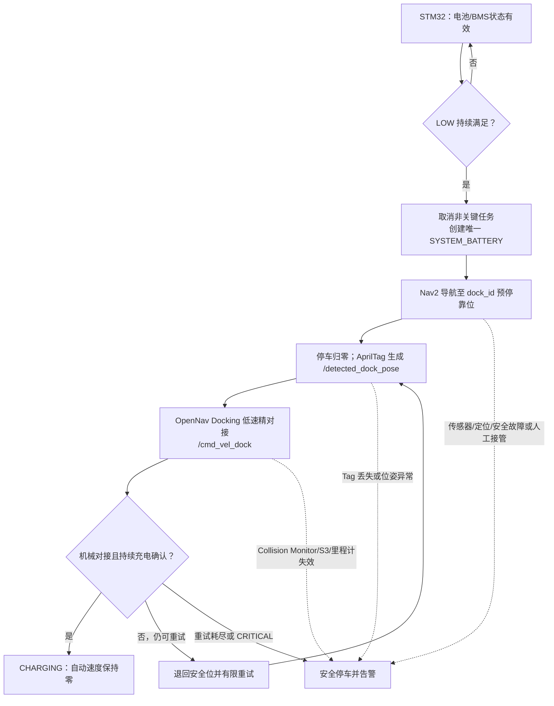

图中所有自动速度均经 `hr_motion_mux → Collision Monitor → /cmd_vel → hr_bridge → STM32`，不得因回充而绕过安全链；“充电确认”仅指持续充电电流或经验证的 BMS/充电器状态，不能用识别到 Tag、到达预停靠位、接触触点或瞬时电压上升替代。

具体流程冻结为：

1. STM32 本地维护 `NORMAL/LOW/DOCK_RESERVE/CRITICAL/INVALID/CHARGING`，使用滤波、持续时间和迟滞避免电机负载压降造成误触发；低电降额和临界停车不依赖 RK3588 存活。
2. `LOW` 持续满足后，`hr_task_manager` 拒绝普通新任务，取消当前非关键自动任务并创建唯一 `SYSTEM_BATTERY` 回充任务；回充阈值必须覆盖最远路线、定位/视觉、冻结重试次数、电池老化/低温和系统安全余量。
3. Nav2 使用地图中的 `dock_id` 预停靠位完成粗导航；到位并归零后，`apriltag_ros` 只识别指定 Tag，`hr_dock_pose_adapter` 使用实测相机内参、`base_link→camera_link` 外参和 Tag—触点偏置生成 `/detected_dock_pose`。
4. OpenNav Docking 在 `DOCKING` 阶段低速闭环对接；`hr_motion_mux` 只选择新鲜 `/cmd_vel_dock`。Tag 丢失、位姿跳变、S3/Collision Monitor/里程计失效、人工接管或安全故障均立即归零并取消。
5. 首选通过充电桩机械设计使触点在桩体进入激光停止区前接通；禁止简单关闭 Collision Monitor。若实物不能满足，必须重新评审机械尺寸或受限对接碰撞策略。
6. 只有机械对接成立且持续充电电流或经验证的 BMS/充电器状态成立，才进入 `CHARGING`。未充电则退回安全位并有限重试；耗尽次数或进入 `CRITICAL` 后停止重试、停车并告警。
7. `CHARGING` 保持自动速度为零；充满判据使用 BMS/充电器状态或经验证的电压、电流收敛条件。充电中断、过温、BMS 故障或人工移车立即退出并记录，不自动恢复旧任务。

异常与恢复：总压或 BMS/电流数据过期进入 `INVALID` 并拒绝无人值守回充；仅有总压时可显示电压和分级，但 `BatteryState.percentage` 必须保持未知。自动回充失败后保留人工充电能力。充电桩触点必须防反接、防短路、限流并有保险，充电器必须与电池化学体系、串数和 BMS 充电口匹配。

### 3.2 Orbbec Gemini 2 深度相机模块

| 项目 | 内容 |
|---|---|
| 模块定位 | 固定前向 RGB-D 感知：目标二维识别、三维距离、前方高低障碍辅助观测 |
| 输入 | 环境反射光；设备内部主动双目 IR 深度计算 |
| 输出 | `/camera/color/image_raw`、`/camera/depth/image_raw`、`/camera/depth/points`、对应 `CameraInfo`、相机 IMU 和诊断 |
| 对应软件 | Orbbec SDK + 官方 ROS 2 驱动；`hr_perception`、`hr_depth_obstacle`、`hr_target_tracker` |
| 连接方式 | Gemini 2 USB 3.0 Type-C → 鲁班猫 5 USB 3.0 Host |
| 能力边界 | 不承担二维 SLAM 的主定位，也不能替代 RPLIDAR S3 的360°扫描与激光停止区；相机 IMU 不替代底盘 BMI088 |

具体实现步骤：

1. 使用 Orbbec ROS 2 驱动，以单根 USB 3.0 线缆采集 RGB、深度、点云和相机 IMU；通过 udev 以序列号固定为 `/dev/gemini2`。
2. 使用已完成实物验证并冻结的 RGB/Depth 同步档位运行；驱动发布帧时间戳、`CameraInfo`、深度有效像素比例、丢帧数与 USB 重连诊断，具体帧率、延迟和测距精度以实测记录为准。
3. 完成 `base_link→camera_link` 静态外参和相机内参标定。相机安装高度、俯仰角与前保险杠/雷达遮挡必须记录在 URDF 与标定记录中。
4. `hr_perception` 使用 RGB 图像执行 RKNN YOLO；YOLO 保持只输出类别、置信度和二维框。
5. `hr_depth_obstacle` 对深度点云执行距离门控、置信度门控与地面滤除，输出经验证的前方障碍点云给 Nav2 局部代价地图；无效点、地面点和超过有效距离的点不得写入障碍层。
6. 深度断流、RGB/深度不同步或标定失效时，立即停用深度障碍与三维目标距离输出并告警；S3 的二维导航与激光停止区仍可独立工作。涉及高低障碍或基于三维距离的跟随任务必须拒绝启动或取消，恢复后需重新通过准入检查。

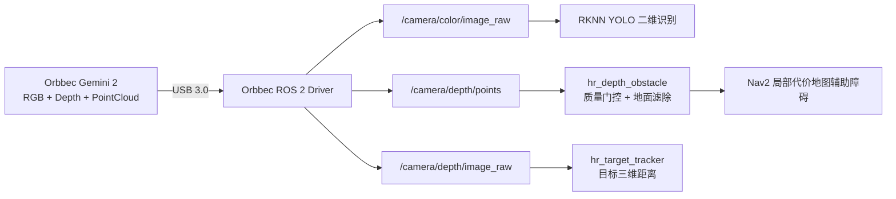

### 3.3 RPLIDAR 激光雷达模块

| 项目 | 内容 |
|---|---|
| 模块定位 | 室内二维环境感知和主要定位观测源 |
| 输入 | 周围物体距离和扫描角度 |
| 输出 | `/scan`、雷达在线状态和扫描频率 |
| 对应软件 | Slamtec `sllidar_ros2` S3 配置、`hr_localization`、`hr_navigation` |
| 连接方式 | RPLIDAR S3 → 原厂 USB 转串口适配器 → RK3588 USB；设备持久化命名为 `/dev/rplidar` |
| 驱动基线 | 使用与实物 S3 固件匹配的 `sllidar_ros2` 启动配置，`frame_id=laser_frame`；串口参数、扫描模式和转速以实测设备信息冻结，串口权限通过 udev 规则配置 |

具体实现步骤：

1. 驱动按实物型号配置串口、扫描模式和转速，发布 `sensor_msgs/LaserScan`。
2. 静态 TF 定义 `laser_frame → base_link`，安装外参通过墙面直线和旋转测试校准。
3. `/scan` 同时进入 SLAM/AMCL 和 Nav2 局部代价地图。
4. 监控扫描频率、量程有效率、数据时间戳和设备重连次数。

异常处理：雷达数据过期立即停止导航输出；短时重连期间保持停车；不能仅用旧扫描继续避障。

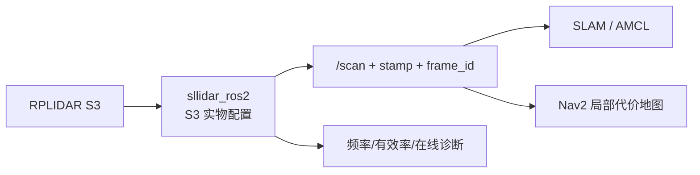

### 3.4 RGB 目标识别与深度关联模块

| 项目 | 内容 |
|---|---|
| 模块定位 | 从 Gemini 2 RGB 图像产生目标类别、置信度和二维检测框，并与同帧深度关联 |
| 输入 | `/camera/color/image_raw`、`/camera/depth/image_raw`、相机内参、任务指定目标类别 |
| 输出 | `/detections`：`Detection2DArray`；目标出现/消失事件和视觉诊断 |
| 对应软件 | `hr_perception`、RKNN、轻量 YOLO、事件门控 |
| 执行载体 | RK3588 NPU + CPU |

具体实现步骤：

1. 将检测模型转换为 RKNN INT8，NPU 输出目标框、类别和置信度。
2. 对检测框执行阈值、非极大值抑制和类别过滤，发布类别、置信度、二维框和图像时间戳。
3. 业务事件采用连续帧确认和消失超时，避免单帧误报；需要目标 ID 时只做二维短时跟踪，不输出距离。
4. `/detections` 供 `hr_target_tracker`、`hr_task_manager`、网页和日志使用，不映射到 `hr_bridge`，不直接产生底盘速度。
5. `hr_target_tracker` 以检测框内通过质量门控的深度像素中值估算目标距离，并由相机内参反投影到 `camera_link` 后经 TF 转到 `base_link`；对深度无效、透明/反光、严重遮挡或跨帧不同步的目标不得输出有效三维位置。S3 角窗/点簇作为交叉验证或深度退化的降级来源；两者均无效时只允许记录、告警或继续搜索，不允许自动接近目标。

异常处理：帧率下降时降低识别频率或跳帧；图像过期时停止发布有效事件。任何旧检测结果不得在相机断流后继续触发业务动作。

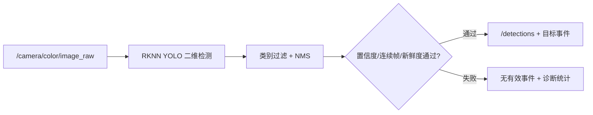

#### 3.4.1 指定地图/区域目标搜索与局部跟随

本项目支持由网页或定时计划提交“在指定地图的指定区域寻找指定目标”的业务任务。地图仍是 Nav2 使用的二维栅格地图；区域是 `map` 坐标系下的房间、多边形或搜索点集合；目标类别是 YOLO 标签集合中的可识别对象。区域配置不代表动态物体的固定坐标，只用于缩小搜索范围、生成搜索路线和限制误检处理范围。

视觉辅助目标跟随的核心链路冻结为：**YOLO 只负责找目标与二维框；Gemini 2 的同帧有效深度经内参和静态 TF 生成目标在 `base_link` 下的三维位置，RPLIDAR S3 在对应水平方向作可选交叉验证或深度退化降级，`hr_target_tracker` 输出局部目标和推荐跟随位姿，`hr_task_manager` 将该位姿作为 Nav2 动态目标更新；速度仍由 Nav2 生成，并必须经过 Collision Monitor、`hr_bridge` 和 STM32。**

目标搜索与跟随分为三段：

1. `hr_task_manager` 根据 `map_id/area_id/target_class/mode` 加载已验收地图和搜索区域，调用 Nav2 将机器人移动到搜索区域入口或有序搜索点。
2. 到达搜索区域后，`hr_perception` 以任务指定类别运行 YOLO；`hr_target_tracker` 用检测框、同帧深度、`CameraInfo` 与 `base_link→camera_link/laser_frame` 静态 TF 得到目标局部坐标；需要交叉验证或深度退化时，再在同一水平方向的 `/scan` 角窗中查询 S3 距离/点簇，输出 `/follow_target`。
3. 若任务模式为 `follow` 且目标连续锁定，`hr_target_tracker` 按冻结的期望距离、最小安全距离、目标跳变门限和目标丢失超时计算推荐跟随位姿；`hr_task_manager` 以受限频率更新 Nav2 目标。自动速度仍由 Nav2 输出 `/cmd_vel_auto`，再进入 Collision Monitor 和 STM32 安全链。

目标方向计算冻结为：

```ini
alpha = atan((u - cx) / fx)
```

其中 `u` 为检测框中心横坐标，`cx/fx` 来自相机标定后的 `CameraInfo`。`alpha` 表示目标相对相机光轴的水平偏角，随后通过 `base_link→camera_link` 与 `base_link→laser_frame` 静态 TF 转换为雷达查询方向 `theta`。当前方案不使用检测框高度或宽度估算距离。

雷达关联成功后，`hr_target_tracker` 必须输出：

```text
range = r
bearing = theta
position_base.x = r * cos(theta)
position_base.y = r * sin(theta)
```

若同时检测到多个同类目标，`hr_target_tracker` 必须使用 `track_id`、上一帧目标位置、类别一致性和最大跳变门限持续锁定同一个目标；不能在多个同类目标之间随机切换。`track_id` 只表达本地短时跟踪身份，不作为跨任务、跨重启的永久身份。

推荐跟随位姿按目标在 `base_link` 或 `map` 坐标系下的位置生成，首版不直接输出 `vx/wz`：

```text
target_base = (range*cos(bearing), range*sin(bearing))
follow_distance = clamp(desired_follow_distance, min_safe_distance, max_follow_distance)
follow_goal_base.x = target_base.x - follow_distance * cos(bearing)
follow_goal_base.y = target_base.y - follow_distance * sin(bearing)
follow_goal_yaw = bearing
```

实际实现时可将 `follow_goal_base` 通过 TF 转换到 `map` 坐标系后作为 Nav2 目标；如果目标更新过快，`hr_task_manager` 必须按冻结周期、距离变化阈值和角度变化阈值限频更新，避免 Nav2 目标抖动。

当 `range <= min_safe_distance`、目标丢失、雷达关联失败、数据超时、目标跳变超限、进入禁止区域、Collision Monitor 不可用或 HT-10A 人工接管时，`hr_task_manager` 必须取消当前 Nav2 跟随目标或进入 `ZERO/CANCELING/INTERRUPTED` 阶段，不得继续使用上一条 `/follow_target` 或 Nav2 目标。

需要在接口评审中冻结的内容如下：

| 类别 | 冻结内容 | 首版建议/结论 |
|---|---|---|
| 架构边界 | 相机、雷达、Nav2 和目标跟随的职责 | YOLO 找目标；Gemini 2 提供三维目标距离和前方高低障碍；S3 提供二维导航与可选交叉验证；`hr_target_tracker` 输出推荐跟随位姿；Nav2 统一负责搜索、巡检和跟随移动 |
| 距离来源 | 跟随目标距离 | 冻结为 Gemini 2 同帧有效深度反投影结果；S3 角窗/点簇仅作交叉验证或深度退化降级。检测框尺寸不参与距离估计 |
| 坐标链 | 方向换算 | 使用 `CameraInfo` 的 `fx/cx` 和 URDF 静态 TF；必须标定 `base_link→camera_link`、`base_link→laser_frame` |
| 目标消息 | `/follow_target` 字段 | 至少包含 `target_id/class/range/bearing/position_base/confidence/stamp/state` |
| 可跟随类别 | 允许进入跟随的目标 | 首版允许人、箱子、垃圾桶等具有稳定 RGB 检测和有效深度的目标；透明、高反光、细小或深度无效的目标仅观察 |
| 多目标处理 | 同类多目标锁定 | 必须使用短时 `track_id` 和最大跳变门限；锁定后不得无故切换目标 |
| 速度输出 | 跟随速度输出 | 跟随不单独输出速度；Nav2 输出 `/cmd_vel_nav`，由 `hr_motion_mux` 在导航/跟随阶段选择，`linear.y=0`，不得发布最终 `/cmd_vel` |
| 安全链 | 跟随速度下发路径 | `Nav2 /cmd_vel_nav → hr_motion_mux → /cmd_vel_auto → Collision Monitor → /cmd_vel → hr_bridge → STM32` |
| 失效动作 | 目标/雷达/数据异常 | 目标丢失、关联失败、超时、跳变、距离过近或人工接管时归零并上报原因 |

首版建议参数如下，最终值需按实车数据和验收证据冻结：

| 参数 | 首版建议值 | 冻结依据 |
|---|---:|---|
| YOLO 置信度阈值 | `0.50` | 先控制误检，后按目标类别分别调参 |
| 连续确认帧数 | `3` 帧 | 避免单帧误检触发搜索/跟随 |
| 图像检测新鲜度 | `≤ 200 ms` | 超时后不得继续使用旧检测框 |
| `/scan` 新鲜度 | `≤ 200 ms` | 超时后不得继续关联目标距离 |
| 雷达角度查询窗口 | `±5°` | 首版用于室内近距离目标，需按相机/雷达外参误差修正 |
| 点簇距离连续门限 | `0.20~0.30 m` | 用于将相邻雷达点聚为候选目标簇 |
| 最大目标跳变 | `0.50 m / 200 ms` | 超过则判定为误关联或目标切换 |
| 期望跟随距离 | `1.0 m` | 室内低速跟随首版安全距离 |
| 最小安全距离 | `0.6 m` | 小于该距离立即禁止继续前进 |
| Nav2 跟随线速度上限 | `0.30 m/s` | 首版低速，降低识别/雷达延迟风险 |
| Nav2 跟随角速度上限 | `0.8 rad/s` | 保持目标居中且避免原地快速旋转 |
| 目标丢失超时 | `500 ms` | 短时遮挡可恢复，超过则停止跟随 |
| Nav2 目标更新频率 | `2~5 Hz` | 避免移动目标过快抖动；速度由 Nav2 和下位机继续做限幅 |

适用目标：人、箱子、垃圾桶、椅子腿/桌腿等能被相机识别且能被 2D 激光雷达平面观测到的目标。不可可靠跟随的目标包括桌面杯子、墙上开关、高处门牌、透明/细小物体和雷达高度扫不到的物体；这些目标只能做到点观察、记录和告警，除非后续增加深度相机、双目或经过实测验证的单目估距方案。

目标锁定必须满足：类别匹配、置信度阈值、连续帧确认、图像时间戳新鲜、雷达角度窗口存在有效距离/聚类、目标位置在搜索区域或允许跟随区域内。目标丢失、雷达关联失败、目标跳变超过门限、进入禁止区域、距离低于最小安全距离或人工接管时，`hr_task_manager` 必须取消 Nav2 跟随目标并上报明确原因。上表首版建议参数必须通过实车日志、rosbag 和跟随/误关联验收后再作为最终冻结值。

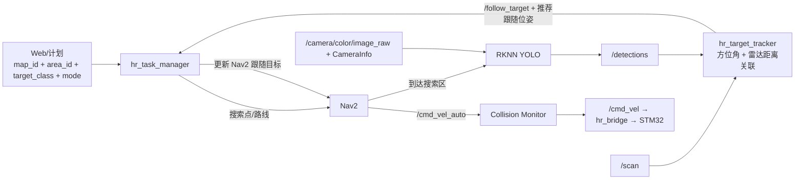

### 3.5 SLAM、定位与导航规划模块

| 项目 | 内容 |
|---|---|
| 模块定位 | 建图、定位、全局路径规划、到达搜索区域和局部动态避障 |
| 输入 | `/scan`、`/odometry/filtered`、TF、导航目标、障碍数据 |
| 输出 | `/map`、`map→odom`、导航结果、Nav2 `/cmd_vel_auto(vx,wz)` 和安全链最终 `/cmd_vel(vx,wz)`；`linear.y` 固定为 0 |
| 对应软件 | `robot_localization`、slam_toolbox/AMCL、Nav2、DWB Controller、`nav2_collision_monitor` |
| 执行载体 | RK3588 CPU |

具体实现步骤：

1. EKF 在 `two_d_mode=true` 下融合轮式 `vx/wz` 与 IMU `gyro_z`，可选接收通过有效性检查的 IST8310 辅助航向，发布 `/odometry/filtered` 和 `odom→base_link`。
2. 建图模式使用雷达扫描匹配、EKF 里程计初值和回环优化生成二维栅格地图。
3. 导航模式加载地图，由 AMCL 估计 `map` 坐标位姿；它与建图模式的 `slam_toolbox` 不同时运行。
4. 全局规划器生成路径；RPLIDAR S3 `/scan` 是二维局部代价地图和 Collision Monitor 的主环境障碍观测源，`hr_depth_obstacle` 的前方点云通过验收后作为局部代价地图辅助障碍观测。
5. Nav2 DWB（参考方案 DWA 的 ROS 2 实现）按差速底盘约束只采样 `vx/wz`，发布 `/cmd_vel_auto` 时强制 `linear.y=0`。
6. 搜索、巡检和目标跟随的自动速度由 Nav2 输出到 `/cmd_vel_nav`；到达充电桩预停靠位后的精对接速度由 OpenNav Docking 输出到 `/cmd_vel_dock`。`hr_motion_mux` 按 `NAVIGATING/FOLLOWING/DOCKING/ZERO` 阶段互斥选择，唯一发布 `/cmd_vel_auto`，切换前必须归零且旧源命令不得复用。
7. `collision_monitor` 使用最新 `/scan` 检查停止区，对 Nav2 和 Docking 的自动速度统一否决；触发时将最终 `/cmd_vel` 置零，未触发时转发 `/cmd_vel_auto`。`hr_bridge` 只订阅最终 `/cmd_vel`，任何自动速度源不得绕过该链。
8. 导航、对接的成功、取消、阻塞、定位丢失和充电确认结果返回业务任务层。

异常处理：无安全轨迹、定位失效或传感器超时时发布零速并返回失败。`/scan` 过期或 Collision Monitor 未运行、未激活、异常退出时，自动运动必须失效并取消活动任务；`hr_bridge` 不得保持最后一个非零命令，其他节点禁止旁路发布最终 `/cmd_vel`。恢复后必须重新完成就绪检查和任务提交，不得自动续跑旧任务；所有恢复行为仍不得绕过下位机安全限制。

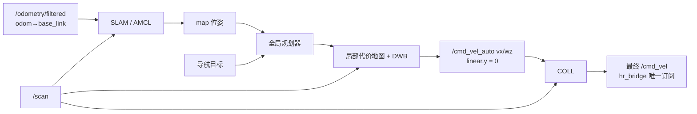

### 3.6 `hr_bridge` 通信桥模块

| 项目 | 内容 |
|---|---|
| 模块定位 | ROS 2 与 STM32 自定义协议之间的双向转换器 |
| 输入 | `/cmd_vel`、模式；STM32 上行状态帧 |
| 输出 | 下行协议帧；`/wheel/odom_raw`、`/imu/data`、`/robot_status`、`/diagnostics` |
| 对应软件 | `hr_bridge` |
| 通信方式 | USB-UART；鲁班猫侧 `/dev/robot_mcu` |

具体实现步骤：

1. 订阅最终底盘速度和模式，检查 ROS 时间戳与数值范围。
2. 按协议填充版本、消息 ID、长度、序号、MCU/Host 时间戳和 CRC16。
3. 独立接收线程或异步 I/O 运行帧状态机，解析 STM32 上行状态。
4. 将轮速正解观测、IMU、故障和设备状态映射为标准 ROS 2 话题；轮式与 IMU 数据分别保留各自时间戳、有效标志和协方差，不生成融合位姿或 TF。
5. 统计 CRC 错误、序号跳变、往返延迟、重连次数和链路超时。

异常处理：串口断开时停止下发非零命令并持续重连；bridge 不承担电机 PID、最终限幅或看门狗刷新。

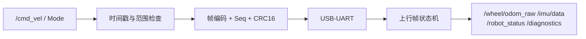

### 3.7 通信与接口层模块

| 项目 | 内容 |
|---|---|
| 模块定位 | 上下位机可靠、可诊断的数据传输边界 |
| 输入 | bridge 下行字节流；STM32 状态快照 |
| 输出 | 已验证的上位机命令候选；已封装 `Robot_Status_t` |
| 对应软件 | 上位机 `hr_bridge`；下位机 `protocol.c`、`command_task.c` |
| 物理接口 | USB-UART；鲁班猫侧持久化命名为 `/dev/robot_mcu` |

具体实现步骤：

1. STM32 使用 UART DMA + IDLE 中断接收，只在 ISR 中记录 DMA 长度并通知 `command_task`。
2. `command_task` 在固定字节预算内搜索帧头，检查版本、长度、消息 ID、CRC、序号、时间戳、数值有限性和范围。
3. 完整有效的上位机命令与最新 SBUS 帧在任务内部形成两个候选，仲裁后只覆盖发布一个 `CommandState_t` 最新快照；旧控制命令不排队执行。
4. `monitor_task` 生成状态快照并提交发送邮箱，UART DMA 异步发送。
5. 上下位机分别维护命令超时和心跳超时，两者不能互相替代。

异常处理：CRC 错、长度异常和未知消息直接丢弃并计数；序号冻结或命令过期触发自动控制失效。

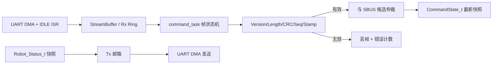

### 3.8 STM32F407 + FreeRTOS 内核调度模块

| 项目 | 内容 |
|---|---|
| 模块定位 | 下位机实时控制和任务调度核心 |
| 输入 | 上位机控制帧、遥控数据、IMU、四路AB相编码器、电流反馈和H桥故障输入 |
| 输出 | 四路PWM/方向/使能、原始轮式观测、IMU/状态帧和错误状态 |
| 对应软件 | `main.c`、`freertos.c`、`Application/` |
| 核心硬件 | 普通 STM32F407VET6 控制板，Cortex-M4F 168 MHz、512 KB Flash、192 KB SRAM |

具体实现步骤：

1. HAL 初始化系统时钟、GPIO、UART、SPI、I2C、DMA、四路编码器定时器、四路PWM、ADC、电机故障输入和 IWDG。
2. BSP 初始化四路VNH5019、MC520编码器、BMI088、IST8310、HT-10A SBUS接收链路和上下位机链路。
3. 创建 IPC 对象和四个常驻任务：`monitor/chassis/imu/command`。
4. 周期任务使用 `vTaskDelayUntil()` 或硬件定时通知；ISR 只搬运数据和发通知。
5. 控制任务采用静态对象，运行期禁止不受控的 `malloc/free` 和阻塞打印。

异常处理：初始化失败保持四路H桥禁能并进入故障态；HardFault 先关闭PWM和H桥使能，记录最小故障现场后等待 IWDG 复位。

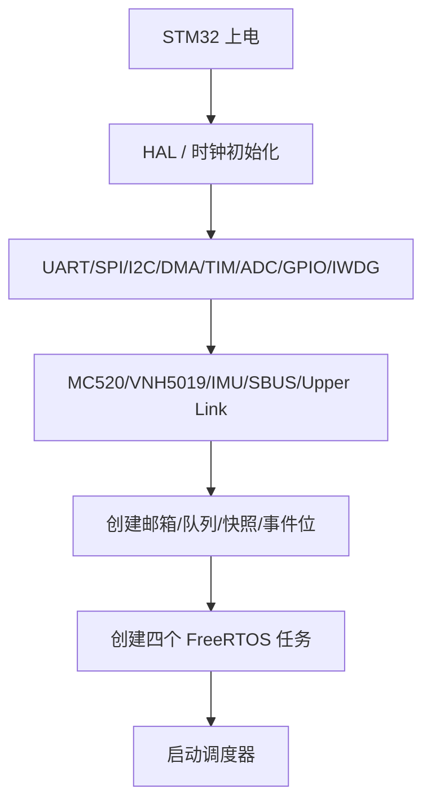

### 3.9 底盘运动控制模块

| 项目 | 内容 |
|---|---|
| 模块定位 | 将差速底盘目标转换为四台 MC520 有刷减速电机的独立 H 桥控制量 |
| 输入 | `CommandState_t`、4路AB相计数、4路电流/故障反馈、`Safety_State_t` |
| 输出 | 4路PWM/方向/使能、`MotorSample_t`、`Chassis_State_t`、原始轮式 `vx/wz` 观测 |
| 对应软件 | `chassis_task.c`、`diff_drive.c`、`pid.c`、`encoder.c`、`brushed_motor.c`、`vnh5019.c`、`current_sense.c` |
| 执行机构 | 4×MC520P30_12V + 4×VNH5019，100 mm轮径为当前机械基准；轮径与有效轮距仍须实车标定 |

具体实现步骤：

1. `command_task` 输出唯一的 `CommandState_t`，包含 `vx/wz/source/enable/seq/stamp`，并强制 `vy=0`。
2. `chassis_task` 检查安全许可、目标新鲜度、四路编码器新鲜度、电流范围和VNH5019故障状态。
3. 对目标执行速度限幅和加减速斜坡，再按轮距 `L` 计算左右轮线速度：`v_left=vx-wz·L/2`、`v_right=vx+wz·L/2`。
4. 左前/左后轮共享左侧目标，右前/右后轮共享右侧目标；四路定时器编码器模式读取A/B相并计算带符号轮速。MC520P30为13线、30:1，四倍频轮端分辨率冻结为 `1560 count/rev`；测速采用10 ms M法，低于30 rpm时切换为相邻边沿T法，避免低速量化抖动。
5. 四路速度PI分别计算有符号控制量并映射为VNH5019的PWM、INA/INB和ENA/ENB。PWM固定20 kHz；`chassis_task`固定1 ms执行安全、斜坡与输出，速度测量和PI固定10 ms（100 Hz）。首版不用D项；归一化速度误差下初始 `Kp=0.40`、`Ki=0.80 s⁻¹`，采用条件积分抗饱和，台架整定只能在不改变周期和保护阈值的前提下修改这两个增益。
6. 正反转时先以 `1.0 m/s²` 减速斜坡将目标归零，PWM=0且ENA/ENB关断；实测轮速低于10 rpm后继续保持50 ms，再切换INA/INB并按 `0.6 m/s²` 加速斜坡恢复。若500 ms内轮速未低于10 rpm，则锁存换向超时故障；非零PWM下禁止直接反向。50 ms远大于VNH5019模式切换最大1.6 ms，积分在限幅、堵转和换向中冻结。
7. ADC1由TIM8触发，在PWM周期中点完成四路电流扫描；软件连续5 ms检测到 `I≥8 A` 即过流关断。`I≥6 A` 且 `|n|≤10 rpm`、`PWM≥40%`、目标速度非零持续300 ms判为堵转。任一过流、驱动故障或编码器异常均撤销四路输出，不允许三轮降级行驶。
8. 用同侧前后轮平均速度抑制单轮噪声，按差速正运动学计算原始轮式 `vx/wz`，连同独立采样时间戳、有效标志和协方差建议值写入 `Chassis_State_t`。STM32 不在此处融合 IMU，也不生成上位机最终 `x/y/yaw` 位姿。
9. 每个周期更新任务心跳、编码器异常、电流/驱动故障和执行时间统计。

异常处理：任一路编码器断线/卡死、VNH5019故障、过流/堵转、命令超时或安全许可撤销时，立即撤销四路H桥使能并将PWM归零，不允许三轮降级行驶；故障锁存与恢复由安全状态机决定，恢复后必须等待新的命令序号。

```mermaid
flowchart LR
  SET["vx/wz + stamp<br/>vy=0"] --> SAFE{"安全/新鲜/在线?"}
  SAFE -->|否| ZERO["PWM=0 + H桥禁能 + 故障状态"]
  SAFE -->|是| RAMP["限幅与斜坡"]
  RAMP --> IK["差速逆解<br/>vL=vx-wz·L/2<br/>vR=vx+wz·L/2"]
  IK --> MAP["左目标→左前/左后<br/>右目标→右前/右后"]
  MAP --> PID["4×编码器测速 + 速度 PI/PID"]
  FB["4×AB计数 + 电流/故障反馈"] --> PID
  PID --> DIR["换向状态机 + 4×PWM/方向/使能"]
  DIR --> HBR["4×VNH5019 → 4×MC520"]
  FB --> FK["左右侧轮速平均<br/>差速正解"]
  FK --> ODOM["Chassis_State<br/>原始轮式 vx/wz + stamp/valid"]
```

### 3.10 传感器与控制输入处理模块

| 项目 | 内容 |
|---|---|
| 模块定位 | 把原始 IMU、遥控、电机反馈和上位机数据转换为三个最新状态快照 |
| 输入 | BMI088、IST8310、HT-10A SBUS、AB相计数、电流/H桥故障、上位机字节流 |
| 输出 | `ImuSample_t`、`CommandState_t`、`MotorSample_t` |
| 对应软件 | `imu_task.c`、`command_task.c`、`mahony_ahrs.c`、设备驱动 |
| 数据机制 | DMA/ISR 通知、最新值双缓冲、序列号一致性检查 |

具体实现步骤：

1. `imu_task` 由 BMI088 DRDY/SPI DMA 完成通知唤醒，以 1 ms 兜底周期读取加速度和陀螺仪，完成轴向映射、单位换算、零偏/比例补偿和 Mahony 解算。
2. IST8310 首版按 100 Hz 读取，经硬铁/软铁补偿和机体系转换后参与九轴 Mahony；初始化失败、数据过期、模长异常或突变时停止磁校正，退化为六轴 Mahony 并设置 `mag_degraded=true`。
3. SBUS UART 每次固定 DMA 接收 25 字节；正常 DMA 接收完成 ISR 仅将该帧发布到独立最新帧槽、记录时间戳并通知 `command_task`，随后立即重启下一帧 DMA。DMA 错误、接收超时或帧校验失败均使遥控候选无效，不依赖 UART IDLE 中断划分 SBUS 帧。
4. `command_task` 在同一任务内分别处理上位机 RingBuffer 和 SBUS 最新帧槽，校验后按“安全否决/急停 > 人工接管 > 上位机 > 零命令”仲裁，只发布一个 `CommandState_t`。
5. 四个定时器以编码器模式硬件累计AB相计数；`chassis_task`按测速子周期读取并清算增量，结合计数方向、溢出和新鲜度生成`MotorSample_t`。ADC/DMA采集四路电流，VNH5019故障GPIO/EXTI只锁存故障位并通知任务；ISR不做PID、运动学或安全状态跳转。
6. 消费者读取快照时复制完整结构体到本地变量，并核对序列号；不跨任务长期持有可能被生产者覆盖的裸指针。

异常处理：每类输入独立维护 `valid/seq/stamp/error_count`；消费者必须再次检查数据新鲜度。

```mermaid
flowchart TB
  BMI["BMI088 SPI DMA"] --> IMUT["imu_task"]
  MAG["IST8310 I2C"] --> IMUT
  IMUT --> IDATA["ImuSample_t 最新快照"]
  SBUS["HT-10A SBUS<br/>25-byte DMA complete"] --> CMD["command_task"]
  UPLINK["上位机 Rx Ring"] --> CMD
  CMD --> CDATA["CommandState_t 最新快照"]
  ENC["4×TIM Encoder"] --> MDATA["MotorSample_t 双缓冲"]
  CUR["4×ADC current + H桥 fault"] --> MDATA
```

#### 3.10.1 `imu_task` 与 Mahony 下位机流程

`ImuSample_t` 是同一发布时刻的一组具体数据，不是数据队列或历史记录：

```c
typedef struct {
    uint32_t seq;
    uint32_t stamp_us;
    float accel_mps2[3];
    float gyro_rps[3];
    float quat_wxyz[4];
    float mag_uT[3];
    bool imu_valid;
    bool mag_valid;
    bool mag_degraded;
} ImuSample_t;
```

`accel/gyro/mag` 均为完成标定和轴向转换后的机体系数据。`quat_wxyz` 是 Mahony 输出；不定义独立 `mag_yaw`，避免与四元数中的航向信息重复。STM32 内部运行 Mahony，上位机仍使用轮式 `vx/wz`、`gyro_z` 和可选航向观测运行 EKF，STM32 不输出最终定位位姿。

初始化按以下顺序执行：检查 BMI088 芯片 ID、自检和 DRDY；初始化 IST8310，失败时直接进入磁力计降级；加载带 CRC 的标定参数；静止条件满足时采集 2 s 陀螺仪数据估计零偏，不满足时使用已保存零偏且不无限等待；最后用重力初始化 roll/pitch，磁场有效时同时初始化 yaw，否则 yaw 置 0 并进入六轴模式。

```mermaid
flowchart TD
  WAKE["BMI088 DRDY / 1 ms 兜底"] --> READ["SPI DMA 读取 accel + gyro"]
  READ --> CHECK{"读取成功且 dt 有效?"}
  CHECK -->|否| FAIL["错误计数；连续失败则 imu_valid=false"]
  CHECK -->|是| CAL["轴向映射、单位换算、零偏/比例补偿"]
  CAL --> MAGDUE{"到 10 ms 磁力计周期?"}
  MAGDUE -->|是| MAGREAD["IST8310 读取、硬铁/软铁补偿、转机体系"]
  MAGDUE -->|否| OBS
  MAGREAD --> MAGCHECK{"新鲜度、模长、跳变正常?"}
  MAGCHECK -->|否| DEG["mag_valid=false<br/>六轴降级"]
  MAGCHECK -->|是| MAGOK["mag_valid=true"]
  DEG --> OBS{"本周期有效观测?"}
  MAGOK --> OBS
  OBS -->|"accel + mag"| M9["Mahony 九轴误差"]
  OBS -->|"仅 accel"| M6["Mahony 六轴误差"]
  OBS -->|"均不可用"| GYRO["仅陀螺积分"]
  M9 --> ERR["实测方向 × 四元数估计方向"]
  M6 --> ERR
  ERR --> PI["Kp 比例 + Ki 有界积分修正"]
  PI --> OMEGA["修正 gyro_x/y/z"]
  OMEGA --> QDOT["q_dot = 0.5 × q ⊗ omega"]
  GYRO --> QDOT
  QDOT --> Q["按实测 dt 积分并归一化四元数"]
  Q --> SNAP["发布 ImuSample_t + 心跳/WCET"]
  FAIL --> RETRY{"达到限次重试条件?"}
  RETRY -->|是| REINIT["后台重新初始化 BMI088"]
  RETRY -->|否| SNAP
  REINIT --> WAKE
```

Mahony 每周期具体执行：有效加速度和磁场向量归一化；根据当前四元数估计重力和地磁方向；用实测方向与估计方向的叉积形成误差；执行 `Kp` 比例和 `Ki` 有界积分修正；用修正后的三轴角速度计算 `q_dot`；按实际采样间隔积分并归一化四元数。动态加速度过大时本周期暂停重力修正，磁场异常时暂停磁修正，二者均不得直接重置 yaw 或四元数。四元数出现非有限值或归一化失败时丢弃本次结果，连续发生才触发重初始化。

首版 BMI088 采样/解算周期为 1 kHz，IST8310 为 100 Hz。Mahony `Kp/Ki`、BMI088 带宽、磁场模长/跳变门限、磁恢复连续有效样本数和标定矩阵必须通过台架与实车数据冻结，不直接照搬 OpenCTR 参数。

#### 3.10.2 HT-10A 推荐通道映射（待实测冻结）

亚博智能资料给出的 HT-10A 默认物理映射为 CH1/CH2 对应右摇杆、CH3/CH4 对应左摇杆、CH5～CH8 对应四个拨杆、CH9/CH10 对应两个旋钮。本项目在不改变发射机默认通道顺序的前提下，推荐映射如下；所有通道的最小值、中值、最大值、方向和死区必须以实物标定结果冻结。

| 通道 | 物理输入 | 推荐项目功能 | 安全约束 |
|---|---|---|---|
| CH1 | 右摇杆左右 | 底盘角速度 `wz` | 回中死区内强制为 0，方向经原地转向试验冻结 |
| CH2 | 右摇杆上下 | 底盘前向速度 `vx` | 回中死区内强制为 0，前后方向经离地轮测冻结 |
| CH3 | 左摇杆上下 | 预留 | 未使用时忽略，不参与运动控制 |
| CH4 | 左摇杆左右 | 预留 | 未使用时忽略，不参与运动控制 |
| CH5 | SWA | 自动/人工接管选择 | 进入人工位置立即使自动目标失效；退出人工不得自动恢复旧任务 |
| CH6 | SWB | 软件急停请求 | 急停位置锁存零输出；不能替代独立硬件急停和安全门 |
| CH7 | SWC | 预留模式选择 | 当前不改变控制权；后续启用必须重新评审 |
| CH8 | SWD | 故障清除请求或预留 | 只能发送请求，`monitor_task` 在故障条件消失且满足恢复条件后决定是否清除 |
| CH9 | VRA | 人工底盘速度比例 | 限制在已冻结的最小/最大比例内，不得提高系统硬限速 |
| CH10 | VRB | 预留 | 未使用时忽略 |

`command_task` 必须同时检查完整有效 SBUS 帧、接收时间戳、失控/帧丢失标志、拨杆合法组合和摇杆回中条件。任何接收超时、接收机断电、发射机关闭、非法帧或通道越界都使遥控候选无效；若当时处于人工接管，立即发布零 `CommandState_t` 并保持人工安全态，禁止保持最后一帧命令或自动回退上位机控制。

### 3.11 状态反馈与安全监控模块

| 项目 | 内容 |
|---|---|
| 模块定位 | 汇总系统健康状态、执行安全动作并向 RK3588 反馈 |
| 输入 | `command/chassis/imu` 三个被监控任务心跳、电机/IMU/通信状态、电池总压/电流/充电/BMS状态、原始轮式观测、遥控状态、错误计数 |
| 输出 | `Safety_State_t`、`Battery_State_t`、`Robot_Status_t`、故障码、IWDG 刷新或停止刷新 |
| 对应软件 | `battery_driver.c`、`monitor_task.c`、`protocol_tx.c`、`iwdg.c` |
| 作用 | 安全保护、状态上传、故障诊断和最后复位保护 |

具体实现步骤：

1. `monitor_task` 每 10 ms 检查任务心跳、周期超限、栈余量和关键中断活动。
2. 检查上位机、遥控器、BMI088、四路编码器更新、电机电流采样、VNH5019、电池总压及 BMS/充电状态的新鲜度。
3. 运行安全与电池状态机，决定底盘 `control_enable`、低电降额、`NORMAL/LOW/DOCK_RESERVE/CRITICAL/INVALID/CHARGING` 和故障锁存。
4. 每 20 ms 从一致性快照组装快速状态帧；每 100 ms 组装诊断状态帧。
5. 状态帧写入 Tx 邮箱后由 UART DMA 异步发送，`monitor_task` 不等待串口完成。
6. 仅当关键软件存活门满足时刷新 IWDG，并记录上次复位原因。

异常处理：可诊断外设故障撤销控制许可但继续运行和上报；关键任务/调度执行流失活且无法维持安全输出时停止喂狗，等待硬件复位。

```mermaid
flowchart TD
  MON["monitor_task 10 ms"] --> SNAP["读取心跳/设备/通信/状态快照"]
  SNAP --> CTRL{"控制许可门通过?"}
  CTRL -->|否| STOP["撤销许可 + 零目标 + 锁存故障"]
  CTRL -->|是| ENABLE["维持 control_enable"]
  STOP --> WDG{"软件存活门通过?"}
  ENABLE --> WDG
  WDG -->|是| FEED["刷新 IWDG"]
  WDG -->|否| RESET["保持安全输出并停止喂狗"]
  FEED --> STATUS["组 Robot_Status_t → Tx 邮箱"]
  STOP --> STATUS
```

---

### 3.12 语音控制、6轴机械臂与末端 D435i 模块

#### 3.12.1 范围、职责与硬件边界

首版任务固定为“**导航到已验收工作位 → 底盘停车 → 末端 D435i 识别固定类别物体 → 低速抓取 → 放到固定位置 → 回零**”。不支持移动中抓取、动态目标抓取、任意物体抓取、人机协作递物，也不允许机械臂在底盘有非零运动目标时执行。

**机械臂总体逻辑框图：**

```mermaid
flowchart TD
  VOICE["语音：有限命令"] --> TASK["hr_task_manager<br/>任务仲裁 / PRECHECK"]
  WEB["网页任务"] --> TASK
  TASK -->|"导航到工作位"| NAV["Nav2 → 速度安全链 → STM32底盘"]
  NAV --> STOP{"底盘已停稳？<br/>目标结束 + cmd_vel=0 + 轮速=0"}
  STOP -->|否| CANCEL["拒绝/取消机械臂任务"]
  STOP -->|是| VISION["末端D435i + hr_arm_perception<br/>检测 / 深度 / 手眼变换 / 抓取候选"]
  VISION --> CHECK{"候选、标定、深度、工作空间有效？"}
  CHECK -->|否| FAIL["停止并记录失败原因"]
  CHECK -->|是| ARM["hr_arm_controller<br/>IK / 关节轨迹 / 碰撞边界"]
  ARM --> DRIVER["hr_arm_driver"]
  DRIVER --> MCU["独立舵机控制器<br/>PWM / 限位 / 过流 / 超时"]
  MCU --> MECH["6轴舵机机械臂 + 夹爪"]
  MECH --> RESULT["抓取/放置结果 → hr_task_manager"]
```

| 子系统 | 运行位置/硬件 | 职责 | 禁止承担 |
|---|---|---|---|
| `hr_voice_capture` / `hr_voice_command` | RK3588 + USB麦克风或麦克风阵列 | 唤醒、有限指令识别、语音反馈和任务请求 | 发布`/cmd_vel`、直接输出舵机PWM |
| `hr_arm_perception` | RK3588 + 末端D435i | RGB-D采集、目标检测、深度有效性、抓取候选和手眼坐标变换 | 替代 Gemini 2/S3 的导航或安全扫描 |
| `hr_arm_controller` | RK3588 | 任务状态机、逆运动学、关节轨迹、工作空间和碰撞边界检查 | 硬实时PWM和硬件急停 |
| `hr_arm_driver` | RK3588 ↔ 独立舵机控制器 | 轨迹下发、关节状态/故障读取、动作取消 | 绕过舵机控制器的限位或过流保护 |
| 独立舵机控制器 | 独立MCU或专用多路舵机控制器 | 六路舵机PWM、夹爪、关节限位、动作超时、舵机电流/堵转监测 | 底盘速度和导航决策 |

舵机电源必须与 RK3588、STM32 的逻辑电源分支隔离；电源按六轴峰值电流、夹爪和D435i末端负载选型，配置独立保险、总使能和急停切断。所有地线在受控位置共地，禁止让舵机大电流经RK3588、USB线缆或STM32逻辑地回流。D435i使用独立、带应力释放的USB 3.0柔性线和拖链，线缆弯曲半径、腕部旋转范围和夹爪遮挡均须进入机械验收。

#### 3.12.2 语音任务入口

语音仅支持有限、可审计的命令：`开始巡检`、`去<地点>`、`搜索<目标>`、`抓取<目标>`、`放到<位置>`、`机械臂回零`、`打开/关闭夹爪`、`停止`、`回充`、`报告电量`。唤醒词后，ASR结果必须映射到受限意图和白名单参数；置信度不足、同音歧义、地点/目标/放置位不在已验收配置、当前任务忙或安全前置条件不满足时，只播报拒绝或澄清，不创建执行任务。

`ExecuteTask.source` 增加 `VOICE`，机械臂任务类型为 `ARM_HOME`、`ARM_GRASP`、`ARM_RELEASE`、`ARM_STOP`。`VOICE`与网页任务同属普通任务，不能抢占HT-10A人工接管、硬件急停、安全故障或`SYSTEM_BATTERY`临界回充。语音“停止”只能请求取消当前任务和机械臂安全停止；它不能解除故障锁存或替代硬件急停。

#### 3.12.3 末端D435i、坐标系与手眼标定

坐标系链固定为 `base_link → arm_base_link → joint_1...joint_6 → tool0 → d435i_link → d435i_color_optical_frame/d435i_depth_optical_frame`。机械臂URDF必须包含每个关节的轴向、零位、软限位、硬限位、速度/加速度上限、连杆碰撞模型和夹爪几何；`tool0 → d435i_link` 由手眼标定获得，不能凭尺量近似替代。

标定流程为：先完成机械臂回零和各关节零偏标定，再测量`base_link → arm_base_link`安装外参；使用固定标定板在机械臂工作空间内采集多组“末端位姿—D435i观测”，求解并验证`tool0 → d435i_link`。验收时须在工作空间的多个位置比较视觉重投影/三维目标位置与实际位置，记录平均、最大误差和时间戳同步误差。标定文件必须带机械臂序列号、D435i序列号、日期、软件版本和有效期；更换相机、末端、舵机零位或机械臂安装位置后必须重新标定。

抓取期间D435i只在底盘停止后作为工作区视觉使用。相机帧、`CameraInfo`、深度有效率、曝光、时间戳、USB重连和温度状态须同时检查；D435i断流、深度无效、标定失效或数据超时不得复用旧目标位姿。

#### 3.12.4 视觉训练与抓取候选

抓取视觉明确分为两步：

1. **目标检测**：YOLO等模型输出固定类别、检测框和置信度。模型从公开目标检测权重出发，用本项目末端D435i在真实工作位采集的RGB图像微调。训练集、验证集和现场测试集必须按拍摄批次/摆放方式隔离，不能把同一场景的近似帧同时放入训练和验证集。
2. **平面抓取候选**：本项目固定使用 **Cornell Grasping Dataset** 训练或初始化抓取候选网络，输出图像平面中的`grasp_center`、`grasp_angle`、`gripper_width`和`grasp_quality`。Cornell数据不提供本机手眼外参，也不代表本项目夹爪、D435i噪声、目标材质或桌面条件下必然可抓，仍须结合本机数据微调并进行真实抓取验收。

对首版固定目标，优先采用“检测框 + 有效深度 + 受限平面抓取”的策略：夹爪接近方向、预抓取高度、最大开口、下降距离和抬升高度由每个`object_class`的抓取配置冻结；网络只在该配置允许的候选中选择质量最高者。少量自采图片可用于补足特定光照、背景和摆放姿态，但不能单独作为泛化训练依据；每种物体应持续收集成功、失败、遮挡、反光和边缘摆放样本，迭代模型版本并保存数据集清单、标签、训练配置和权重哈希。

#### 3.12.5 抓取执行状态机

```text
IDLE → ARM_HOME → NAVIGATE_TO_WORKPOSE → BASE_STOP_CONFIRM
→ D435I_PRECHECK → DETECT_TARGET → SELECT_GRASP → PREGRASP
→ APPROACH → CLOSE_GRIPPER → LIFT_VERIFY → PLACE → RELEASE → ARM_HOME
```

**正常抓取状态流：**

```mermaid
stateDiagram-v2
  [*] --> IDLE
  IDLE --> ARM_HOME: 接收ARM_GRASP
  ARM_HOME --> NAVIGATE_TO_WORKPOSE: 回零成功
  NAVIGATE_TO_WORKPOSE --> BASE_STOP_CONFIRM: 到达工作位
  BASE_STOP_CONFIRM --> D435I_PRECHECK: 底盘与速度均为零
  D435I_PRECHECK --> DETECT_TARGET: 相机/标定有效
  DETECT_TARGET --> SELECT_GRASP: 目标置信度满足
  SELECT_GRASP --> PREGRASP: IK/限位/碰撞检查通过
  PREGRASP --> APPROACH
  APPROACH --> CLOSE_GRIPPER
  CLOSE_GRIPPER --> LIFT_VERIFY
  LIFT_VERIFY --> PLACE: 夹持确认
  PLACE --> RELEASE
  RELEASE --> ARM_HOME
  ARM_HOME --> [*]: 任务完成
```

`BASE_STOP_CONFIRM`要求Nav2目标已取消/成功、`/cmd_vel_auto`与最终`/cmd_vel`连续为零、STM32轮速为零且无人工接管。`SELECT_GRASP`同时检查检测置信度、深度有效性、手眼变换、工作空间、关节限位、夹爪开口和桌面/车体碰撞边界。`LIFT_VERIFY`以夹爪位置/电流状态、末端相机物体持续可见性或其他已验收的夹持确认信号组合判断；不允许仅因夹爪已经闭合就宣告抓取成功。

任一阶段出现取消、急停、遥控接管、安全故障、舵机故障、D435i失效、逆运动学无解、碰撞预测、目标丢失或阶段超时，立即停止关节轨迹，撤销底盘运动许可，保持或按冻结策略张开夹爪，记录失败阶段和原始诊断；故障解除后不得自动重试，必须由任务管理器创建新任务。

**安全互锁框图：**

```mermaid
flowchart LR
  E["硬件急停"] --> KILL["切断底盘与机械臂执行电源"]
  RC["HT-10A人工接管"] --> STOPARM["取消ARM Action<br/>停止关节轨迹"]
  SAFE["STM32 safe_stop / 低电临界 / 底盘故障"] --> STOPARM
  ARMFAULT["堵转 / 过流 / 越限 / 超时"] --> STOPARM
  CAMFAULT["D435i断流 / 深度无效 / 标定失效 / IK无解"] --> STOPARM
  STOPARM --> HOLD["夹爪安全保持或按策略张开<br/>记录故障并等待新任务"]
  KILL --> HOLD
```

#### 3.12.6 算力、USB与运行策略

RK3588负责语音、任务管理、Nav2、机械臂逆运动学和视觉推理；逆运动学和关节轨迹计算负担远低于深度图、点云和神经网络推理，六轴实时PWM始终由独立舵机控制器执行。Gemini 2与D435i同时运行前必须核验USB 3.0拓扑、总线带宽、5V供电、温升和持续掉帧；首版D435i仅在机械臂任务阶段启用工作区RGB-D档位，非抓取阶段关闭或降至诊断档，避免与Gemini 2长期争用USB和内存。

RK3588资源验收需在“Nav2 + S3 + Gemini 2 + D435i抓取 + 语音唤醒 + 网页状态”并发场景下记录CPU、内存、NPU、温度、USB重连、相机丢帧、导航控制频率和舵机命令延迟。性能超限时依次降低D435i档位/启用时长、减少点云发布范围、将视觉模型转换为RKNN并限频；不得通过降低底盘安全、雷达频率、命令超时保护或绕过Collision Monitor解决。

---

## 四、下位机 FreeRTOS 四任务划分

### 4.1 精简后的任务清单

参考 OpenCTR 的“最新命令 → 固定周期底盘控制 → 最新状态上报”主链，下位机收敛为 **四个常驻任务**。原 `remote_task` 与 `nav_task` 合并为 `command_task`，在一个执行上下文中完成两个输入源的校验和仲裁；电机闭环、Mahony 和安全监控仍保持独立，避免通信突发或姿态计算破坏 1 kHz 底盘周期。

| 任务 | 建议周期/触发 | FreeRTOS 优先级 | 逻辑优先级 | 合并后的职责 | 主要输出 |
|---|---:|---:|---|---|---|
| `monitor_task` | 10 ms，含 20 ms/100 ms 子周期 | 5 | 最高且短小 | 安全状态机、心跳/设备检查、状态打包、诊断子周期、IWDG 门控 | `Safety_State_t`、Tx 邮箱、故障码 |
| `chassis_task` | 1 ms绝对周期；测速/PI固定10 ms子周期 | 4 | 很高 | 物理速度/加减速度限制、差速逆解、4×编码器测速与速度PI、换向状态机、PWM/H桥输出、电流/堵转保护和轮速正解 | 4路PWM/INA/INB/ENA/ENB、`MotorSample_t`、原始轮式`Chassis_State_t`、心跳 |
| `imu_task` | BMI088 DRDY/SPI DMA 通知，兜底 1 ms | 3 | 高 | BMI088 采样标定、Mahony 六/九轴解算；100 Hz IST8310 与磁异常降级 | `ImuSample_t` 快照、心跳 |
| `command_task` | Rx 通知 + 5 ms 固定发布 | 2 | 高 | 上位机协议、SBUS 解码、命令新鲜度、控制源切换与最终命令选择 | `CommandState_t` 快照、心跳 |

`configMAX_PRIORITIES` 不小于 6：`0` 保留给 idle，`1` 保留给后续非关键后台任务，四个常驻业务任务使用 `2~5`。`app_init` 只负责 BSP/设备基础初始化、静态 IPC 和四任务创建，完成后删除启动任务；IMU 标定在 `imu_task` 初始化状态中限时完成。编码器定时器、ADC DMA、VNH5019故障EXTI、UART/SBUS和SPI DMA完成处理属于ISR，不计入任务数量。

### 4.2 合并规则与边界

| 原独立功能 | 合并位置 | 不产生强耦合的条件 |
|---|---|---|
| 上位机接收 + SBUS 解码 + 命令仲裁 | `command_task` | 两个 DMA 接收区保持独立；parser、SBUS decoder 与 arbiter 仍为独立函数；每次解析有固定字节预算 |
| 原始轮式观测 | `chassis_task` | 按测速子周期读取四路编码器增量并执行正解；只输出 `vx/wz + stamp/valid`，不融合IMU、不调用ROS或通信代码 |
| 状态上报 + 诊断 | `monitor_task` | 只组装快照并投递Tx邮箱，严禁等待UART发送完成 |
| LED/蜂鸣器 | `monitor_task` 的 100 ms 子周期 | 非阻塞状态机，不使用 `delay` |

不建议继续合并：

- `imu_task` 不并入 `chassis_task`，避免 IMU 驱动或姿态解算异常破坏电机控制周期。
- `command_task` 不并入 `chassis_task`，避免协议突发、CRC 校验或 SBUS 状态切换影响 1 kHz 电机闭环。
- `monitor_task` 必须独立且短小，否则无法可靠判断其他任务是否失活。

### 4.3 四任务关系图

```mermaid
flowchart LR
  UPPER["上位机 Rx Ring"] --> CMD["command_task<br/>5 ms + Rx事件"]
  REM["HT-10A SBUS 最新帧槽"] --> CMD
  CMD -->|"CommandState_t"| CH["chassis_task<br/>1 ms"]
  CH -->|"状态/心跳"| MON["monitor_task<br/>10 ms"]
  IMU["imu_task<br/>1 ms"] -->|"ImuSample_t/心跳"| MON
  CMD -->|"链路/控制源状态/心跳"| MON
  MON -->|"Safety_State"| CH
  MON -->|"Robot_Status Tx 邮箱<br/>发送快照槽"| TXDMA["USB-UART Tx DMA"]
```

### 4.4 调度建议

优先级编排遵循“短安全检查优先、底盘闭环优先于姿态解算、姿态解算优先于通信解析”的原则。`monitor_task` 逻辑优先级最高但必须短小；`chassis_task` 与 `imu_task` 保持 1 kHz 级节拍；`command_task` 可以由任一 Rx 事件提前唤醒解析，但最终命令仍按 5 ms 固定节拍发布。

1. `monitor_task` 优先级最高，每 10 ms 只完成快照读取、安全状态机、心跳/deadline 检查和 IWDG 门控；`STATE_FAST`、`STATE_SLOW`、`FAULT_EVENT` 只投递 Tx 邮箱或事件队列，不等待 UART DMA 完成。
2. `chassis_task` 固定执行底盘控制主循环。它不读取或融合IMU，首版按1 ms执行安全检查、斜坡、换向和PWM更新；编码器测速与PI/PID推荐先按10 ms子周期聚合。若低速量化、阶跃响应或WCET不满足要求，必须基于台架数据调整子周期，不能通过降低安全优先级解决。
3. `imu_task` 使用 BMI088 DRDY/SPI DMA 通知并保留 1 ms 兜底；IST8310 每 10 个 IMU 周期读取一次。Mahony 的执行时间、数值异常和重初始化次数纳入监控。
4. `command_task` 的上位机 RingBuffer 与 SBUS 最新帧槽互相独立；单次唤醒只处理固定字节预算，遥控链路不因上位机错误帧或串口突发失效。遥控仍受 `monitor_task` 安全否决。
5. 所有周期任务使用 `vTaskDelayUntil()` 或硬件定时/外设完成通知；控制相关任务单次 WCET 初始目标小于周期的 30%，并将平均/最大执行时间、抖动和 deadline miss 纳入验收。
6. 运行期采用静态队列和静态任务栈；互斥锁不得覆盖日志、协议发送、外设发送等待或其他不可控耗时路径。

---

## 五、任务间低耦合设计

### 5.1 数据交换机制

`Tx 邮箱` 是下位机内部的发送快照槽，用于把 `monitor_task` 已组装好的状态帧交给 USB-UART 发送侧。它不是 ROS Topic，也不是上下位机协议字段；实现上可采用长度为 1 的覆盖邮箱/队列或双缓冲快照。周期状态帧允许被新快照覆盖，故障事件必须走不可覆盖的事件队列或确认重发机制。

| 数据 | 生产者 → 消费者 | 机制 | 原因 |
|---|---|---|---|
| 上位机字节流 | UART ISR → `command_task` | StreamBuffer/RingBuffer + TaskNotify | 支持 DMA 分块和跨帧拼接 |
| SBUS 字节流 | UART ISR → `command_task` | 独立 DMA/RingBuffer + TaskNotify | 与上位机协议互不阻塞 |
| 控制命令 | `command_task` → `chassis_task`/`monitor_task` | `CommandState_t` 序列锁只读快照 | 上位机和遥控器只在一个任务内仲裁 |
| IMU 状态 | `imu_task` → `monitor_task`/上行状态组包 | `ImuSample_t` 序列锁快照 | 高频一致性读取，包含 accel/gyro/quat/mag |
| 电机状态 | 编码器TIM/ADC DMA/VNH5019故障ISR → `chassis_task`/`monitor_task` | `MotorSample_t` 序列锁快照 | ISR只锁存计数、采样和故障，不执行控制策略；任务生成带时间戳的一致快照 |
| 故障事件 | 任意模块 → `monitor_task` | Queue | 事件不可被覆盖，保留首故障 |
| 安全许可 | `monitor_task` → `chassis_task`/`command_task` | 原子位图/快照 | 快速读取，不允许反向写入 |
| 状态发送 | `monitor_task` → Tx DMA | 长度 1 快照邮箱 + 事件队列 | 周期状态可覆盖，故障事件不可覆盖 |

### 5.2 强制规则

1. 所有高频跨任务状态统一使用序列锁快照：共享区只有一份公开快照，生产者写入前使内部 `lock_seq` 变为奇数，写完后再次递增为偶数。消费者将业务负载整体复制到局部变量，并比较复制前后的 `lock_seq`；只有两次值相等且均为偶数，才是“读到一致快照”。最多重试 3 次，仍失败则本周期按数据不可用处理并计数。`lock_seq` 只表示写入一致性，不表示业务命令序号。
2. `CommandState_t` 只能由 `command_task` 写；`chassis_task` 只读取并执行其中的 `vx/wz/enable/source/source_seq/source_stamp_ms`。
3. `Safety_State_t` 只能由 `monitor_task` 写；控制任务只能读取并执行。
4. ISR 不执行 PID、运动学、Mahony、完整 CRC 校验或日志格式化。
5. 模块不得直接读写另一个模块的内部变量，只能访问公开快照或邮箱。
6. 每个跨任务业务快照包含 `valid/source/source_seq/source_stamp_ms`：`valid` 表示数据可信，`source` 表示数据或控制来源，`source_seq` 表示原始有效输入/采样序号，`source_stamp_ms` 表示原始数据获得或确认有效的 MCU 单调时刻。周期发布不得刷新陈旧数据的 `source_stamp_ms` 或把无效数据伪装为有效。
7. 消费者先获得一致快照，再检查 `valid`、允许的 `source`、数值有限性和 `age_ms = now_ms - source_stamp_ms`。只有 `age_ms <= fresh_limit_ms` 才可使用。命令超时、`enable=false`、来源切换或安全否决后，必须收到新的 `source_seq` 才可恢复，旧命令不得复活。
8. 队列满、CRC 错、业务序号跳变、快照重试耗尽、快照过期和 deadline miss 都必须计数。

### 5.3 新鲜度阈值与过期动作

`source_stamp_ms` 采用 MCU 单调毫秒计数；年龄必须用无符号差值计算，以支持 32 位计数器回绕。含不同采样速率子数据的快照必须保留子数据自己的时间戳，例如磁力计使用 `mag_stamp_ms`，不能借用 IMU 主采样时间戳。

| 数据/健康项 | 预期更新周期 | `fresh_limit_ms` | 过期动作 |
|---|---:|---:|---|
| 上位机 `CMD_MOTION` 有效输入 | 10~20 ms | 150 | 自动命令归零；仅新的上位机 `source_seq` 可恢复 |
| HT-10A SBUS 有效帧 | 设计按不大于 14 ms | 50 | 若人工源在用，四路PWM归零、H桥禁能并保持人工安全态，不回退旧自动命令 |
| `CommandState_t` 发布健康/`command_task` 心跳 | 5 ms | 20 | `chassis_task` 零目标；`monitor_task` 撤销许可 |
| BMI088/`ImuSample_t` 主采样及 `imu_task` 心跳 | 1 ms | 5 | `imu_valid=false`；禁止自动运动；人工仅允许既定受限撤离策略 |
| IST8310 磁场子样本 | 10 ms | 30 | `mag_valid=false`、`mag_degraded=true`，Mahony 降为六轴，不直接停车 |
| 单路 `MotorSample_t`（编码器/电流/H桥故障） | 10 ms测速周期；20 kHz PWM同步ADC采样 | 30 | 任一路编码器无更新、数据无效、VNH5019故障或电流超限时，四路PWM归零并撤销H桥使能；故障锁存等待人工确认 |
| `ChassisState_t`/`chassis_task` 心跳 | 1 ms | 5 | `monitor_task` 撤销许可、保持零输出并停止 IWDG 喂狗 |
| `Safety_State_t` 许可 | 10 ms | 15 | `chassis_task` 将许可视为 `false` 并零目标 |
| `STATE_FAST` 上行状态 | 20 ms | 60 | RK3588 标记状态陈旧，不以其作为任务准入依据 |
| `STATE_SLOW` 上行状态 | 100 ms | 300 | RK3588 标记诊断陈旧，不以其确认设备恢复 |

```mermaid
flowchart LR
  PRODUCER["唯一生产者"] -->|"Mailbox / Snapshot / EventQueue"| CONTRACT["带 valid/seq/stamp 的数据契约"]
  CONTRACT --> FRESH{"消费者检查新鲜度"}
  FRESH -->|有效| USE["使用数据"]
  FRESH -->|过期/无效| SAFE["使用安全默认值 + 上报"]
```

---

## 六、状态反馈、安全监控与看门狗

### 6.1 状态反馈是否包含看门狗

**状态反馈包含看门狗健康信息；`monitor_task` 同时拥有 IWDG 门控职责，但状态发送动作本身不能决定是否喂狗。**

- 上报字段包括 `watchdog_gate_ok`、任务健康位图、deadline miss、最近故障和 MCU `reset_cause`。
- `monitor_task` 先独立完成安全判断，再组装状态快照；UART DMA 成功与否不影响本周期安全判断。
- IWDG 处理软件执行流卡死；上位机命令超时处理“强制零命令并等待新的 `source_seq`”，两者必须并存。

### 6.2 两道安全门

| 安全门 | 检查对象 | 失败动作 | IWDG 行为 |
|---|---|---|---|
| 控制许可门 | 命令新鲜度、控制模式、控制源优先级、电机/IMU在线、电池等级、数值和机械限位 | 低电按等级降额；严重低电/故障时撤销许可、目标归零、锁存并上报 | 软件仍健康时继续喂狗，避免外设故障反复复位 |
| 软件存活门 | `command/chassis/imu` 三个被监控任务心跳、`monitor_task` 周期自检、关键 ISR 活动、栈余量、调度周期、内存完整性 | 保持安全输出并停止喂狗 | IWDG 超时复位 |

控制许可门先执行安全否决，再执行控制源仲裁；HT-10A 遥控器是最高优先级运动控制源，但不能覆盖 `safe_stop`、硬件急停、机械限位、电流限幅或锁存安全故障。

### 6.3 `monitor_task` 子周期

| 子周期 | 内容 |
|---:|---|
| 10 ms | 任务心跳、设备在线、电池状态/低电降额、控制许可、安全状态机、IWDG 门控 |
| 20 ms | 组装 `STATE_FAST`：原始轮式 `vx/wz`、轮式时间戳/有效标志、IMU `accel[3]/gyro[3]/quat[4]/mag[3]`、IMU 时间戳/有效与磁力计有效/降级状态、模式、安全状态 |
| 100 ms | 组装 `STATE_SLOW`：电机在线、电池总压/电流/温度/SOC有效性、电池等级、充电/BMS状态、栈余量、错误计数、复位原因、LED/蜂鸣器 |
| 事件触发 | 组装 `FAULT_EVENT`，保存首故障来源和时间戳 |

### 6.4 建议 `Robot_Status_t`

```text
Robot_Status_t
  protocol_version, seq, mcu_time_ms
  mode, control_source, safety_state
  wheel_vx, wheel_wz, wheel_stamp_ms, wheel_valid
  imu_accel[3], imu_gyro[3], imu_quat[4], imu_mag[3], imu_stamp_ms, imu_valid
  mag_valid, mag_degraded
  chassis_motor_online_bits
  upper_link_ok, remote_link_ok, imu_ok
  task_health_bits, deadline_miss_bits, isr_health_bits
  watchdog_gate_ok, reset_cause
  active_fault, latched_fault_bits
  crc_error_count, rx_drop_count, can_error_count
  battery_voltage, battery_current, battery_temperature
  battery_soc, battery_data_valid, battery_stamp_ms
  battery_level  # NORMAL/LOW/DOCK_RESERVE/CRITICAL/INVALID/CHARGING
  charging, charge_confirmed, bms_fault_bits, battery_speed_limit_ratio
  # 未配置或未可靠测量的 current/temperature/soc 必须带无效标志，不得伪造数值
```

---

## 七、主架构完整数据流时序

### 7.1 导航与底盘闭环时序

```mermaid
sequenceDiagram
  autonumber
  participant Env as 家庭环境
  participant Lidar as RPLIDAR
  participant Nav as RK3588 SLAM/Nav2
  participant Collision as collision_monitor
  participant Bridge as hr_bridge
  participant EKF as robot_localization EKF
  participant Command as STM32 command_task
  participant Monitor as monitor_task
  participant Chassis as chassis_task
  participant Motor as 4×MC520/VNH5019

  Env->>Lidar: 障碍物距离
  Lidar->>Nav: /scan
  Motor-->>Chassis: AB计数 + 电流反馈 + H桥故障
  Chassis-->>Bridge: 原始轮式 vx/wz + stamp/valid
  Bridge-->>EKF: /wheel/odom_raw
  Bridge-->>EKF: /imu/data（gyro_z/姿态/有效状态）
  EKF-->>Nav: /odometry/filtered + odom→base_link
  Nav->>Nav: 定位、全局规划、DWB 局部避障
  Nav->>Collision: /cmd_vel_auto(vx,wz)，linear.y=0
  Lidar->>Collision: /scan
  Collision->>Collision: 单激光停止区检查
  Collision->>Bridge: 最终 /cmd_vel(vx,wz)，触发时请求零速
  Bridge->>Command: CMD_MOTION + Seq + Stamp + CRC
  Command->>Command: 校验、控制源仲裁、发布最新命令
  Command->>Monitor: 命令新鲜度与模式状态
  Monitor-->>Chassis: control_enable / fault
  Command->>Chassis: CommandState_t
  Chassis->>Chassis: 差速逆解 + 4×编码器测速 + 速度PI/PID
  Chassis->>Chassis: 限幅/抗饱和 + 换向状态机
  Chassis->>Motor: 4×PWM / 方向 / 使能
  Motor-->>Chassis: 新一周期反馈
  Chassis->>Chassis: 正运动学，更新原始轮式观测
```

### 7.2 Gemini 2 图像/深度、目标识别与局部跟随时序

```mermaid
sequenceDiagram
  autonumber
  participant Scene as 家庭场景
  participant Sensor as Orbbec Gemini 2
  participant Cam as Orbbec ROS 2 Driver
  participant Per as RK3588 RKNN YOLO
  participant Lidar as RPLIDAR S3
  participant Track as hr_target_tracker
  participant Nav as Nav2
  participant Collision as collision_monitor
  participant Task as hr_task_manager
  participant Web as hr_web_ui

  Scene->>Sensor: 彩色/红外场景信息
  Sensor->>Cam: USB 3.0 RGB + Depth + PointCloud
  Cam->>Per: /camera/color/image_raw + stamp
  Per->>Per: 二维检测、类别过滤、连续帧门控
  Per->>Track: /detections
  Lidar->>Track: /scan
  Cam->>Track: /camera/depth/image_raw + CameraInfo
  Track->>Track: 同帧深度反投影；S3角窗可选交叉验证
  alt 关联成功且任务模式允许跟随
    Track->>Task: /follow_target + 推荐跟随位姿
    Task->>Nav: 更新 Nav2 跟随目标
    Nav->>Collision: /cmd_vel_auto
    Collision->>Collision: 最新 /scan 停止区检查
    Collision->>Task: 跟随可用/受阻状态
    Task->>Web: 目标锁定、距离、方位和跟随状态
  else 仅识别或关联失败
    Track->>Task: 目标事件/关联失败原因
    Task->>Web: 识别事件与状态
  end
  alt USB 断开、帧冻结或图像过期
    Cam-->>Per: 图像源无效
    Per->>Task: 视觉离线/无有效检测
    Task->>Nav: Cancel Goal 或更新为零速保持
    Task->>Web: 视觉任务降级或失败
    Note over Task: 基础导航仍由 RPLIDAR S3 提供二维环境观测
  end
```

### 7.3 状态反馈与安全时序

```mermaid
sequenceDiagram
  autonumber
  participant Tasks as imu/chassis/command
  participant Monitor as monitor_task
  participant WDG as STM32 IWDG
  participant DMA as USB-UART Tx DMA
  participant Bridge as hr_bridge
  participant Host as RK3588 业务/诊断

  loop 每个任务周期
    Tasks-->>Monitor: 心跳、状态快照、deadline 统计
  end
  loop 每 10 ms
    Monitor->>Monitor: 检查控制许可门
    Monitor->>Monitor: 检查软件存活门
    alt 软件存活门通过
      Monitor->>WDG: Refresh
    else 软件失活
      Monitor-->>Tasks: 撤销 control_enable / 安全输出
      Note over Monitor,WDG: 停止喂狗，等待硬件复位
    end
  end
  loop 每 20/100 ms
    Monitor->>DMA: STATE_FAST / STATE_SLOW 快照
    DMA->>Bridge: 异步上行帧
    Bridge->>Host: /wheel/odom_raw /imu/data /robot_status /diagnostics
  end
  alt 故障事件
    Monitor->>DMA: FAULT_EVENT（首故障快照）
    DMA->>Bridge: 事件帧
    Bridge->>Host: FaultEvent
  end
```

---

## 八、上下位机接口契约

参考 PDF 使用自定义协议，但未给出可直接冻结的数据字典。本项目不沿用此前不适用的 OpenCTR `0x50/0x10` 帧号，建议在编码前冻结以下协议。

### 8.1 建议帧格式

```text
SOF(2) | Version(1) | MsgId(1) | Length(2) | Seq(2) |
TimestampMs(4) | Payload(N) | CRC16(2)
```

| MsgId | 方向 | 载荷 | 建议频率 | 超时策略 |
|---|---|---|---:|---|
| `CMD_MOTION` | RK3588 → STM32 | `vx,wz,enable`；不定义横向速度 | 50~100 Hz | `source_stamp_ms` 超过 150 ms 未更新，自动底盘目标归零；恢复必须使用新的 `source_seq` |
| `CMD_MODE` | RK3588 → STM32 | 模式、控制权、清故障请求 | 事件 + 周期重发 | 非法状态跳转拒绝并上报 |
| `HEARTBEAT` | 双向 | 端状态、协议版本 | 10 Hz | 只证明链路存活，不替代命令超时 |
| `STATE_FAST` | STM32 → RK3588 | 原始轮式 `vx/wz` 及独立时间戳/有效标志；IMU `accel[3]/gyro[3]/quat[4]/mag[3]` 及独立时间戳/有效/磁力计有效/降级状态；模式 | 50 Hz | 上位机分别判断轮式和 IMU 数据新鲜度，禁止用整帧到达掩盖单一传感源过期 |
| `STATE_SLOW` | STM32 → RK3588 | 四路编码器/轮速、PWM、方向、电机电流、VNH5019故障、堵转状态、电池总压/电流/温度/SOC有效性、电池等级、充电/BMS状态、任务、看门狗和错误统计 | 10 Hz | 不阻塞快速状态帧；未校准或未提供的电流、温度、SOC必须带无效标志，不得伪装成有效值；充电/临界事件另发 `FAULT_EVENT` |
| `FAULT_EVENT` | STM32 → RK3588 | 首故障码、来源、时间、快照 | 事件触发 + 确认重发 | 必须可去重且不可静默丢失 |

所有多字节字段固定端序；浮点或定点格式二选一后冻结。接收端必须依次检查 `Version/Length/MsgId/CRC/Seq/Timestamp`，完整有效后才覆盖命令邮箱。

---

## 九、项目目录与代码分层

以下目录是本项目上、下位机的目标工程基线。目录名称体现已冻结的模块职责；业务层统一采用任务状态机，Nav2 导航层继续采用 `bt_navigator` 行为树。尚未冻结的编程语言、编译工具链和具体参数值，不通过目录结构提前作出决定。仓库根目录只保存项目公共文档、接口契约和跨端测试，上、下位机分别独立构建。

### 9.1 项目根目录

```text
home_robot/
├─ README.md                           # 环境、构建、部署和首次运行入口
├─ 家庭服务机器人技术方案.md          # 项目权威技术基线
├─ docs/                               # 接口评审、接线、调试和验收说明
│  ├─ protocol/                        # 协议数据字典、版本兼容和错误码
│  ├─ hardware/                        # STM32引脚、H桥/编码器/电流采样接线、轮序、坐标系和急停
│  └─ acceptance/                      # 分阶段验收步骤与判定标准
├─ tools/                              # 跨端协议生成、日志解析和数据检查工具
├─ tests/
│  ├─ protocol/                        # 上下位机帧向量、CRC、异常帧一致性测试
│  └─ integration/                     # 串口回环、断链、超时和端到端测试
├─ upper/                              # RK3588 / Ubuntu 22.04 / ROS 2 Humble
└─ lower/                              # 普通 STM32F407VET6 控制板 / FreeRTOS
```

`docs/protocol/` 是上下位机共享接口的人类可读权威说明；上位机 `hr_bridge` 与下位机 `Protocol` 中不得各自维护一份含义不同的数据字典。若后续引入消息代码生成器，生成输入放在 `docs/protocol/` 或 `tools/` 的唯一源文件中，生成结果分别进入两端工程。

### 9.2 上位机项目目录

```text
upper/                                 # ROS 2 workspace 根目录
├─ src/
│  ├─ hr_bringup/                      # 全系统启动、模式选择和生命周期编排
│  │  ├─ launch/
│  │  │  ├─ robot_bringup.launch.py    # 实机总入口
│  │  │  ├─ mapping.launch.py          # 建图模式；不得同时启动 AMCL
│  │  │  └─ navigation.launch.py       # 静态地图 + AMCL + Nav2 模式
│  │  ├─ config/
│  │  │  ├─ system.yaml                # 设备名、模式和全局非算法参数
│  │  │  └─ diagnostics.yaml           # 诊断聚合与过期阈值
│  │  ├─ systemd/                      # 开机启动和进程拉起配置
│  │  ├─ package.xml
│  │  └─ CMakeLists.txt 或 setup.py
│  │
│  ├─ hr_description/                  # 机器人几何、固定 TF 和可视化模型
│  │  ├─ urdf/                         # base_link、laser、camera、imu 等坐标系
│  │  ├─ meshes/
│  │  ├─ rviz/
│  │  ├─ launch/
│  │  └─ package.xml
│  │
│  ├─ hr_interfaces/                   # 项目自定义 ROS 2 接口唯一来源
│  │  ├─ msg/
│  │  │  ├─ RobotStatus.msg
│  │  │  ├─ FaultEvent.msg
│  │  │  ├─ TaskStatus.msg
│  │  │  ├─ FollowTarget.msg           # 目标类别、距离、方位、局部坐标和跟踪状态
│  │  │  ├─ PerceptionControl.msg      # 目标类别、识别启停和搜索/观察阶段门控
│  │  │  ├─ TrackerPolicy.msg          # 搜索区域、关联窗口、跳变门限和丢失策略
│  │  │  ├─ FollowPolicy.msg           # 跟随使能、期望距离、安全距离、目标更新和超时
│  │  │  └─ MotionPhase.msg            # NAVIGATING/FOLLOWING/DOCKING/ZERO、源序号和切换原因
│  │  ├─ action/
│  │  │  └─ ExecuteTask.action         # task_id/source/type/map_id/area_id/location_or_route/target_class/mode
│  │  ├─ srv/                          # 仅存放接口评审后确需的短事务服务
│  │  ├─ CMakeLists.txt
│  │  └─ package.xml
│  │
│  ├─ hr_camera/                       # Gemini 2 RGB/深度/点云接入；不承担识别
│  │  ├─ launch/
│  │  ├─ config/                       # usb_cam、分辨率、帧率和设备路径
│  │  ├─ calibration/                  # CameraInfo 标定结果
│  │  ├─ udev/                         # 稳定设备名规则
│  │  └─ package.xml
│  │
│  ├─ hr_perception/                   # RKNN YOLO 二维识别与事件门控
│  │  ├─ include/hr_perception/        # 若采用 C++ 时的公开头文件
│  │  ├─ src/                          # 预处理、RKNN 推理、后处理和 ROS 节点
│  │  ├─ config/                       # 类别、阈值、识别开关和事件门控
│  │  ├─ models/                       # 经版本标记的 RKNN 模型及标签
│  │  ├─ launch/
│  │  ├─ test/
│  │  └─ package.xml
│  │
│  ├─ hr_depth_obstacle/               # 深度点云质量门控、地面滤除与局部障碍输出
│  ├─ hr_target_tracker/               # RGB检测与深度距离关联、S3交叉验证；输出目标观测和推荐跟随位姿
│  │  ├─ include/hr_target_tracker/
│  │  ├─ src/                          # bbox 方位换算、scan 角度窗口/聚类、短时跟踪、推荐跟随位姿
│  │  ├─ config/                       # 角度窗口、关联门限、丢失超时、可跟随类别和跟随距离
│  │  ├─ launch/
│  │  ├─ test/
│  │  └─ package.xml
│  │
│  ├─ hr_localization/                 # EKF、雷达、SLAM Toolbox、地图与 AMCL
│  │  ├─ launch/
│  │  ├─ config/
│  │  │  ├─ sllidar_s3.yaml
│  │  │  ├─ ekf.yaml                   # two_d_mode；轮式 vx/wz + IMU gyro_z/可选 yaw
│  │  │  ├─ slam_toolbox.yaml
│  │  │  └─ amcl.yaml
│  │  ├─ maps/                         # 已验收地图 yaml/pgm 及版本说明
│  │  └─ package.xml
│  │
│  ├─ hr_navigation/                   # Nav2 规划、控制和上位机速度安全链
│  │  ├─ launch/
│  │  ├─ config/
│  │  │  ├─ nav2_params.yaml           # planner/controller/BT/lifecycle 主参数
│  │  │  └─ collision_monitor.yaml
│  │  ├─ behavior_trees/               # Nav2 bt_navigator 使用的 XML
│  │  │  ├─ navigate_to_pose.xml
│  │  │  └─ navigate_through_poses.xml
│  │  ├─ test/                         # 路径、窄道、取消和恢复行为测试
│  │  └─ package.xml
│  │
│  ├─ hr_docking/                      # AprilTag充电桩识别适配与OpenNav Docking集成
│  │  ├─ src/                          # Tag检测结果门控、Tag—触点位姿换算、Docking适配
│  │  ├─ config/
│  │  │  ├─ apriltag.yaml              # tag36h11、允许ID、实际边长和检测门限
│  │  │  ├─ docks.yaml                 # dock_id、map预停靠位、Tag—触点偏置
│  │  │  └─ docking.yaml               # 对接速度、超时、重试与充电确认
│  │  ├─ launch/
│  │  ├─ test/
│  │  └─ package.xml
│  │
│  ├─ hr_motion_mux/                   # Nav2与Docking自动速度源互斥；唯一输出/cmd_vel_auto
│  │  ├─ src/                          # 阶段/源序号、新鲜度、切换先归零和故障归零
│  │  ├─ config/
│  │  ├─ test/
│  │  └─ package.xml
│  │
│  ├─ hr_task_manager/                 # 唯一业务任务仲裁器
│  │  ├─ include/hr_task_manager/
│  │  ├─ src/
│  │  │  ├─ scheduler/                 # 定时计划读取、触发和错过策略
│  │  │  ├─ state_machine/             # 业务任务状态、事件、转移和进入/退出动作
│  │  │  │  ├─ task_state.*            # 状态与阶段定义
│  │  │  │  ├─ task_event.*            # 网页、计划、低电、Nav2、Docking、感知和安全事件
│  │  │  │  └─ task_state_machine.*    # 转移规则、守卫条件和动作执行
│  │  │  ├─ navigation_client/         # Nav2 Action 发送、反馈、结果和取消
│  │  │  ├─ docking_client/            # DockRobot Action、充电确认、重试和取消
│  │  │  ├─ perception_gate/           # 识别类别、启停和事件结果协调
│  │  │  └─ task_manager_node.*        # task_id 去重、互斥和状态发布
│  │  ├─ config/
│  │  │  ├─ locations.yaml             # map 坐标系下的命名地点
│  │  │  ├─ search_areas.yaml          # 地图、区域、多边形边界和搜索点集合
│  │  │  ├─ routes.yaml                # 有序巡检点和到点动作
│  │  │  ├─ schedules.yaml             # 时区、计划和冲突策略
│  │  │  ├─ motion_phase.yaml          # NAVIGATING/FOLLOWING/DOCKING/ZERO 阶段切换和归零时限
│  │  │  └─ task_policy.yaml           # 超时、取消、接管、低电回充、目标丢失和恢复策略
│  │  ├─ launch/
│  │  ├─ test/
│  │  └─ package.xml
│  │
│  ├─ hr_web_ui/                       # 局域网任务入口；禁止发布速度
│  │  ├─ backend/                      # HTTP/WebSocket、鉴权和 ROS 2 适配
│  │  ├─ frontend/                     # 地图/区域/目标/模式选择、开始/取消、状态和故障页面
│  │  ├─ config/
│  │  ├─ launch/
│  │  ├─ test/
│  │  └─ package.xml
│  │
│  └─ hr_bridge/                       # ROS 2 与 STM32 的唯一业务通信边界
│     ├─ include/hr_bridge/
│     ├─ src/
│     │  ├─ transport/                 # USB-UART 打开、异步收发和重连
│     │  ├─ protocol/                  # 帧解析/封装、CRC、Seq、Stamp、版本
│     │  ├─ ros_mapping/               # cmd_vel/wheel_odom_raw/imu/battery/status 映射；不发布 TF
│     │  └─ bridge_node.*
│     ├─ config/                       # 串口、超时、限值和诊断参数
│     ├─ launch/
│     ├─ test/                         # 回环、半帧、粘包、乱序、超时和重连
│     └─ package.xml
│
├─ scripts/                            # 部署、环境检查、地图保存和日志采集
└─ README.md                           # colcon 构建、依赖安装和运行方式
```

上位机目录必须遵守以下边界：

1. `hr_task_manager` 只能通过 Nav2/DockRobot Action、感知/跟踪/电池接口、跟随/对接策略和任务接口编排任务，不得发布速度或绕过 `hr_motion_mux` 与 Collision Monitor。
2. 业务任务状态机统一放在 `hr_task_manager/src/state_machine/`，负责任务互斥、低电回充优先级、搜索区域导航、目标识别/跟踪、跟随/对接阶段切换、取消、超时、接管和结果归档。Nav2 专用行为树仍只负责单次导航，Docking Server负责精对接；二者不得承担跨阶段业务状态机职责。
3. `hr_localization/maps/` 中每张地图必须同时保存地图文件、分辨率/原点配置和版本说明；`search_areas.yaml` 只能引用已验收地图和 `map` 坐标系下的区域/搜索点，不能把可移动目标写成固定障碍物位置；建图模式与 AMCL 导航模式不得共同发布 `map→odom`。
4. `hr_perception/models/` 中模型、标签和预处理参数必须成套版本化；目标跟随参数、AprilTag/充电桩标定、Nav2与Docking限速参数必须按地图/场景验收保存。视觉结果不得进入 `hr_bridge` 或下位机控制链；自动速度只能通过 `Nav2或Docking → hr_motion_mux → /cmd_vel_auto → Collision Monitor → /cmd_vel` 间接影响运动。
5. `build/`、`install/`、`log/`、运行期 rosbag 和网页依赖缓存均为生成物，不纳入上述源码目录，也不得提交大容量临时数据。

### 9.3 下位机项目目录

```text
lower/
├─ Core/                               # MCU 启动、时钟、中断和 HAL 入口
│  ├─ Inc/
│  │  ├─ main.h
│  │  ├─ stm32f4xx_it.h
│  │  └─ freertos.h
│  └─ Src/
│     ├─ main.c                        # 硬件初始化后进入 app_init
│     ├─ stm32f4xx_it.c                # ISR 仅做采集、清标志和通知
│     ├─ stm32f4xx_hal_msp.c
│     ├─ system_stm32f4xx.c
│     └─ freertos.c                    # RTOS 内核接入，不放业务任务逻辑
│
├─ Drivers/                            # 芯片厂商代码，原则上不直接修改
│  ├─ CMSIS/
│  └─ STM32F4xx_HAL_Driver/
│
├─ Middlewares/
│  └─ Third_Party/
│     └─ FreeRTOS/                     # FreeRTOS 内核及 portable 层
│
├─ BSP/                                # 板级外设与 DMA/中断适配
│  ├─ Inc/
│  │  ├─ bsp_uart.h
│  │  ├─ bsp_spi.h
│  │  ├─ bsp_i2c.h
│  │  ├─ bsp_timer.h
│  │  ├─ bsp_pwm.h
│  │  ├─ bsp_adc.h
│  │  ├─ bsp_exti.h
│  │  ├─ bsp_dma.h
│  │  └─ bsp_iwdg.h
│  └─ Src/                             # 与上述头文件一一对应
│
├─ Devices/                            # 外部器件驱动，不包含业务策略
│  ├─ Inc/
│  │  ├─ mc520_encoder.h               # 四路AB相计数、方向、速度和断线诊断
│  │  ├─ vnh5019.h                     # PWM/方向/使能、故障输入和电流反馈
│  │  ├─ current_sense.h               # ADC标定、PWM同步采样与滤波
│  │  ├─ battery_monitor.h              # 电池总压、双向电流/智能BMS、充电状态与新鲜度
│  │  ├─ bmi088.h
│  │  ├─ ist8310.h
│  │  └─ sbus_receiver.h               # HT-10A 接收与帧有效性
│  └─ Src/                             # 与上述头文件一一对应
│
├─ Components/                         # 与硬件解耦的算法和通用组件
│  ├─ Inc/
│  │  ├─ pid.h
│  │  ├─ differential_drive.h
│  │  ├─ mahony_ahrs.h
│  │  ├─ filter.h
│  │  ├─ ramp_limiter.h
│  │  ├─ motor_direction_sm.h          # 先归零再换向的状态机
│  │  ├─ stall_detector.h              # 速度/PWM/电流/时间联合堵转判定
│  │  ├─ crc16.h
│  │  └─ endian_codec.h
│  └─ Src/                             # 与上述头文件一一对应
│
├─ Protocol/                           # 上下位机协议的 MCU 实现
│  ├─ Inc/
│  │  ├─ protocol_types.h              # Version、MsgId、公共帧头
│  │  ├─ protocol_messages.h           # CMD/STATE/FAULT 载荷定义
│  │  ├─ protocol_parser.h             # 流式接收状态机
│  │  └─ protocol_serializer.h
│  └─ Src/
│     ├─ protocol_parser.c
│     ├─ protocol_serializer.c
│     └─ protocol_validate.c           # 长度、CRC、Seq、Stamp 和版本检查
│
├─ Application/                        # FreeRTOS 业务层和唯一共享状态所有者
│  ├─ Inc/
│  │  ├─ app_init.h
│  │  ├─ ipc_objects.h
│  │  ├─ app_types.h                   # Command/Chassis/Imu/Battery/Safety/RobotStatus
│  │  ├─ imu_task.h
│  │  ├─ chassis_task.h
│  │  ├─ command_task.h
│  │  └─ monitor_task.h
│  └─ Src/
│     ├─ app_init.c                    # 静态 IPC、校准和四任务创建
│     ├─ ipc_objects.c                 # 邮箱、快照、队列和事件位
│     ├─ imu_task.c                    # BMI088 DRDY/SPI DMA + 1 ms fallback，Mahony 与 ImuSample_t
│     ├─ chassis_task.c                # 1 ms安全/PWM节拍，10 ms推荐测速/PI子周期，运动学和原始轮式观测
│     ├─ command_task.c                # Rx 通知 + 5 ms 发布，上位机/SBUS 解析、仲裁和 CommandState_t
│     ├─ monitor_task.c                # 10 ms，电池分级/降额、安全、诊断和 IWDG 门控
│     ├─ control_arbiter.c             # 安全 > 遥控 > 自动控制
│     ├─ safety_state_machine.c        # 安全许可、锁存和恢复
│     └─ status_snapshot.c             # 快慢状态帧的一致性快照
│
├─ Config/                             # 编译期板级和应用配置
│  ├─ board_config.h                   # UART、SPI、I2C、编码器TIM、PWM、ADC、故障EXTI和引脚映射
│  ├─ chassis_config.h                 # 轮径、有效轮距、轮序、正方向、30:1、1560 count/rev、速度/电流限值
│  ├─ motor_driver_config.h            # 20 kHz PWM、50 ms换向保护、采样相位、电流标定、堵转与故障恢复参数
│  ├─ battery_config.h                 # 电池/BMS来源、分压标定、低电阈值/迟滞、降额和充电确认
│  ├─ task_config.h                    # 周期、优先级、栈、超时和心跳
│  └─ protocol_config.h                # 版本、最大帧长和链路超时
│
├─ Tests/
│  ├─ Unit/                            # PID、运动学、CRC、parser、状态机主机测试
│  ├─ HIL/                             # UART/编码器/H桥/电流采样/传感器/电机硬件在环测试
│  └─ Vectors/                         # 与上位机共享的协议输入和期望输出
│
├─ Project/                            # Keil/CMake/CubeIDE 等工程入口；工具链待冻结
├─ HomeRobot.ioc                       # 若采用 CubeMX，作为引脚/时钟生成输入
└─ README.md                           # 烧录、调试、板级自检和验收入口
```

下位机目录必须遵守以下边界：

1. 依赖主方向为 `Application → Protocol / Components / Devices → BSP → HAL/CMSIS`；`Protocol` 只允许复用 CRC、端序等无硬件组件，`Components` 不得依赖 FreeRTOS 任务或具体外设。
2. `Core` 和 ISR 不实现控制策略；ISR 只完成收数、时间戳、清中断标志、写缓冲或通知任务，复杂解析和状态跳转放入任务上下文。
3. 四个 FreeRTOS 任务只能在 `Application/Src/` 各自文件中实现；不得再创建隐含的第五个业务任务。UART、SBUS、SPI、ADC DMA、编码器定时器和VNH5019故障处理仍属于ISR或外设硬件，不计入业务任务数量。
4. `Safety_State_t` 与 `Battery_State_t` 只能由 `monitor_task` 及其状态机写入，其他任务只读；`chassis_task` 只消费已发布的电池降额比例，不自行解释原始电压。底盘目标和状态继续通过邮箱、快照、队列或事件位交接，禁止跨任务直接修改内部变量。
5. CubeMX、Keil、CMake 或 CubeIDE 的最终组合尚未冻结；`Project/` 只承载构建入口，工具生成文件不得反向覆盖 `BSP/Devices/Components/Protocol/Application` 中的项目代码。

---

## 十、实施与验收

### 10.1 实施顺序

1. 按本方案冻结实物BOM、STM32F407VET6引脚、四路VNH5019通道、MC520P30编码器接口、坐标系、轮序、30:1减速比、拨杆模式和急停策略；厂家额定/堵转电流未见可追溯资料，不得在简历或答辩中冒充实测值。
2. 冻结成品电池包/BMS/匹配充电器、人工充电接口、总压与充电状态采样、充电桩导向/触点/保险/限流和 STM32 资源；先完成台架电气安全评审，不连接整车运动控制。
3. 冻结上下位机协议、错误码、电池状态字段、超时时间、恢复条件和版本兼容策略。
4. 完成普通STM32F407VET6板BSP、单路编码器、PWM/方向/使能、电流采样、VNH5019故障输入和单电机闭环；验证换向与堵转保护后再扩展四路并创建四任务与IPC。
5. 完成电池总压/电流或BMS状态采集、标定、数据新鲜度、低电分级、降额与临界停车；在无上位机情况下验证这些本地保护以及遥控接管、通信超时、任务失活和 IWDG 复位。
6. 开发 `hr_bridge`，发布 `/battery_state`，完成回环、丢帧、乱序、CRC错误、断线和重连测试。
7. 配置 `robot_localization` 平面 EKF，验证 `/wheel/odom_raw + /imu/data → /odometry/filtered + odom→base_link`，并确认原始观测超时或降级可被独立识别。
8. 完成 Gemini 2 在 RK3588 上的 RGB/深度/点云接入、时间戳、内外参标定、RKNN YOLO 二维识别，并接入目标搜索链路；视觉检测结果不直接进入下位机控制链。
9. 完成 `hr_depth_obstacle`、`hr_target_tracker` 和 Nav2 搜索/巡检/跟随链路，保存目标锁定、丢失、误关联、深度无效和S3退化证据。
10. 配置 Collision Monitor，按实测总延迟、STM32 制动距离和安全余量冻结停止区；完成 Nav2 `/cmd_vel_nav → hr_motion_mux → /cmd_vel_auto → Collision Monitor`，验证唯一最终速度链。
11. 完成 `tag36h11` 检测、Gemini 2 CameraInfo、Tag/相机/触点外参、`docks.yaml` 预停靠位和 `/detected_dock_pose`，先在静止底盘上验收位姿精度与超时失效。
12. 接入 Humble `opennav_docking` 和 `/cmd_vel_dock → hr_motion_mux`，先断开充电电源进行低速机械对接，再以限流台架电源验证接触，最后接入匹配充电器/BMS验证真实充电与有限重试。
13. 接入 `hr_task_manager`、`hr_web_ui` 和 HT-10A，验证低电自动取消非关键任务、生成唯一回充任务、人工接管/急停、失败停车告警和人工充电后恢复。

### 10.2 下位机验收项

以下 STM32F407VET6 正式固件、四路 MC520P30+VNH5019 闭环、电池/BMS采集、真实制动、急停、断链停车和过流保护项目均按已完成实机验收处理；表中阈值和时间常数以实测记录为准。

| 类别 | 验收项 |
|---|---|
| 实时性 | 四任务平均/最大执行时间、抖动、deadline miss；连续满负载不越限 |
| 任务隔离 | 状态发送堵塞不影响监控；协议错误和视觉节点故障不破坏下位机控制周期 |
| 通信安全 | 断开上位机、停止 `/cmd_vel`、CRC 连续错误、业务序号冻结后按规定停车；上位机/SBUS 分别在 150/50 ms 后归零，旧 `source_seq` 不得恢复 |
| 电机与驱动基线 | 四台MC520P30逐台记录单圈四倍频`1560 count/rev`、空载 `360±20 rpm`、额定转矩 `1.5 kg·cm`、正方向和温升；实测与选型资料不符时停止装车并追溯批次 |
| H桥与换向 | 四路VNH5019在20 kHz PWM下完成正转、滑行、制动和反转；非零PWM不得直接反向，必须执行“归零→低于10 rpm→50 ms→换向”；示波器确认无异常直通 |
| 电流与堵转 | 校准四路电流反馈并记录误差；验证每路2 A连续目标、6 A/100 ms峰值、8 A/5 ms过流切断，以及6 A/10 rpm/40%PWM/300 ms堵转判据；故障均须使四路PWM归零并禁能，恢复须人工确认且等待新命令 |
| 设备安全 | 任一路编码器、VNH5019、IMU或遥控器异常时进入对应安全/降级态并上报错误码；底盘电机链故障不允许三轮降级行驶 |
| IMU/Mahony | BMI088 1 kHz、IST8310 100 Hz 数据有效；Mahony 四元数归一化且无 NaN/Inf；磁力计异常时降级 6 轴并置位 `mag_degraded`；`STATE_FAST` 包含 `accel/gyro/quat/mag` 且不输出独立 `mag_yaw` |
| SBUS 遥控链路 | 实测 HT-10A 全部使用通道的范围、中值、方向、拨杆状态、帧率、失控标志和断帧超时；接收机断电或发射机关闭后不得保持最后运动命令 |
| 看门狗 | 分别挂起 `command/chassis/imu` 三个被监控任务，并单独阻塞 `monitor_task`、制造关键 ISR 停止和调度死锁，验证安全输出、IWDG 复位及 `reset_cause` |
| 控制性能 | 验证1 ms安全/PWM节拍和10 ms测速/PI子周期；覆盖低速、差速直行、转弯、双向原地旋转、速度阶跃、换向、负载变化和条件积分抗饱和；仅允许台架调节Kp/Ki，不得改变已冻结周期与保护阈值 |
| 状态闭环 | `/wheel/odom_raw` 与 `/imu/data` 各自时间戳、有效标志和 RobotStatus 一致；任一源过期可被 RK3588 独立识别，不能因另一源仍更新而掩盖 |
| 电池与充电采集 | 电池总压经校准后在工作范围内满足冻结误差；电流/温度/SOC未提供或未校准时带无效标志；断开采样/BMS通信后进入 `INVALID`；LOW/DOCK_RESERVE/CRITICAL的持续时间、迟滞、降额和停车动作均可通过可控电源逐级注入判定 |
| 快照一致性与新鲜度 | 序列锁复制前后 `lock_seq` 相等且为偶数才可使用；连续 3 次读取失败按不可用处理；全部 §5.3 阈值满足“等于阈值可用、大于阈值 1 ms 失效”，且 32 位单调时钟回绕判定正确 |
| Gemini 2 感知链 | RGB、深度、点云与 `CameraInfo` 的时间戳、帧号和有效性可监控；USB 拔插 20 次可恢复；连续 24 小时无不可恢复断流；相机断流、RGB/深度不同步或深度有效率不足时，旧三维结果不得继续触发事件。具体帧率/延迟/有效率以实测冻结。 |
| 目标识别 | `/camera/color/image_raw` 帧率与时间戳可监控；RKNN YOLO 发布 `Detection2DArray`；保存目标类别、置信度、二维框、端到端延迟和误检/漏检原始证据 |
| 深度障碍与目标跟踪 | 对人、箱子、垃圾桶等，`hr_depth_obstacle` 必须滤除地面与无效点，`hr_target_tracker` 必须以同帧有效深度发布含距离、方位、局部坐标和状态的 `/follow_target`；透明、高反光、细小或深度无效目标必须输出无效/仅观察，不得进入跟随。S3 `/scan` 必须继续独立通过导航与激光停止区验收。 |

### 10.3 任务触发与接管验收项

| 类别 | 验收项 |
|---|---|
| 节点拓扑 | 通过 ROS 2 graph/接口检查确认节点、Topic、Action 和 TF 与 §3.1.2 一致；建图与 AMCL 导航模式不得同时发布 `map→odom` |
| 状态估计与 TF | EKF 是 `/odometry/filtered` 和 `odom→base_link` 的唯一发布者；`hr_bridge` 不发布 TF；当前定位模式是 `map→odom` 的唯一发布者；项目中不存在最终 `/odom` 话题 |
| 速度单通道 | Nav2只能发布`/cmd_vel_nav`，Docking只能发布`/cmd_vel_dock`；`hr_motion_mux`按`NAVIGATING/FOLLOWING/DOCKING/ZERO`互斥选择并唯一发布`/cmd_vel_auto`，再经`Collision Monitor → /cmd_vel → hr_bridge`；切换先归零、旧源过期不得复用，且不得出现绕过安全链的最终速度发布者；STM32仍是物理限制权威 |
| 碰撞停止区 | 首版仅启用一个基于最新 `/scan` 的停止区；障碍进入时 Collision Monitor 请求零速，STM32 按安全斜坡执行；停止区尺寸覆盖机器人轮廓、总延迟行程、实测制动距离和安全余量 |
| 碰撞链失效 | 注入 `/scan` 过期以及 Collision Monitor 未启动、未激活和异常退出，自动任务均须在冻结时限内取消，Nav2 与 `hr_bridge` 不得继续下发最后一个非零命令，ROS graph 不得出现绕过 Collision Monitor 的最终 `/cmd_vel` 发布者；恢复后旧任务不得自行续跑 |
| 启动依赖 | 定位、Nav2、雷达、轮式观测、IMU、EKF或STM32任一未就绪时拒绝普通运动任务；回充还必须检查电池数据、Gemini 2 RGB/CameraInfo、AprilTag/外参、Docking、`hr_motion_mux`与充电桩配置；恢复后重新准入，不续跑旧任务 |
| 定时巡检 | 在有效地图、定位和安全状态下，计划到时只创建一个带唯一 `task_id` 的巡检任务；重复触发不得生成重复导航目标；前置条件不满足时记录明确的拒绝原因 |
| 网页任务 | 手机和电脑在局域网内可选择已验收地图、区域、目标类别和任务模式，开始/取消巡检、搜索、跟随或仅观察任务并查看活动任务、控制源和故障；刷新或断开页面不得重复创建任务，也不得绕过 Nav2、Collision Monitor 和下位机仲裁直接控制电机 |
| 指定区域搜索 | 在有效地图、定位和安全状态下，Web 提交 `map_id/area_id/target_class/mode` 后，`hr_task_manager` 只在该地图和区域的搜索点内调度 Nav2；目标出现在区域外、地图不匹配、区域未验收或目标类别不支持时必须拒绝或降级为仅观察 |
| 局部目标跟随 | 搜索区域内目标连续锁定后，`hr_target_tracker` 输出推荐跟随位姿，`hr_task_manager` 限频更新 Nav2 动态目标并保持冻结的期望距离；目标丢失、雷达关联失败、距离低于最小安全距离、目标跳变超限或人工接管时取消 Nav2 跟随目标并上报原因 |
| 任务互斥 | 定时与网页普通任务同一时刻只允许一个；`SYSTEM_BATTERY`回充可取消非关键普通任务，但只能有一个回充实例；取消后Nav2/Docking目标与旧nav/dock速度均失效 |
| 遥控接管 | 自动任务或回充运行中切换 HT-10A 接管拨杆，自动目标立即失效，RK3588取消Nav2/Docking Action并令`hr_motion_mux=ZERO`；接管响应上限采用已实测冻结值 |
| 遥控失联 | 人工接管期间制造 SBUS 超时，底盘按冻结时限归零并进入安全状态，不得自动恢复被中断的定时或网页任务 |
| 安全优先级 | 同时施加遥控命令与 `safe_stop`/急停/限位条件，安全输出必须覆盖遥控器；解除安全条件后仍按锁存和人工确认策略恢复，不得自行运动 |
| 可追溯性 | 每次任务记录`task_id/source`、地图/区域/目标/dock、开始/结束时间、Nav2/Docking结果、Tag质量/丢失、重试、接触、充电电流/状态、接管和取消原因；验收保存日志或rosbag原始证据 |
| 低电量回充 | `LOW`持续满足后拒绝普通任务、取消非关键自动任务并只生成一个`SYSTEM_BATTERY`回充任务；`DOCK_RESERVE`仅允许回充/受限人工接管；`CRITICAL`取消回充并停车；恢复不得自动续跑旧任务 |
| AprilTag精对接 | 仅接受配置的Tag ID；在冻结的距离、横向/航向偏差和照度组合中完成统计试验，成功率达到冻结目标；Tag过期、错ID、位姿跳变或相机断流均在冻结时限内归零，不能沿用旧位姿 |
| 充电真实性 | 到达位姿或机械接触不能单独判成功；必须检测持续充电电流或经验证的BMS/充电器状态。接触未充电时后退重试，超过冻结次数停车告警；充电期间自动速度保持零 |
| 对接安全链 | 回充全过程保持S3、Collision Monitor、命令超时和STM32限制有效；桩体不得导致触点接通前被停止区永久阻挡。若机械设计无法满足，禁止关闭安全链，返回机械/碰撞策略评审 |
| 语音任务入口 | 唤醒后只接受配置的有限命令；低置信度、歧义、非法地点/目标、任务忙或安全未就绪时拒绝执行并播报原因；检查ROS graph确认语音节点不发布`/cmd_vel`和任何舵机PWM接口 |
| D435i末端视觉与手眼标定 | 检查`base_link→arm_base_link→tool0→d435i_link`完整且唯一；在工作空间多点记录三维目标定位误差、时间戳同步误差和深度有效率；更换相机、末端、舵机零位或安装位后，旧标定必须失效并拒绝抓取 |
| 机械臂安全互锁 | 机械臂任务开始前确认Nav2已结束、ROS最终速度与STM32轮速连续为零；机械臂动作中请求任何底盘移动必须拒绝。急停、HT-10A接管、舵机堵转/过流、关节越限、D435i断流、IK无解和动作超时均在冻结时限内停止关节轨迹，并记录失败阶段 |
| 固定目标抓取 | 对每一已验收目标类别和工作位，分别保存训练/验证/现场测试集、检测结果、抓取候选、实际抓取成功/失败及放置结果；只统计未参与训练的真实摆放场景，不用训练图片结果代替实抓验收 |
| 并发资源 | 在S3导航、Gemini 2、D435i抓取、语音唤醒、网页状态并发场景记录RK3588 CPU/内存/NPU/温度、USB掉线和相机丢帧；性能不足只能按§3.12.6降级，不能关闭安全链 |

### 10.4 已实测冻结的参数记录

本节参数均已通过项目实测并用于当前实现。具体数值、标定文件、阈值和原始记录以仓库配置及测试记录为准；后续改动必须重新实测并更新证据，不得用估算值覆盖。

- 上下位机 USB-UART 转换器型号、波特率、线缆长度、供电/隔离方式和 `/dev/robot_mcu` udev 规则；
- 底盘电机冻结为 MC520P30_12V：13线AB相、30:1、`1560 count/rev`（四倍频）、空载 `360±20 rpm`、额定转矩 `1.5 kg·cm`；厂家额定/堵转电流没有可追溯证据，文档仅使用项目运行上限（2 A连续目标、6 A/100 ms峰值、8 A/5 ms切断），后续实物测试只能校验而不得擅自抬高上限；
- 100 mm轮径、有效轮距、左右轮序、每轮电机/编码器正方向，以及已分配的编码器TIM、TIM8 PWM、Port D VNH输入、ADC1/DMA、USART和IMU引脚；
- 四路VNH5019按每路4 A连续、8 A/100 ms峰值降额，功率板测点温度上限80 °C；PWM固定20 kHz；换向固定为零PWM、轮速<10 rpm后再等待50 ms；电流反馈ADC采用1.0 kΩ采样电阻和TIM8触发扫描；过流/堵转阈值与人工恢复条件按§3.9执行；
- 自动、遥控、安全、故障锁存和故障恢复状态机；
- HT-10A 的 SBUS 电气兼容、帧格式、通道映射、失控保护、接管拨杆组合、摇杆回中范围、接管响应上限、遥控失联超时和退出人工模式的确认条件；SBUS 接收触发已冻结为固定 25 字节 UART DMA 接收完成中断，正常路径不使用 UART IDLE 中断分帧；
- 网页任务接口、访问控制、`task_id` 去重期限，以及页面断开后活动任务的继续/取消策略；
- 巡检计划的时区、错过计划后的跳过/补执行策略、任务冲突策略和持久化格式；
- 命令超时、设备离线超时、任务心跳期限和 IWDG 周期；
- Gemini 2 的实物序列号/udev 规则、USB 3.0端口与供电、RGB/深度档位、帧同步误差、点云有效率、时间戳来源、掉线重连、安装高度/俯仰角与标定外参；
- MT7601U 的实物 USB ID、Ubuntu 22.04 驱动/固件加载、天线安装位置、与 HT-10A 2.4 GHz FHSS 链路的共存测试，以及局域网掉线恢复策略；
- 成品电池包的化学体系、串数、容量、BMS型号/保护阈值/通信能力、匹配充电器、总压分压和ADC通道、双向电流/充电确认来源及标定误差；
- `LOW/DOCK_RESERVE/CRITICAL/INVALID/CHARGING`阈值、持续时间、迟滞、低电速度/加速度降额、最远回充能耗裕量、停车和人工恢复条件；
- 充电桩`dock_id`与map预停靠位、tag36h11 ID/实际边长/安装位姿、Gemini 2内外参、Tag—触点偏置、导向槽和触点尺寸/材料/弹力、保险/限流/防反接、对接速度/容差/超时/重试次数和充电成功/充满判据；
- 状态估计边界：STM32 只输出轮速正解 `vx/wz` 与 IMU/Mahony 原始观测及各自时间戳/有效状态；RK3588 EKF 融合并唯一输出 `/odometry/filtered` 与 `odom→base_link`，当前 SLAM/AMCL 模式唯一输出 `map→odom`；
- EKF 的过程噪声、各观测协方差、IST8310 磁场异常门限，以及是否使用磁修正后的姿态航向作为可选观测；
- Collision Monitor 停止区几何尺寸、扫描超时、系统总延迟、STM32最大允许减速度、实测制动距离与安全余量；并验证充电触点在桩体触发不可恢复停止前接通，禁止用关闭安全链解决对接冲突；
- `hr_depth_obstacle` 的深度有效距离、有效像素比例、地面滤除、点云高度/距离门限与局部代价地图接入条件；`hr_target_tracker` 的可跟随目标类别、检测置信度、连续帧确认数、相机/雷达外参、深度中值窗口、S3交叉验证门限、最大目标跳变、目标丢失超时和关联失败降级策略；
- Nav2 跟随模式的期望跟随距离、最小安全距离、最大线速度、最大角速度、加减速限制、原地搜索策略、目标更新周期、目标居中误差阈值和跟随区域边界；
- `/task/motion_phase` 的导航/跟随/对接切换条件、源序号、切换归零时限、nav/dock命令新鲜度和状态记录字段；
- STM32的最大速度、加速度、减速度、速度斜坡、电流限制、1 ms安全/PWM节拍和10 ms测速/PI子周期参数；首版速度PI为Kp=0.40、Ki=0.80 s⁻¹，台架仅可调增益；它是这些物理约束及H桥输出的唯一执行权威。

---

## 结论

本项目采用 **野火鲁班猫5（RK3588 8 GB + 64 GB）+ 普通STM32F407VET6** 分层架构。RPLIDAR S3 输出二维 `/scan`，承担建图、定位、二维局部避障和 Collision Monitor 主环境观测；Orbbec Gemini 2 输出 RGB、深度和点云，承担前方高低障碍、目标三维距离及充电桩 AprilTag 识别；末端 D435i 仅承担机械臂工作区 RGB-D 感知。电池采用带保护 BMS 的成品电池包，STM32独立采集总压及经选型冻结的电流/充电状态，负责低电分级、本地降额与临界停车。自主回充采用“Nav2到预停靠位→tag36h11精定位→Humble OpenNav Docking低速前向对接→漏斗导向与宽弹簧触点接通→持续充电电流/BMS状态确认”，保留人工充电。`hr_task_manager`统一编排普通、`VOICE`和`SYSTEM_BATTERY`任务；语音只产生离散导航/机械臂请求，6轴舵机机械臂由独立控制器执行，机械臂动作期间底盘保持零速。Nav2输出`/cmd_vel_nav`，Docking输出`/cmd_vel_dock`，`hr_motion_mux`按阶段互斥并唯一输出`/cmd_vel_auto`，再经`Collision Monitor → /cmd_vel → hr_bridge → STM32`。任何回充速度不得绕过激光安全链，STM32仍是速度、加减速度、电流限制和H桥输出的唯一物理执行权威。底盘继续采用4×MC520P30_12V与4×VNH5019，保留`monitor/chassis/imu/command`四任务、USB-UART协议、HT-10A人工接管和IWDG软件存活门，不采用micro-ROS、无线充电、自动换电或自动插头机构。

