# 家庭服务机器人技术方案

> 文档状态：架构与下位机四任务划分基线（接口参数待实测冻结）  
> 参考资料：`满分大神居家机器人方案资料(1).pdf`  
> 硬件差异：参考方案的 Jetson Xavier AGX 替换为 **野火鲁班猫 5（RK3588，8 GB RAM + 64 GB eMMC）**；视觉链改为 **SC4336P + Hi3516CV610 USB UVC** 固定相机，不采用深度相机和云台。  
> 控制边界：RK3588 负责感知、规划和业务决策；大疆 C 板 **STM32F407IGT6 + FreeRTOS** 负责实时控制、状态采集和安全保护。

---

## 目录

- [一、项目硬件基线](#一项目硬件基线)
- [二、项目分层与主架构](#二项目分层与主架构)
- [三、各层模块具体实现](#三各层模块具体实现)
- [四、下位机 FreeRTOS 四任务划分](#四下位机-freertos-四任务划分)
- [五、任务间低耦合设计](#五任务间低耦合设计)
- [六、状态反馈、安全监控与看门狗](#六状态反馈安全监控与看门狗)
- [七、主架构完整数据流时序](#七主架构完整数据流时序)
- [八、上下位机接口契约](#八上下位机接口契约)
- [九、建议代码分层](#九建议代码分层)
- [十、实施与验收](#十实施与验收)

---

## 一、项目硬件基线

| 类别 | 本项目选型 | 接口 | 主要职责 |
|---|---|---|---|
| 上位机 | 野火鲁班猫 5，RK3588，8 GB + 64 GB，Ubuntu 22.04 + ROS 2 Humble | USB 3.0、USB-UART、以太网、外接 Wi-Fi | 视觉识别、SLAM、导航、任务编排、日志 |
| RGB 相机 | SC4336P + Hi3516CV610-20S 开发板 | MIPI（传感器→Hi3516）；USB UVC（Hi3516→鲁班猫 5） | 固定前向彩色图像采集；不提供深度、点云或相机 IMU |
| 2D 激光雷达 | RPLIDAR A1 | 原厂 USB 转串口适配器 → RK3588 USB | 扫描、SLAM、定位、避障 |
| 下位机 | 大疆 C 板，STM32F407IGT6，FreeRTOS | USB-UART ↔ 鲁班猫 5 | 实时控制、状态估计、安全监控 |
| 底盘执行器 | 4×M3508 + 4×C620 | CAN → C 板 | 四轮差速底盘驱动及反馈；同侧前后轮同向控制 |
| 机械臂/末端执行器 | **当前无** | - | 当前方案不具备抓取、递物、开门等物理操作能力 |
| 底盘 IMU | BMI088 + IST8310（均确认安装） | SPI/I2C → C 板 | 姿态、角速度、航向辅助 |
| 遥控器与接收机 | 亚博智能 HT-10A + SBUS 接收机（推荐选型，待采购与实测冻结） | SBUS/UART → C 板 | 低成本人工接管、模式切换、急停请求 |
| 充电方式 | 当前采用人工充电，不配置自主回充桩 | 电池/BMS/充电器参数待电源设计冻结 | 低电量拒绝新巡检、网页告警并安全停车；自主充电列为后续扩展 |

> 本项目底盘已经确认为四轮差速，车体控制量为前向速度 `vx` 和角速度 `wz`，不支持横向速度 `vy`；2D 激光雷达已冻结为 RPLIDAR A1；相机已冻结为 SC4336P + Hi3516CV610 USB UVC 固定相机；上下位机已冻结为 USB-UART；BMI088 与 IST8310 均确认安装。当前不采用 D435i、深度点云、云台、GM6020、ML307 Cat.1、micro-ROS 和自主回充。UVC 像素格式/分辨率/帧率、USB 设备模式固件和 Wi-Fi 模块具体型号仍须按实物验证。亚博智能 HT-10A 接入 C 板前仍须实测信号极性/电平、帧格式、通道映射和失控保护。

---

## 二、项目分层与主架构

### 2.1 五层项目分层

| 层级 | 运行载体 | 核心职责 | 向下输出 | 明确不负责 |
|---|---|---|---|---|
| L5 业务任务层 | RK3588 | 自主移动、巡检、指定地图/区域目标搜索、目标跟随任务编排 | 任务目标、导航目标、识别类别、跟随模式 | 电机电流和 CAN 帧 |
| L4 感知与规划层 | RK3588 / ROS 2 | UVC 相机/雷达驱动、二维视觉识别、目标跟踪、EKF、SLAM、Nav2/DWA(DWB)、Collision Monitor | `/odometry/filtered`、`/cmd_vel`、目标识别/跟踪结果、定位状态 | 硬实时闭环和物理速度/加减速度/电流限制 |
| L3 通信与接口层 | RK3588 + STM32 | `hr_bridge`、帧协议、CRC、序号、时间戳、心跳 | 已校验控制帧和状态帧 | 运动学、PID、业务决策 |
| L2 实时控制与安全层 | STM32F407IGT6 / FreeRTOS | 控制权仲裁、底盘、IMU、轮速正解、物理限速/斜坡/限流和监控 | 电机电流目标、原始轮式观测、RobotStatus | 复杂视觉、全局规划和最终位姿融合 |
| L1 驱动与执行层 | C 板和执行器 | CAN/UART/SPI/I2C/DMA、M3508、传感器 | 原始反馈并执行控制输出 | 跨模块业务逻辑 |

分层原则：上位机输出“期望运动”，下位机决定“当前是否允许执行”；任何自动或人工命令都必须经过下位机的模式仲裁、数据新鲜度检查、限幅和安全许可。

### 2.2 简化主架构图

主架构图按 §2.1 的**五层项目分层**组织：L5 只放业务任务入口；视觉识别、目标跟踪、EKF、SLAM/AMCL、Nav2 和速度安全属于 L4；上下位机协议属于 L3；STM32 四个 FreeRTOS 任务属于 L2；传感器、电调和电机属于 L1。每个主节点都标出主要输入和输出，避免把“视觉事件”误画成业务任务入口。EKF 单独作为定位融合模块；首版不单独设置 `hr_motion_mux` 或独立跟随速度控制器，自动运动速度统一由 Nav2 发布到 `/cmd_vel_auto` 后进入 Collision Monitor。

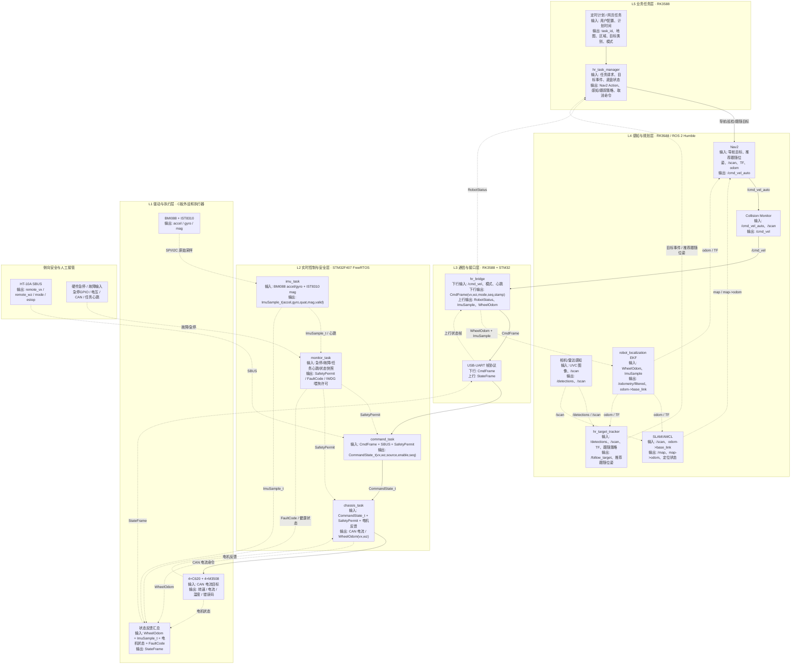

主逻辑按以下顺序理解：

1. **任务触发**：定时计划和网页请求都先进入任务管理器，由任务管理器决定导航目标和任务步骤，不能直接控制电机。
2. **视觉识别与跟随**：固定 RGB 相机负责目标类别和图像方位；`hr_target_tracker` 将 YOLO 检测框、相机内参、静态 TF 和 RPLIDAR 角度窗口/聚类结果关联，形成可短时跟踪的局部目标。相机不参与 SLAM 建图，不直接向 Nav2 costmap 写入障碍，也不能在雷达关联失败时独立给出目标距离。
3. **自主导航与跟随**：RPLIDAR A1 为 SLAM、定位、Nav2 局部代价地图和 Collision Monitor 提供环境数据。搜索阶段由 Nav2 到达指定地图区域的搜索点；跟随阶段由 `hr_target_tracker` 输出目标观测和推荐跟随位姿，`hr_task_manager` 将其作为 Nav2 动态目标更新。首版不设置独立 `hr_motion_mux` 或跟随速度控制器，自动速度统一由 Nav2 发布到 `/cmd_vel_auto`；`/cmd_vel_auto` 再由 Collision Monitor 作最后否决，最终以 `/cmd_vel` 经 `hr_bridge` 发往 STM32。上位机不配置 Velocity Smoother。
4. **控制与安全**：STM32 负责控制源仲裁和底盘实时闭环。SBUS 遥控直接进入 STM32，优先级高于 ROS 2 自动控制；硬件急停和故障保护仍可否决遥控与自动控制。
5. **状态反馈**：电机、原始轮式观测、IMU 和故障状态经 USB-UART 返回 ROS 2；RK3588 的 EKF 融合轮式 `vx/wz` 与 IMU `gyro_z`，可选使用 IST8310 辅助航向观测，输出统一里程计供导航闭环、任务状态机和网页显示使用。

### 2.3 硬件连接与通信架构

下图只表达硬件之间的数据和控制通信，不表达电源树、保险、接地、隔离和急停回路；这些电气安全内容需要在硬件接口评审中另行冻结。

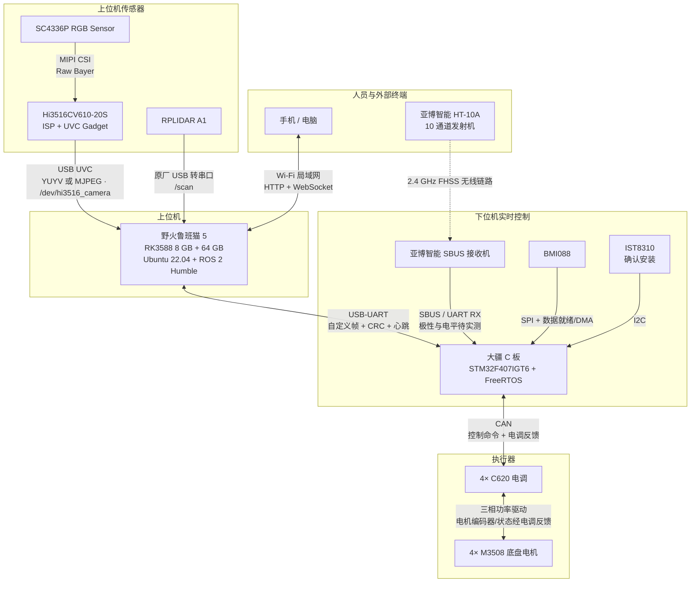

| 硬件链路 | 通信方式 | 方向 | 当前状态与约束 |
|---|---|---|---|
| 手机/电脑 ↔ 鲁班猫 5 | 外接 Wi-Fi 模块组成的局域网；HTTP/WebSocket | 双向 | 网页仅发送离散任务和读取状态，不远程直通 `/cmd_vel`；Ethernet 不作为日常上位机入口 |
| SC4336P → Hi3516CV610 | MIPI CSI | 单向 | Hi3516 完成 Sensor 驱动、ISP 和帧格式转换；不向 RK3588 输出深度或点云 |
| Hi3516CV610 → 鲁班猫 5 | USB UVC | 主要上行 | Hi3516 固件实现 UVC Gadget；鲁班猫侧持久化设备名为 `/dev/hi3516_camera`；优先验证 YUYV 640×480@20~30 FPS，带宽或画质不满足时验证 MJPEG 1280×720@15~20 FPS |
| RPLIDAR A1 → RK3588 | 原厂 USB 转串口适配器 | 主要上行 | RK3588 侧使用持久化设备名 `/dev/rplidar`，避免与 STM32 的 USB-UART 串口混淆；数据统一发布为 `/scan` |
| 鲁班猫 5 ↔ STM32 C 板 | USB-UART | 双向 | RK3588 侧持久化设备名为 `/dev/robot_mcu`；承载运动/模式/心跳下行和原始轮式观测/IMU/状态/故障上行，不使用 micro-ROS |
| HT-10A → SBUS 接收机 | 2.4 GHz FHSS | 无线单向控制 | 配对、通道方向和失控保护必须实测 |
| SBUS 接收机 → STM32 | SBUS，经 UART RX + DMA | 单向 | 需验证反相、电平、100 kbit/s 帧格式、失控位和断帧超时；人工接管不依赖 RK3588 |
| BMI088 → STM32 | SPI + DMA/数据就绪 | 主要上行 | 底盘与安全姿态源；RGB 相机不提供底盘姿态 |
| IST8310 → STM32 | I2C | 主要上行 | 已确认安装，用作低频航向参考；初始化失败、数据过期或磁场异常时停止磁力计校正并上报降级状态 |
| STM32 ↔ 4×C620 | CAN | 双向 | STM32 下发电流目标，C620 返回电机状态；CAN 总线分配和 ID 待冻结 |
| C620 ↔ M3508 | 电机三相线和电机反馈链 | 双向机电连接 | C620 执行功率驱动；不是 ROS 2 或 STM32 直接串口通信 |

---

## 三、各层模块具体实现

本章按照参考 PDF 的范式，对每个模块统一给出：**模块定位、输入、输出、对应软件/硬件、具体实现步骤、异常处理和模块流程图**。

### 3.1 RK3588 上位机 / Host 模块

| 项目 | 内容 |
|---|---|
| 模块定位 | 非硬实时计算核心，负责感知、规划、决策和系统管理 |
| 输入 | Hi3516 UVC 彩色图像、RPLIDAR 扫描、定时计划、网页任务请求、STM32 上传的原始轮式观测/IMU/状态 |
| 输出 | `/cmd_vel`、`/detections`、任务模式、配置和心跳 |
| 对应软件 | Ubuntu 22.04、ROS 2 Humble、`hr_bringup`、`hr_task_manager`、`hr_target_tracker` |
| 通信方式 | ROS 2 Topic/Action/Service；USB UVC；USB-UART；Ethernet/Wi-Fi |

具体实现步骤：

1. `systemd` 启动 ROS 2 bringup，按依赖顺序拉起 bridge、相机、雷达、EKF、定位、导航、感知、目标跟踪和 Collision Monitor。
2. CPU 大核优先运行 SLAM/Nav2，小核承担设备驱动、bridge 和后台服务，NPU 运行 RKNN INT8 视觉模型。
3. 业务层接收定时计划或网页任务请求，由 `hr_task_manager` 的任务状态机统一发布地图/区域搜索目标、视觉识别类别、跟随模式和任务取消请求；Nav2 内部行为树只负责单次导航的规划、控制、恢复和取消执行，不承担跨导航、视觉搜索与跟随步骤的业务编排。
4. 上位机只向下位机输出底盘速度和模式目标，不直接发送电机电流或大疆电机 CAN 控制帧。
5. 64 GB 存储采用日志轮转；rosbag 必须配置容量上限或写入扩展存储。

异常处理：ROS 2 节点退出由 `systemd`/launch 重启；感知或定位失效时取消自动任务并发布零速；bridge 失联由 STM32 独立超时停车。

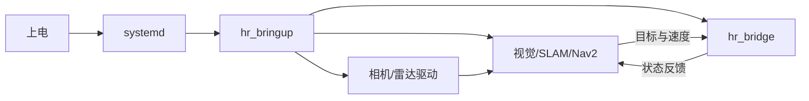

#### 3.1.1 任务触发方式与控制优先级

本项目采用“业务任务触发”和“实时运动接管”分离的设计。定时自动巡检和手机/电脑网页均进入 RK3588 的 `hr_task_manager`；长耗时、可反馈、可取消的运动任务统一使用 ROS 2 Action：网页/计划侧通过 `ExecuteTask` Action 请求任务，`hr_task_manager` 再调用 Nav2 的 `NavigateToPose`、`FollowWaypoints` 等 Action。ROS 2 Service 仅用于短时同步操作，例如配置查询、参数校验、清故障请求或一次性状态查询，不承载巡检、导航、搜索、跟随等运动任务。定时任务和网页二者均不得直接发布 `/cmd_vel`。HT-10A 的 SBUS 接收机直接进入 STM32 `command_task`，与上位机字节流使用独立 DMA 接收槽；人工接管不依赖网页、ROS 2 或上位机链路存活。

| 触发方式 | 入口与执行位置 | 允许操作 | 失效或冲突处理 |
|---|---|---|---|
| 定时自动巡检 | `hr_task_manager` 内的计划调度器读取持久化巡检计划 | 按路线依次发送 Nav2 导航目标，执行到点停留/观察；可在指定区域内启用目标搜索和观察记录，完成后返回待机点或后续指定点 | 定位无效、传感器故障、已有高优先级任务或人工接管时不得启动；运行中被接管则取消当前 Nav2 目标并保存任务结果，不自动恢复 |
| 手机或电脑网页 | 局域网网页前端 → `hr_web_ui` 后端 → `hr_task_manager` | 选择已验收地图、房间/区域、目标类别和任务模式（巡检、搜索、跟随、仅观察）；只发送离散任务请求 | 页面断开不产生新命令；已接受任务按任务策略继续，只有显式取消、人工接管、目标丢失超时或安全故障才中止；重复请求用 `task_id` 去重 |
| HT-10A 遥控器主动接管 | SBUS → `command_task` 控制源仲裁 | 异常场景下直接控制底盘，切换自动/人工模式并请求急停 | 有效接管请求立即覆盖定时和网页任务；遥控失联时目标归零并保持人工/安全态，禁止自动回退到上位机控制 |

任务来源统一记录为 `TaskSource{SCHEDULE, WEB}`，并携带唯一 `task_id`、创建时间、`map_id`、`area_id`、目标类别、任务模式、搜索路线、跟随策略、超时和取消状态。这里的 `source` 只是任务审计和优先级判断字段，表示任务来自定时计划还是网页请求，不表示速度控制源；真正的运动速度仍只能由 Nav2 经过 Collision Monitor 输出到下位机。网页是人机交互入口，不允许提供绕过 Nav2、Collision Monitor 和下位机仲裁的远程摇杆控制；如后续确需网页遥操作，必须作为独立功能重新进行时延、断链和安全评审。

`schedules.yaml` 是 RK3588 本地保存的定时计划配置文件，网页可以作为它的配置入口：用户在网页上新增、启用、停用或修改计划后，由 `hr_web_ui` 后端校验并写入该文件或等价的持久化配置；`hr_task_manager` 启动时读取它，运行中也可通过受控接口重新加载。首版实现也允许工程人员直接编辑该文件，但最终执行前仍必须经过统一校验和任务准入检查。

`PRECHECK` 指 `hr_task_manager` 内部的任务准入检查，不是任务队列。定时计划或网页请求先生成“候选任务”，只有在地图/区域合法、定位新鲜、Nav2 就绪、雷达/IMU/STM32 状态正常、没有活动运动任务、没有 HT-10A 人工接管且安全状态允许时，候选任务才会变成正在执行的活动任务；不满足条件时直接拒绝、跳过或记录错过，不在后台堆积等待执行。

控制优先级固定为：

1. **安全否决**：硬件急停、安全故障、机械/电流限位和 `monitor_task` 的 `safe_stop`；任何来源均不得绕过。
2. **HT-10A 遥控器人工接管**：在所有运动控制源中优先级最高，覆盖定时巡检、网页任务及其他自动任务。
3. **上位机自动任务**：定时巡检与网页任务由 `hr_task_manager` 串行仲裁，同一时刻只允许一个活动运动任务；默认不互相抢占，冲突请求返回“忙”，显式取消后方可启动新任务。
4. **无有效控制源**：底盘目标归零并进入安全保持状态。

遥控器从自动切入人工时，`command_task` 先将自动目标置无效，进入 `REMOTE_ARMING` 并确认摇杆回中后才接受新的人工速度；STM32 同时通过 `Robot_Status_t` 上报接管状态，RK3588 收到后取消 Nav2 Action。遥控器退出人工模式后不得恢复旧速度，必须确认摇杆回中、遥控数据有效、安全状态允许，并等待新的上位机命令序号；业务任务由 `hr_task_manager` 重新创建。

当前不实现自主回充。若电池/BMS 已提供经验证的可靠电量或电压数据，低电量状态应拒绝新的定时/网页巡检并通过网页告警，严重低电量应取消活动自动任务并在安全位置停车；系统不得生成“返回充电桩”目标。阈值和恢复条件在电源方案冻结后确定。

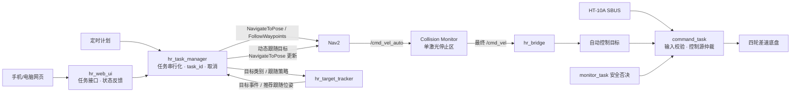

#### 3.1.1.1 定时计划模块

| 项目 | 内容 |
|---|---|
| 模块定位 | L5 业务任务入口之一，在 RK3588 本地按持久化计划生成自动任务请求 |
| 输入 | `schedules.yaml`、当前时间、地图/区域/路线配置、`/robot_status`、`/odometry/filtered`、任务状态 |
| 输出 | 带唯一 `task_id` 的内部任务事件或 `/task/execute` Action 请求；拒绝/错过/启动记录 |
| 对应软件 | `hr_task_manager/src/scheduler/`、`hr_task_manager/config/schedules.yaml`、`task_policy.yaml` |
| 明确不负责 | 不发布 `/cmd_vel`，不直接调用下位机，不绕过任务互斥和前置检查 |

定时计划由 `hr_task_manager` 进程内部的 scheduler 子模块实现，首版不单独拆成一个 ROS 2 节点。推荐实现为 `hr_task_manager/src/scheduler/` 下的 `ScheduleManager` 或等价 C++ 类，由 `hr_task_manager` 主节点创建并持有；它负责读取配置、计算下一次触发时间、生成候选任务事件，候选任务再交给 `hr_task_manager` 的统一任务状态机做准入检查和执行编排。

`schedules.yaml` 定义为 RK3588 上定时计划模块的持久化配置文件，存放“什么时候、在哪张地图、到哪个区域或路线、执行哪类业务任务”。它不是 STM32 的硬件定时器配置，也不是 FreeRTOS 任务配置；STM32 不读取该文件。网页端只负责提供可视化配置入口，真正的计划触发、任务准入和任务执行仍由 `hr_task_manager` 完成。

文件职责固定如下：

| 内容 | 说明 |
|---|---|
| 保存位置 | `hr_task_manager/config/schedules.yaml`，随 RK3588 上位机程序部署 |
| 写入来源 | 首版允许工程人员离线编辑；网页配置功能完成后，由 `hr_web_ui` 后端校验后写入 |
| 读取者 | `hr_task_manager` 内部 scheduler 子模块，启动时加载，运行中通过受控 Reload 接口重新加载 |
| 触发者 | scheduler 子模块根据系统日历时间触发，不依赖 Linux `cron`，也不依赖 STM32 定时中断 |
| 执行者 | `hr_task_manager` 任务状态机执行任务准入、Nav2 Action 调用、感知策略切换和任务结束处理 |
| 表达内容 | 计划启停、触发时间、地图/区域/路线、目标类别、任务模式、超时、错过策略 |
| 不表达内容 | 不保存实时速度，不保存电机参数，不保存下位机 PID，不保存遥控器控制状态 |

推荐字段如下，具体枚举值以后以 `hr_interfaces` 和地图配置文件为准：

```yaml
schedules:
  - schedule_id: morning_patrol
    enabled: true
    timezone: Asia/Shanghai
    trigger:
      type: daily
      time: "09:00"
    task:
      type: patrol
      map_id: home_v1
      route_id: living_room_route
      area_id: living_room
      target_class: person
      mode: search_then_observe
    policy:
      max_duration_s: 900
      miss_policy: skip
      conflict_policy: reject_when_busy
```

字段含义：

| 字段 | 含义 |
|---|---|
| `schedule_id` | 计划编号，用于生成 `task_id`、日志查询和网页显示 |
| `enabled` | 是否启用该计划，关闭后不触发候选任务 |
| `timezone` | 日历触发使用的时区，首版固定为 `Asia/Shanghai` |
| `trigger` | 触发规则，可先支持每天固定时间，后续再扩展每周/间隔触发 |
| `task` | 业务任务参数，对应网页手动创建任务时选择的地图、区域、路线、目标类别和模式 |
| `policy` | 执行策略，包含最大执行时长、错过策略和冲突策略 |

网页修改定时计划时不直接让机器人运动，而是走“配置写入”流程：前端提交计划参数，`hr_web_ui` 后端校验字段和地图/区域合法性，写入临时文件后原子替换 `schedules.yaml`，再通知 `hr_task_manager` 重新加载。重新加载只影响后续触发；已经被接受并正在执行的任务不因配置文件变化而中途改目标，除非用户显式取消当前任务后重新创建。

具体实现步骤：

1. 启动时从 `schedules.yaml` 读取启用的计划项，字段至少包含 `schedule_id`、时区、触发时间或周期、`map_id`、`area_id/route_id`、`target_class`、`mode`、错过策略和最大执行时长。
2. 调度器使用单调时钟和系统时间双重记录：系统时间用于日历触发，单调时钟用于运行超时和防重复触发。
3. 计划到时后先生成候选任务，候选任务进入 `hr_task_manager` 的统一任务准入检查（`PRECHECK`），检查地图/区域有效、定位新鲜、Nav2 就绪、雷达/IMU/STM32 状态正常、当前没有活动运动任务、未被 HT-10A 接管。
4. 前置检查通过后创建 `task_id = schedule_id + planned_time + sequence`，进入 `ACCEPTED/RUNNING`，再由 `hr_task_manager` 调用 Nav2 Action 和感知/跟踪策略。
5. 前置检查失败、任务冲突或处于人工接管时不排队强行执行；按错过策略记录为 `SKIPPED/REJECTED/MISSED`，并通过 `/task/status` 和网页状态上报。
6. 每次计划触发、拒绝、开始、取消、完成都写入任务日志，记录原始计划时间、实际处理时间、任务参数、拒绝原因和最终结果。

异常处理：系统时间跳变时不补跑大量历史计划，只按 `miss_policy` 处理最近一次触发；配置文件损坏或字段非法时禁用对应计划并上报诊断；运行中的计划任务被遥控接管、安全故障或定位失效中断后，不自动恢复旧任务，下一次计划触发重新创建新任务。

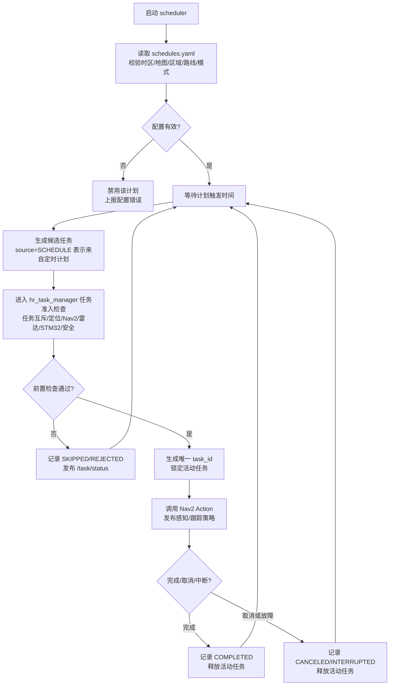

#### 3.1.1.2 `hr_web_ui` 网页任务模块

| 项目 | 内容 |
|---|---|
| 模块定位 | L5 人机交互入口，提供局域网任务创建、取消、状态查看和基础配置选择 |
| 输入 | 手机/电脑 HTTP 请求、WebSocket 连接、用户选择的地图/区域/目标类别/模式、ROS 2 状态 Topic |
| 输出 | 作为 `/task/execute` 的 Action Client 发送 Goal/Cancel、网页状态、参数校验错误、操作审计记录 |
| 对应软件 | `hr_web_ui` 前端与后端、`hr_interfaces/action/ExecuteTask`、`hr_interfaces/msg/TaskStatus` |
| 明确不负责 | 不发布 `/cmd_vel`，不提供首版远程摇杆，不直接写 STM32 协议帧，不绕过 Collision Monitor |

具体实现步骤：

1. 网页启动后通过 HTTP 获取地图列表、区域列表、路线列表、可识别目标类别、当前任务状态、控制源、安全状态和故障状态。
2. 用户创建任务时，前端只允许选择已验收地图、区域/路线、目标类别和任务模式；后端再次校验参数合法性，生成客户端请求 ID，防止刷新页面重复提交。
3. 后端作为 `/task/execute` 的 Action Client，将合法请求转换为 `ExecuteTask.Goal` 目标数据并发送给 `hr_task_manager`；Goal 字段至少包含 `task_id/source/type/map_id/area_id/location_or_route/target_class/mode/options`。网页任务的 `source=WEB`，定时任务的 `source=SCHEDULE`，二者都只是任务来源标记。
4. 任务执行中通过 WebSocket 推送 `/task/status`、`/robot_status`、定位状态、目标锁定状态和失败原因；页面只显示状态，不参与实时速度闭环。
5. 用户点击取消时，后端调用 `/task/execute` Cancel；`hr_task_manager` 负责取消 Nav2 Goal、禁用感知/跟随策略并等待系统进入安全状态。
6. 页面断开或刷新不自动取消已接受任务，也不重新创建任务；同一请求 ID 重复提交时返回已有任务状态。

异常处理：鉴权失败、参数非法、地图/区域未验收、任务忙、定位或安全状态不满足时，后端拒绝创建任务并返回明确原因；WebSocket 断开只影响显示，不影响已接受任务；如果后端进程重启，必须从 ROS 2 当前 `/task/status` 和任务日志恢复页面状态，不补发旧 Goal。

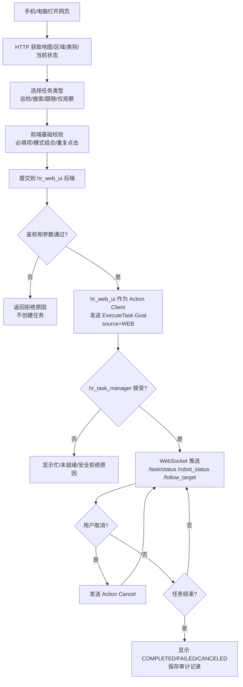

#### 3.1.1.3 主架构模块展开索引

主架构图中的模块必须在后文存在对应展开说明，并配套模块流程图或数据时序图；首版按下表维护一致性：

| 主架构模块 | 对应展开位置 | 说明 |
|---|---|---|
| 定时计划 | §3.1.1.1 | 本地计划读取、触发、错过策略和任务创建 |
| 网页任务 / `hr_web_ui` | §3.1.1.2、§3.1.2 | 局域网任务入口、状态显示、取消和参数校验 |
| `hr_task_manager` | §3.1.1、§3.1.2 | 任务互斥、状态机、Nav2 Action、感知/跟踪策略 |
| 相机/雷达感知 | §3.2、§3.3、§3.4 | UVC 图像、RPLIDAR 扫描和 RKNN YOLO |
| `hr_target_tracker` | §3.4.1 | 图像方位、雷达距离关联、目标锁定和推荐跟随位姿 |
| `robot_localization` EKF | §3.1.3、§3.5 | 轮式观测和 IMU 融合，唯一输出 `odom→base_link` |
| SLAM/AMCL | §3.1.3、§3.5 | 建图/定位互斥，唯一输出 `map→odom` |
| Nav2 | §3.1.2、§3.5 | 搜索、巡检和目标跟随的统一运动执行 |
| Collision Monitor | §3.1.3、§3.5、§6 | 上位机速度安全门，输出最终 `/cmd_vel` |
| `hr_bridge` / USB-UART | §3.6、§8 | ROS 2 与 STM32 帧协议边界 |
| `command_task` | §3.10、§4 | 上位机命令、SBUS 和安全许可仲裁 |
| `chassis_task` | §3.9、§4 | 差速解算、PID、电流输出和轮速正解 |
| `imu_task` | §3.10.1、§4 | BMI088/IST8310 采样、Mahony 和 IMU 快照 |
| `monitor_task` | §3.11、§4、§6 | 安全状态、任务心跳、故障码和 IWDG |
| HT-10A SBUS | §3.10.2、§4 | 人工接管通道、失控检测和命令仲裁输入 |
| 硬件急停 / 故障输入 | §3.11、§6 | 安全否决、故障锁存和恢复条件 |
| BMI088 + IST8310 | §3.10.1 | 原始采样、标定、Mahony 和磁力计降级 |
| C620/M3508 与状态反馈 | §3.9、§3.11、§8 | 电机执行、反馈汇总和上行状态帧 |

#### 3.1.2 上位机 ROS 2 节点与连接关系

`hr_bringup` 是启动与参数编排包，不承担业务逻辑。`systemd` 启动 `hr_bringup` 后，由 ROS 2 launch 按依赖顺序拉起设备、TF、通信、定位、导航、感知、任务和网页节点。建图模式与加载已有地图的导航模式互斥；两种模式不得同时发布 `map→odom`。

| 节点/节点组 | 所属包 | 主要输入 | 主要输出 | 责任边界 |
|---|---|---|---|---|
| `/camera/usb_cam` | `usb_cam` | `/dev/hi3516_camera` UVC 数据 | `/camera/image_raw`、`/camera/camera_info`、相机诊断 | 只负责 V4L2/UVC 采集、格式转换和时间戳，不做目标识别 |
| `/lidar/sllidar_node` | `sllidar_ros2`（A1 配置） | RPLIDAR A1 扫描 | `/scan` | 使用 A1 启动配置，只发布扫描和设备诊断 |
| `/robot_state_publisher` | `robot_state_publisher` | URDF | `base_link→camera_link/laser_frame/imu_link` 等静态 TF | 相机固定安装，不存在云台动态关节；不发布 `map→odom` 和 `odom→base_link` |
| `/hr_bridge` | `hr_bridge` | 最终 `/cmd_vel`、任务模式；STM32 上行帧 | `/wheel/odom_raw`、`/imu/data`、`/robot_status`、`/diagnostics` | ROS 2 与 STM32 的唯一业务通信边界；不进行状态融合且不发布里程计 TF；视觉识别结果不下发 STM32 |
| `/ekf_filter_node` | `robot_localization` | `/wheel/odom_raw`、`/imu/data` | `/odometry/filtered`、`odom→base_link` | `two_d_mode=true`；融合轮式 `vx/wz` 与 IMU `gyro_z`，IST8310 航向作为可选观测；唯一发布 `odom→base_link` |
| `/slam_toolbox` | `slam_toolbox` | `/scan`、TF | `/map`、`map→odom` | 建图模式启用；通过 TF 获取 `odom→base_link`，不要求订阅名为 `/odom` 的话题 |
| `/map_server` + `/amcl` | Nav2 | 已保存地图、`/scan`、TF | `/map`、定位位姿、`map→odom` | 已知地图定位模式启用；通过 TF 获取运动关系，与建图模式的 `map→odom` 发布者互斥 |
| Nav2 导航节点组 | `nav2_*` | `/map`、`/scan`、`/odometry/filtered`、TF、导航/跟随目标 | 路径、恢复结果、`/cmd_vel_auto` | 包含 `planner_server`、`controller_server(DWB)`、`bt_navigator`、`behavior_server`、`waypoint_follower` 和生命周期管理器；负责到达搜索区、巡检点和跟随阶段的动态目标，不直接接收网页速度 |
| `/hr_perception` | `hr_perception` | `/camera/image_raw`、`CameraInfo`、目标类别/识别开关 | `/detections`、目标事件、视觉诊断 | 完成 RKNN YOLO 二维检测和事件门控；输出类别、置信度和二维框，不独立测距、不输出底盘速度、不向局部代价地图提供障碍 |
| `/hr_target_tracker` | `hr_target_tracker` | `/detections`、`/scan`、`/camera/camera_info`、TF、任务目标类别和跟随策略 | `/follow_target`、目标锁定/丢失事件、推荐跟随位姿、跟踪诊断 | 将检测框中心换算为相机方位角，并在对应雷达角度窗口/聚类中关联距离；只输出目标观测和推荐 Nav2 跟随目标，不输出底盘速度 |
| `/collision_monitor` | `nav2_collision_monitor` | `/cmd_vel_auto`、`/scan` | 最终 `/cmd_vel` | 首版仅配置一个激光停止区；进入停止区即请求零速，不承担正常避障、速度平滑或物理紧急制动 |
| `/hr_task_manager` | `hr_task_manager` | 定时计划、网页 `ExecuteTask`、`/robot_status`、Nav2/感知/跟踪结果 | Nav2 Action 目标、目标类别/识别开关、跟随策略、`/task/status`、取消请求 | 系统唯一业务任务仲裁器，同一时刻只允许一个活动运动任务；负责“搜索区导航→目标扫描→跟随/观察”的阶段切换 |
| `/hr_web_ui` | `hr_web_ui` | 手机/电脑 HTTP/WebSocket 请求、ROS 2 状态 | `ExecuteTask` Action 请求、状态页面 | 只做鉴权、地图/区域/目标/模式选择、参数校验和状态转换，不发布 `/cmd_vel` 或跟随速度 |
| `/diagnostics_aggregator` | `diagnostic_aggregator` | 各节点 `/diagnostics` | 汇总诊断 | 汇总显示和记录，不参与控制仲裁 |

**`hr_task_manager` 业务状态机：**

`hr_task_manager` 是 RK3588 上的业务任务状态机节点，只负责任务编排、Action 调用、阶段切换和状态发布，不直接发布 `/cmd_vel`。巡检、搜索和跟随任务必须经过前置检查；人工接管、安全故障、定位/Nav2/STM32 失效会中断当前任务，旧任务不得自动恢复。

`hr_task_manager` 使用的 ROS 2 接口建议冻结为：

| 接口方向 | 本节点 ROS 2 实体 | 接口名 | 接口类型定义 | 对端节点身份 | 用途 |
|---|---|---|---|---|---|
| 接收任务 | Action Server | `Action: /task/execute` | `hr_interfaces/action/ExecuteTask` | `/hr_web_ui` 为 Action Client；计划调度器为节点内部事件源 | 接收网页或定时计划创建的巡检、搜索、跟随、观察任务；支持反馈、结果和取消 |
| 调用导航 | Action Client | `Action: /navigate_to_pose` | `nav2_msgs/action/NavigateToPose` | Nav2 `bt_navigator` 为 Action Server | 发送单个搜索区、观察点或待机点目标，并接收反馈/结果 |
| 调用巡检路线 | Action Client | `Action: /follow_waypoints` | `nav2_msgs/action/FollowWaypoints` | Nav2 `waypoint_follower` 为 Action Server | 发送有序巡检点，任务管理器负责到点后的观察、搜索和阶段切换 |
| 订阅安全状态 | Topic Subscriber | `Topic: /robot_status` | `hr_interfaces/msg/RobotStatus` | `/hr_bridge` 为 Topic Publisher | 判断 STM32 链路、控制源、遥控接管、安全故障、看门狗健康状态 |
| 订阅定位状态 | Topic Subscriber | `Topic: /odometry/filtered` | `nav_msgs/msg/Odometry` | `/ekf_filter_node` 为 Topic Publisher | 判断定位/里程计新鲜度，并作为任务前置条件和运行中依赖 |
| 订阅目标状态 | Topic Subscriber | `Topic: /follow_target` | `hr_interfaces/msg/FollowTarget` | `/hr_target_tracker` 为 Topic Publisher | 获取目标锁定、丢失、距离、方位和雷达关联状态 |
| 发布任务状态 | Topic Publisher | `Topic: /task/status` | `hr_interfaces/msg/TaskStatus` | `/hr_web_ui`、日志、诊断为 Topic Subscriber | 发布任务阶段、进度、结果、失败原因、接管和取消原因 |
| 控制视觉搜索 | Topic Publisher | `Topic: /task/perception_control` | `hr_interfaces/msg/PerceptionControl` | `/hr_perception` 为 Topic Subscriber | 发布目标类别、识别启停、搜索/观察阶段门控 |
| 控制目标关联 | Topic Publisher | `Topic: /task/tracker_policy` | `hr_interfaces/msg/TrackerPolicy` | `/hr_target_tracker` 为 Topic Subscriber | 发布目标类别、搜索区域、关联窗口和目标丢失策略 |
| 控制跟随策略 | Topic Publisher | `Topic: /task/follow_policy` | `hr_interfaces/msg/FollowPolicy` | `/hr_target_tracker` 为 Topic Subscriber | 发布是否允许跟随、期望距离、角度误差、丢失超时和禁用命令；目标跟随后续仍由 Nav2 执行 |
| 控制自动阶段 | Topic Publisher | `Topic: /task/motion_phase` | `hr_interfaces/msg/MotionPhase` | Nav2 生命周期管理、`hr_target_tracker` | 发布当前自动阶段是 `NAVIGATING/FOLLOWING/ZERO`，要求切换先归零；自动速度仍只有 Nav2 发布 `/cmd_vel_auto` |

接口名称本身不能可靠判断它是 Topic、Action 还是 Service，必须同时看“接口种类”和 `.msg/.action/.srv` 类型定义。`/task/execute`、`/task/status` 中的 `/task` 是 ROS 2 接口命名空间前缀，用来把业务任务相关接口归到同一组；它不是单独的节点，也不是必须存在的 Topic。首版也可按节点私有命名空间写成 `/hr_task_manager/execute`、`/hr_task_manager/status`，但全项目必须统一一种命名方式。本文推荐 `/task/*`，含义是“业务任务接口族”。

**正常任务执行时序：**

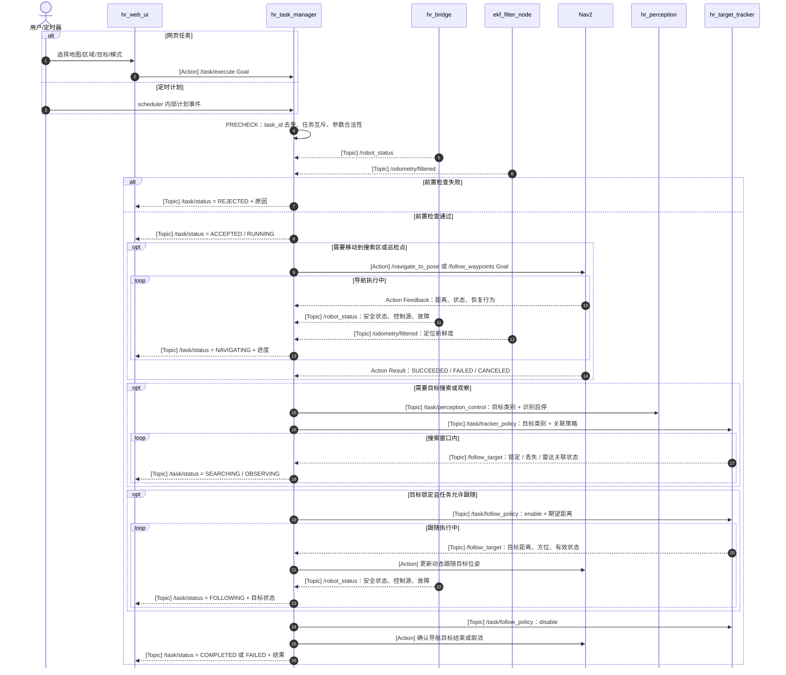

**取消与中断处理：**

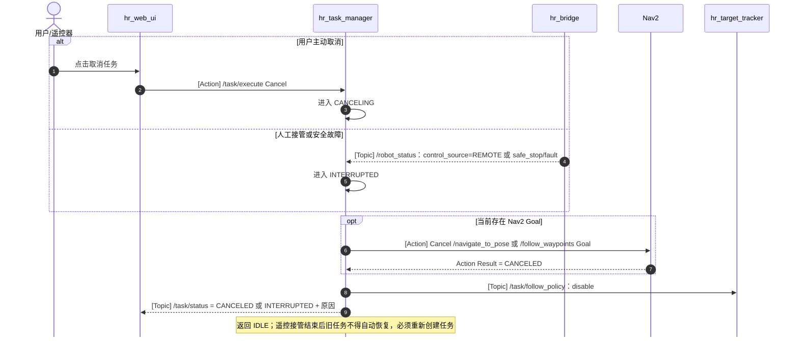

状态机执行约束：

1. `IDLE` 之外同一时刻只允许一个活动运动任务；冲突请求返回“忙”，不得抢占已有自动任务。
2. `PRECHECK` 必须检查地图/区域有效性、定位状态、Nav2 生命周期、雷达、EKF、STM32 `/robot_status`、安全状态和任务参数合法性。
3. `NAVIGATING` 只调用 Nav2 Action，不发布速度；速度由 Nav2 在导航阶段发布到 `/cmd_vel_auto`，再经 Collision Monitor → `hr_bridge` 链路产生。
4. `SEARCHING` 只控制目标类别、识别开关和搜索策略；视觉结果不得绕过 `hr_target_tracker` 与安全速度链。
5. `FOLLOWING` 不直接发布速度；`hr_target_tracker` 输出 `/follow_target` 和推荐跟随位姿，`hr_task_manager` 按新鲜度和跳变门限更新 Nav2 动态目标，自动速度仍只由 Nav2 输出。
6. `CANCELING` 和 `INTERRUPTED` 必须取消 Nav2 Goal、禁用跟随策略、要求 `/cmd_vel_auto` 归零并发布明确原因；遥控接管结束后旧任务不得自动续跑，必须重新创建任务。

上位机节点按“启动就绪”和“任务执行”两条时序说明，避免把持续数据流与单次任务请求混在一张连线图中。

**启动与就绪时序：**

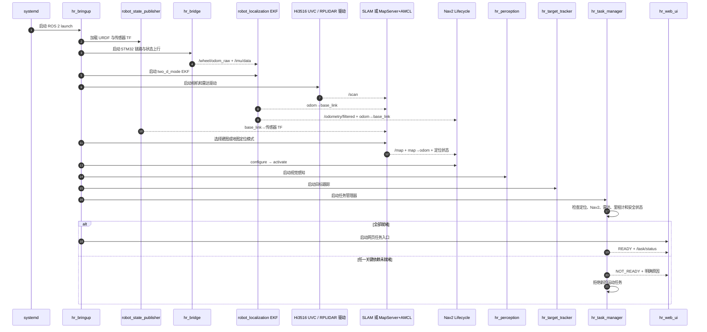

**导航/巡检任务执行时序：**

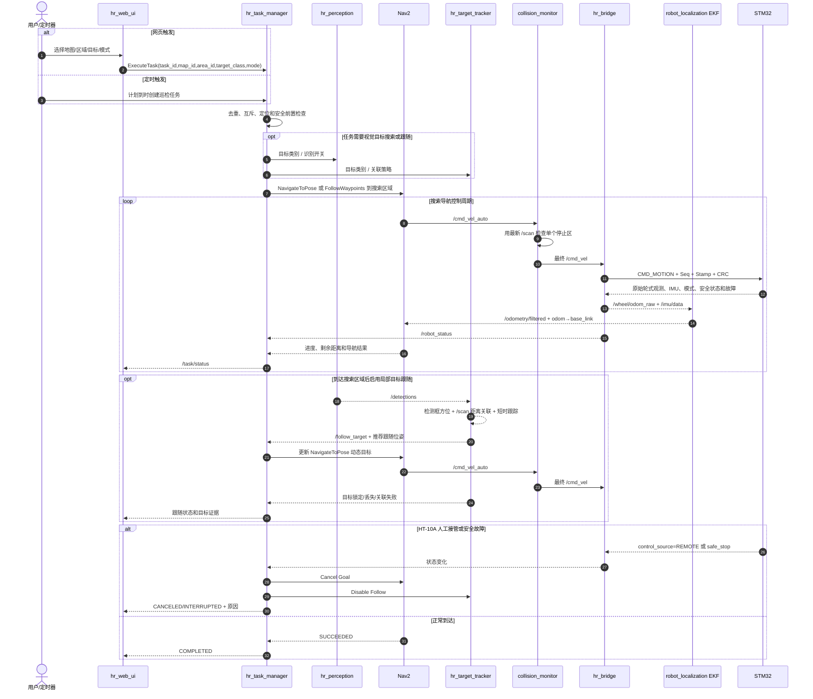

关键 ROS 2 接口建议冻结为：

| 接口 | 类型 | 生产者 → 消费者 | 用途与约束 |
|---|---|---|---|
| `/scan` | `sensor_msgs/msg/LaserScan` Topic | 雷达驱动 → 定位、Nav2、Collision Monitor | 保留设备时间戳和 `laser_frame`；过期后自动导航无效 |
| `/wheel/odom_raw` | `nav_msgs/msg/Odometry` Topic | `hr_bridge` → EKF、诊断 | 承载 STM32 轮速正解得到的 `vx/wz` 及协方差、独立时间戳和有效标志；不代表最终融合位姿，不发布 TF |
| `/imu/data` | `sensor_msgs/msg/Imu` Topic | `hr_bridge` → EKF、诊断 | 承载 BMI088 `accel/gyro`、Mahony 四元数和 IST8310 `mag[3]` 对应状态；必须携带独立时间戳、协方差和有效/降级状态 |
| `/odometry/filtered` | `nav_msgs/msg/Odometry` Topic | EKF → Nav2、任务、网页、诊断 | `robot_localization` 默认融合结果；`frame_id=odom`，`child_frame_id=base_link`。本项目不重映射为 `/odom` |
| `/detections` | `vision_msgs/msg/Detection2DArray` Topic | `hr_perception` → `hr_target_tracker`、`hr_task_manager`、网页、日志 | 包含类别、置信度、二维框和时间戳；仅表达图像检测结果，不单独代表目标距离或地图位置 |
| `/follow_target` | `hr_interfaces/msg/FollowTarget` Topic | `hr_target_tracker` → `hr_task_manager`、网页、日志 | 包含 `target_id/class/range/bearing/position_base/confidence/stamp/state` 和推荐跟随位姿；只在 YOLO 与雷达关联通过时有效，过期或丢失后不得继续驱动跟随 |
| `/navigate_to_pose` | `nav2_msgs/action/NavigateToPose` Action | `hr_task_manager` → Nav2 | 单目标导航，使用 `map` 坐标系，任务管理器处理反馈、取消和结果 |
| `/follow_waypoints` | `nav2_msgs/action/FollowWaypoints` Action | `hr_task_manager` → Nav2 | 定时巡检的有序巡检点；到点观察动作由任务管理器或 waypoint task executor 编排 |
| `/task/execute` | `hr_interfaces/action/ExecuteTask` Action | `hr_web_ui` → `hr_task_manager` | 目标包含 `task_id/source/type/map_id/area_id/location_or_route/target_class/mode`，结果包含成功、失败、拒绝和原因 |
| `/task/status` | `hr_interfaces/msg/TaskStatus` Topic | `hr_task_manager` → 网页、日志 | 包含活动任务、阶段、进度、Nav2 结果、控制源和中断原因 |
| `/task/perception_control` | `hr_interfaces/msg/PerceptionControl` Topic | `hr_task_manager` → `hr_perception` | 包含目标类别、识别启停、搜索/观察阶段和任务时间戳 |
| `/task/tracker_policy` | `hr_interfaces/msg/TrackerPolicy` Topic | `hr_task_manager` → `hr_target_tracker` | 包含目标类别、搜索区域、雷达关联窗口、目标跳变门限和丢失策略 |
| `/task/follow_policy` | `hr_interfaces/msg/FollowPolicy` Topic | `hr_task_manager` → `hr_target_tracker` | 包含跟随使能、期望距离、最小安全距离、目标跳变门限、跟随目标更新周期和丢失超时 |
| `/task/motion_phase` | `hr_interfaces/msg/MotionPhase` Topic | `hr_task_manager` → Nav2 生命周期管理、`hr_target_tracker` | 包含当前自动阶段 `NAVIGATING/FOLLOWING/ZERO`、切换原因和归零要求；自动速度仍只有 Nav2 发布 `/cmd_vel_auto` |
| `/robot_status` | `hr_interfaces/msg/RobotStatus` Topic | `hr_bridge` → 任务、网页、诊断 | 包含定位依赖状态、控制源、HT-10A 接管、故障和看门狗健康信息 |
| `/cmd_vel_auto` | `geometry_msgs/msg/Twist` Topic | Nav2 → `collision_monitor` | 当前自动速度候选；导航、巡检和目标跟随均由 Nav2 输出；`linear.y=0`，不得直接进入 `hr_bridge` |
| `/cmd_vel` | `geometry_msgs/msg/Twist` Topic | `collision_monitor` → `hr_bridge` | 上位机唯一最终速度话题；`linear.y` 必须为 0；其他节点禁止并行发布 |

TF 权威关系必须保持单一：`map→odom` 只能由当前定位模式（建图时 `slam_toolbox`，已知地图定位时 AMCL）产生；`odom→base_link` 只能由 EKF 产生；`base_link→camera_link/laser_frame/imu_link` 由 URDF/`robot_state_publisher` 产生。`hr_bridge` 不发布 TF。若任一关键 TF 缺失或时间戳过期，`hr_task_manager` 拒绝新任务，活动自动任务取消并进入零速；遥控人工接管仍由 STM32 独立完成。

启动顺序为：① `robot_state_publisher`、`hr_bridge`；② Hi3516 UVC 相机和雷达驱动；③ `robot_localization` EKF；④ 建图或地图定位节点；⑤ Nav2 生命周期节点；⑥ `hr_perception`、`hr_target_tracker` 和 Collision Monitor；⑦ `hr_task_manager`；⑧ `hr_web_ui`。相机离线只禁用视觉识别、目标搜索和跟随任务，不影响以 RPLIDAR A1 为唯一环境观测源的基础导航；雷达、定位、轮式观测、IMU、EKF 或 STM32 状态异常仍必须拒绝运动任务。

#### 3.1.3 上位机输入输出、状态估计与控制权威

上位机输入输出按“原始观测进入、唯一融合结果供消费、单一路径下发速度”冻结如下：

| 上位机模块 | 主要输入 | 主要输出 | 唯一责任 |
|---|---|---|---|
| `hr_bridge` | STM32 原始轮式观测、BMI088/IST8310 IMU 数据、设备与安全状态；最终 `/cmd_vel` | `/wheel/odom_raw`、`/imu/data`、`/robot_status`、`/diagnostics`；下行协议帧 | 协议和 ROS 消息映射，不融合位姿、不发布 TF |
| `robot_localization` EKF | `/wheel/odom_raw` 的 `vx/wz`，`/imu/data` 的 `gyro_z`，可选有效航向观测 | `/odometry/filtered`、`odom→base_link` | 平面状态估计的唯一权威；`two_d_mode=true`，约束 `z/roll/pitch/vy` |
| `slam_toolbox`（建图）或 AMCL（已知地图定位） | `/scan`、传感器静态 TF、EKF 发布的 `odom→base_link` | `/map`、`map→odom`、定位状态 | 二者按模式互斥，当前模式是 `map→odom` 的唯一权威 |
| Nav2 + DWB | 地图、定位 TF、`/scan`、`/odometry/filtered`、搜索区/巡检点/推荐跟随位姿 | 路径、导航结果、`/cmd_vel_auto` | 正常规划和主动避障；负责到达指定搜索区域、巡检点和跟随动态目标，不发布最终 `/cmd_vel` |
| `hr_target_tracker` | `/detections`、`/scan`、`/camera/camera_info`、TF、任务目标类别和跟随策略 | `/follow_target`、推荐跟随位姿、锁定/丢失/关联失败事件 | 只在图像目标与雷达距离可关联时输出局部目标和 Nav2 跟随目标建议；不能替代深度相机，不能把二维框直接当作三维位置 |
| Collision Monitor | `/cmd_vel_auto`、最新 `/scan` | `/cmd_vel` | 首版只用一个激光停止区作末端零速否决；不做减速区、不做路径规划 |
| `hr_task_manager` / `hr_web_ui` | Nav2、感知、目标跟踪、`/robot_status`、`/odometry/filtered`、诊断状态 | 任务 Action、搜索/跟随策略、任务状态和页面状态 | 业务编排与显示，不直接发布速度 |

完整数据流为：`STM32 轮速正解 → /wheel/odom_raw`，`STM32 ImuSample_t(accel/gyro/quat/mag) → /imu/data`，二者进入 EKF 后形成 `/odometry/filtered + odom→base_link`；`slam_toolbox` 或 AMCL 再结合 `/scan` 发布 `map→odom`。搜索导航和目标跟随速度链统一为 `Nav2 /cmd_vel_auto → Collision Monitor → /cmd_vel → hr_bridge → STM32`。本项目不创建 `/odom` 别名，不存在 `/cmd_vel_smoothed`，也不启动 Velocity Smoother；首版不设置独立 `hr_motion_mux` 或 `hr_follow_controller`。

`/scan` 过期、数据无效或 Collision Monitor 未运行、未激活、异常退出时，自动运动必须立即判定为不可用：任务管理器取消活动自动任务，Nav2 和 `hr_bridge` 不得继续沿用最后一个非零速度，STM32 依靠命令新鲜度超时和安全状态机将目标归零。任何节点均不得绕过 Collision Monitor 另行发布最终 `/cmd_vel`；恢复后也不得自动续跑旧任务，必须重新满足传感器、节点和安全状态就绪条件并重新提交任务。

Collision Monitor 的“停止”是上位机零速请求，不等同于硬件急停。STM32 是速度、加速度、减速度和电流限制的唯一物理执行权威，收到零速后仍按已冻结的安全斜坡执行；硬件急停、安全故障和电流保护继续在 STM32 侧独立否决。停止区必须大于机器人投影轮廓；直线运动方向的最小扩展量按 `d_zone ≥ v_max·T_total + v_max²/(2·a_decel) + d_margin` 估算，再用最不利地面实测修正。单个多边形还必须覆盖后退和原地旋转时车体角点的扫掠包络。具体几何尺寸、总延迟、允许减速度和安全余量需实车验证后冻结；验收目标是障碍物进入停止区后，机器人在接触障碍物或侵入冻结的最小安全间距前停住，而不是要求在停止区外边界处瞬时停住。

### 3.2 Hi3516CV610 + SC4336P USB UVC 相机模块

| 项目 | 内容 |
|---|---|
| 模块定位 | 固定前向二维彩色图像源，用于目标识别和视频预览 |
| 输入 | SC4336P MIPI Raw Bayer 图像 |
| 输出 | 标准 USB UVC 视频流；鲁班猫侧发布 `/camera/image_raw`、`/camera/camera_info` 和诊断 |
| 对应软件 | Hi3516 Sensor/ISP/VPSS + Linux UVC Gadget；鲁班猫侧 `usb_cam`/V4L2 |
| 连接方式 | SC4336P → MIPI → Hi3516CV610；Hi3516 USB Device/OTG → 鲁班猫 5 USB Host |
| 能力边界 | 无深度、无点云、无相机 IMU，不参与 Nav2 建图、定位或避障 |

具体实现步骤：

1. Hi3516 固件完成 SC4336P Sensor 驱动、ISP 和 VPSS 配置，并把视频帧送入 UVC Gadget 用户态输出队列。
2. 第一验证档采用 YUYV 640×480@20~30 FPS，以低延迟目标识别为主；若 USB 带宽或画质不满足，再验证 MJPEG 1280×720@15~20 FPS。最终格式必须以连续运行和端到端延迟实测冻结。
3. UVC 描述符只声明固件实际支持的格式、分辨率和帧间隔；USB 拔插后必须重新枚举并自动恢复采集。
4. 鲁班猫通过 udev 将摄像头固定命名为 `/dev/hi3516_camera`，`usb_cam` 使用 `mmap` 采集并发布标准 ROS 2 图像话题。
5. 相机固定安装，URDF 中使用静态 `base_link→camera_link`；完成内参标定并保存 `CameraInfo`。
6. ML307 Cat.1、RTSP 和相机侧目标识别不进入当前核心链路；YOLO 统一在鲁班猫 5 RK3588 NPU 上执行。

异常处理：图像超时、帧序号冻结、USB 断开或格式协商失败时停止发布有效检测结果并上报告警；相机恢复后重新初始化检测流水线。相机故障不影响以 RPLIDAR A1 为基础的导航，但依赖视觉的观察任务必须失败或降级。

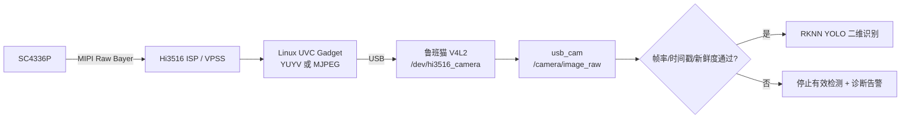

### 3.3 RPLIDAR 激光雷达模块

| 项目 | 内容 |
|---|---|
| 模块定位 | 室内二维环境感知和主要定位观测源 |
| 输入 | 周围物体距离和扫描角度 |
| 输出 | `/scan`、雷达在线状态和扫描频率 |
| 对应软件 | Slamtec `sllidar_ros2` A1 驱动、`hr_localization`、`hr_navigation` |
| 连接方式 | RPLIDAR A1 → 原厂 USB 转串口适配器 → RK3588 USB；设备持久化命名为 `/dev/rplidar` |
| 驱动基线 | A1 串口波特率 `115200`，`frame_id=laser_frame`，使用 `sllidar_a1_launch.py` 对应配置；串口权限通过 udev 规则配置 |

具体实现步骤：

1. 驱动按实物型号配置串口、扫描模式和转速，发布 `sensor_msgs/LaserScan`。
2. 静态 TF 定义 `laser_frame → base_link`，安装外参通过墙面直线和旋转测试校准。
3. `/scan` 同时进入 SLAM/AMCL 和 Nav2 局部代价地图。
4. 监控扫描频率、量程有效率、数据时间戳和设备重连次数。

异常处理：雷达数据过期立即停止导航输出；短时重连期间保持停车；不能仅用旧扫描继续避障。

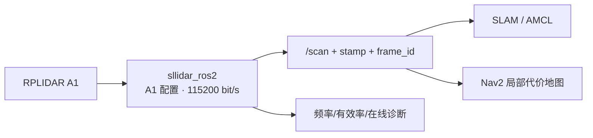

### 3.4 二维视觉目标识别模块

| 项目 | 内容 |
|---|---|
| 模块定位 | 从 UVC 彩色图像产生目标类别、置信度和二维检测框 |
| 输入 | `/camera/image_raw`、相机内参、任务指定目标类别 |
| 输出 | `/detections`：`Detection2DArray`；目标出现/消失事件和视觉诊断 |
| 对应软件 | `hr_perception`、RKNN、轻量 YOLO、事件门控 |
| 执行载体 | RK3588 NPU + CPU |

具体实现步骤：

1. 将检测模型转换为 RKNN INT8，NPU 输出目标框、类别和置信度。
2. 对检测框执行阈值、非极大值抑制和类别过滤，发布类别、置信度、二维框和图像时间戳。
3. 业务事件采用连续帧确认和消失超时，避免单帧误报；需要目标 ID 时只做二维短时跟踪，不输出距离。
4. `/detections` 供 `hr_target_tracker`、`hr_task_manager`、网页和日志使用，不映射到 `hr_bridge`，不直接产生底盘速度。
5. 当前不实现仅凭单目相机的目标三维定位、跌倒判断或深度障碍检测；目标跟随必须由二维检测框与 RPLIDAR 距离关联后才能更新 Nav2 跟随目标。雷达关联失败时只允许记录、告警或继续搜索，不允许自动接近目标。

异常处理：帧率下降时降低识别频率或跳帧；图像过期时停止发布有效事件。任何旧检测结果不得在相机断流后继续触发业务动作。

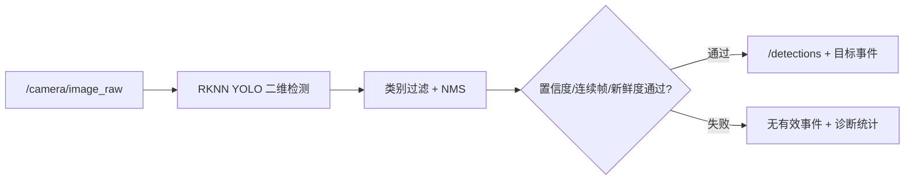

#### 3.4.1 指定地图/区域目标搜索与局部跟随

本项目支持由网页或定时计划提交“在指定地图的指定区域寻找指定目标”的业务任务。地图仍是 Nav2 使用的二维栅格地图；区域是 `map` 坐标系下的房间、多边形或搜索点集合；目标类别是 YOLO 标签集合中的可识别对象。区域配置不代表动态物体的固定坐标，只用于缩小搜索范围、生成搜索路线和限制误检处理范围。

视觉辅助目标跟随的核心链路冻结为：**YOLO 只负责找目标和给出图像方向，相机内参与静态 TF 将图像方向转换到机器人坐标系，RPLIDAR A1 在对应方向确认距离，`hr_target_tracker` 输出局部目标和推荐跟随位姿，`hr_task_manager` 将该位姿作为 Nav2 动态目标更新；速度仍由 Nav2 生成，并必须经过 Collision Monitor、`hr_bridge` 和 STM32。**

目标搜索与跟随分为三段：

1. `hr_task_manager` 根据 `map_id/area_id/target_class/mode` 加载已验收地图和搜索区域，调用 Nav2 将机器人移动到搜索区域入口或有序搜索点。
2. 到达搜索区域后，`hr_perception` 以任务指定类别运行 YOLO；`hr_target_tracker` 用检测框中心、`CameraInfo`、`base_link→camera_link/laser_frame` 静态 TF 和 `/scan` 在相同方位附近寻找雷达距离或点簇，输出 `/follow_target`。
3. 若任务模式为 `follow` 且目标连续锁定，`hr_target_tracker` 按冻结的期望距离、最小安全距离、目标跳变门限和目标丢失超时计算推荐跟随位姿；`hr_task_manager` 以受限频率更新 Nav2 目标。自动速度仍由 Nav2 输出 `/cmd_vel_auto`，再进入 Collision Monitor 和 STM32 安全链。

目标方向计算冻结为：

```ini
alpha = atan((u - cx) / fx)
```

其中 `u` 为检测框中心横坐标，`cx/fx` 来自相机标定后的 `CameraInfo`。`alpha` 表示目标相对相机光轴的水平偏角，随后通过 `base_link→camera_link` 与 `base_link→laser_frame` 静态 TF 转换为雷达查询方向 `theta`。当前方案不使用检测框高度或宽度估算距离。

雷达关联成功后，`hr_target_tracker` 必须输出：

```text
range = r
bearing = theta
position_base.x = r * cos(theta)
position_base.y = r * sin(theta)
```

若同时检测到多个同类目标，`hr_target_tracker` 必须使用 `track_id`、上一帧目标位置、类别一致性和最大跳变门限持续锁定同一个目标；不能在多个同类目标之间随机切换。`track_id` 只表达本地短时跟踪身份，不作为跨任务、跨重启的永久身份。

推荐跟随位姿按目标在 `base_link` 或 `map` 坐标系下的位置生成，首版不直接输出 `vx/wz`：

```text
target_base = (range*cos(bearing), range*sin(bearing))
follow_distance = clamp(desired_follow_distance, min_safe_distance, max_follow_distance)
follow_goal_base.x = target_base.x - follow_distance * cos(bearing)
follow_goal_base.y = target_base.y - follow_distance * sin(bearing)
follow_goal_yaw = bearing
```

实际实现时可将 `follow_goal_base` 通过 TF 转换到 `map` 坐标系后作为 Nav2 目标；如果目标更新过快，`hr_task_manager` 必须按冻结周期、距离变化阈值和角度变化阈值限频更新，避免 Nav2 目标抖动。

当 `range <= min_safe_distance`、目标丢失、雷达关联失败、数据超时、目标跳变超限、进入禁止区域、Collision Monitor 不可用或 HT-10A 人工接管时，`hr_task_manager` 必须取消当前 Nav2 跟随目标或进入 `ZERO/CANCELING/INTERRUPTED` 阶段，不得继续使用上一条 `/follow_target` 或 Nav2 目标。

需要在接口评审中冻结的内容如下：

| 类别 | 冻结内容 | 首版建议/结论 |
|---|---|---|
| 架构边界 | 相机、雷达、Nav2 和目标跟随的职责 | YOLO 找目标和方向；RPLIDAR A1 提供目标距离；`hr_target_tracker` 输出推荐跟随位姿；Nav2 统一负责搜索、巡检和跟随移动 |
| 距离来源 | 跟随目标距离 | 冻结为 RPLIDAR A1 关联距离；单目相机不输出三维距离，检测框尺寸不参与距离估计 |
| 坐标链 | 方向换算 | 使用 `CameraInfo` 的 `fx/cx` 和 URDF 静态 TF；必须标定 `base_link→camera_link`、`base_link→laser_frame` |
| 目标消息 | `/follow_target` 字段 | 至少包含 `target_id/class/range/bearing/position_base/confidence/stamp/state` |
| 可跟随类别 | 允许进入跟随的目标 | 首版只允许人、箱子、垃圾桶等能被 2D 雷达平面观测到的目标；高处、透明、细小、雷达扫不到的目标仅观察 |
| 多目标处理 | 同类多目标锁定 | 必须使用短时 `track_id` 和最大跳变门限；锁定后不得无故切换目标 |
| 速度输出 | 跟随速度输出 | 首版跟随不单独输出速度；Nav2 统一输出 `/cmd_vel_auto`，`linear.y=0`，不得发布最终 `/cmd_vel` |
| 安全链 | 跟随速度下发路径 | `Nav2 /cmd_vel_auto → Collision Monitor → /cmd_vel → hr_bridge → STM32` |
| 失效动作 | 目标/雷达/数据异常 | 目标丢失、关联失败、超时、跳变、距离过近或人工接管时归零并上报原因 |

首版建议参数如下，最终值需按实车数据和验收证据冻结：

| 参数 | 首版建议值 | 冻结依据 |
|---|---:|---|
| YOLO 置信度阈值 | `0.50` | 先控制误检，后按目标类别分别调参 |
| 连续确认帧数 | `3` 帧 | 避免单帧误检触发搜索/跟随 |
| 图像检测新鲜度 | `≤ 200 ms` | 超时后不得继续使用旧检测框 |
| `/scan` 新鲜度 | `≤ 200 ms` | 超时后不得继续关联目标距离 |
| 雷达角度查询窗口 | `±5°` | 首版用于室内近距离目标，需按相机/雷达外参误差修正 |
| 点簇距离连续门限 | `0.20~0.30 m` | 用于将相邻雷达点聚为候选目标簇 |
| 最大目标跳变 | `0.50 m / 200 ms` | 超过则判定为误关联或目标切换 |
| 期望跟随距离 | `1.0 m` | 室内低速跟随首版安全距离 |
| 最小安全距离 | `0.6 m` | 小于该距离立即禁止继续前进 |
| Nav2 跟随线速度上限 | `0.30 m/s` | 首版低速，降低识别/雷达延迟风险 |
| Nav2 跟随角速度上限 | `0.8 rad/s` | 保持目标居中且避免原地快速旋转 |
| 目标丢失超时 | `500 ms` | 短时遮挡可恢复，超过则停止跟随 |
| Nav2 目标更新频率 | `2~5 Hz` | 避免移动目标过快抖动；速度由 Nav2 和下位机继续做限幅 |

适用目标：人、箱子、垃圾桶、椅子腿/桌腿等能被相机识别且能被 2D 激光雷达平面观测到的目标。不可可靠跟随的目标包括桌面杯子、墙上开关、高处门牌、透明/细小物体和雷达高度扫不到的物体；这些目标只能做到点观察、记录和告警，除非后续增加深度相机、双目或经过实测验证的单目估距方案。

目标锁定必须满足：类别匹配、置信度阈值、连续帧确认、图像时间戳新鲜、雷达角度窗口存在有效距离/聚类、目标位置在搜索区域或允许跟随区域内。目标丢失、雷达关联失败、目标跳变超过门限、进入禁止区域、距离低于最小安全距离或人工接管时，`hr_task_manager` 必须取消 Nav2 跟随目标并上报明确原因。上表首版建议参数必须通过实车日志、rosbag 和跟随/误关联验收后再作为最终冻结值。


### 3.5 SLAM、定位与导航规划模块

| 项目 | 内容 |
|---|---|
| 模块定位 | 建图、定位、全局路径规划、到达搜索区域和局部动态避障 |
| 输入 | `/scan`、`/odometry/filtered`、TF、导航目标、障碍数据 |
| 输出 | `/map`、`map→odom`、导航结果、Nav2 `/cmd_vel_auto(vx,wz)` 和安全链最终 `/cmd_vel(vx,wz)`；`linear.y` 固定为 0 |
| 对应软件 | `robot_localization`、slam_toolbox/AMCL、Nav2、DWB Controller、`nav2_collision_monitor` |
| 执行载体 | RK3588 CPU |

具体实现步骤：

1. EKF 在 `two_d_mode=true` 下融合轮式 `vx/wz` 与 IMU `gyro_z`，可选接收通过有效性检查的 IST8310 辅助航向，发布 `/odometry/filtered` 和 `odom→base_link`。
2. 建图模式使用雷达扫描匹配、EKF 里程计初值和回环优化生成二维栅格地图。
3. 导航模式加载地图，由 AMCL 估计 `map` 坐标位姿；它与建图模式的 `slam_toolbox` 不同时运行。
4. 全局规划器生成路径，RPLIDAR A1 `/scan` 是局部代价地图和 Collision Monitor 的唯一环境障碍观测源。
5. Nav2 DWB（参考方案 DWA 的 ROS 2 实现）按差速底盘约束只采样 `vx/wz`，发布 `/cmd_vel_auto` 时强制 `linear.y=0`。
6. 首版不设置独立 `hr_motion_mux` 或 `hr_follow_controller`。搜索、巡检和目标跟随的自动速度均由 Nav2 输出到 `/cmd_vel_auto`；`collision_monitor` 使用最新 `/scan` 检查单个停止区，触发时将最终 `/cmd_vel` 置零，未触发时转发 `/cmd_vel_auto`。它不配置减速区，`hr_bridge` 只订阅最终 `/cmd_vel`。
7. 导航成功、取消、阻塞和定位丢失结果返回业务任务层。

异常处理：无安全轨迹、定位失效或传感器超时时发布零速并返回失败。`/scan` 过期或 Collision Monitor 未运行、未激活、异常退出时，自动运动必须失效并取消活动任务；`hr_bridge` 不得保持最后一个非零命令，其他节点禁止旁路发布最终 `/cmd_vel`。恢复后必须重新完成就绪检查和任务提交，不得自动续跑旧任务；所有恢复行为仍不得绕过下位机安全限制。

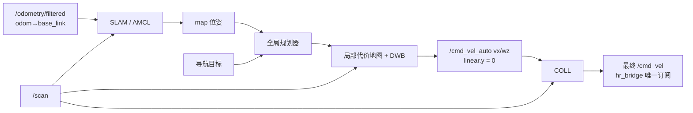

### 3.6 `hr_bridge` 通信桥模块

| 项目 | 内容 |
|---|---|
| 模块定位 | ROS 2 与 STM32 自定义协议之间的双向转换器 |
| 输入 | `/cmd_vel`、模式；STM32 上行状态帧 |
| 输出 | 下行协议帧；`/wheel/odom_raw`、`/imu/data`、`/robot_status`、`/diagnostics` |
| 对应软件 | `hr_bridge` |
| 通信方式 | USB-UART；鲁班猫侧 `/dev/robot_mcu` |

具体实现步骤：

1. 订阅最终底盘速度和模式，检查 ROS 时间戳与数值范围。
2. 按协议填充版本、消息 ID、长度、序号、MCU/Host 时间戳和 CRC16。
3. 独立接收线程或异步 I/O 运行帧状态机，解析 STM32 上行状态。
4. 将轮速正解观测、IMU、故障和设备状态映射为标准 ROS 2 话题；轮式与 IMU 数据分别保留各自时间戳、有效标志和协方差，不生成融合位姿或 TF。
5. 统计 CRC 错误、序号跳变、往返延迟、重连次数和链路超时。

异常处理：串口断开时停止下发非零命令并持续重连；bridge 不承担电机 PID、最终限幅或看门狗刷新。

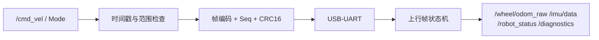

### 3.7 通信与接口层模块

| 项目 | 内容 |
|---|---|
| 模块定位 | 上下位机可靠、可诊断的数据传输边界 |
| 输入 | bridge 下行字节流；STM32 状态快照 |
| 输出 | 已验证的上位机命令候选；已封装 `Robot_Status_t` |
| 对应软件 | 上位机 `hr_bridge`；下位机 `protocol.c`、`command_task.c` |
| 物理接口 | USB-UART；鲁班猫侧持久化命名为 `/dev/robot_mcu` |

具体实现步骤：

1. STM32 使用 UART DMA + IDLE 中断接收，只在 ISR 中记录 DMA 长度并通知 `command_task`。
2. `command_task` 在固定字节预算内搜索帧头，检查版本、长度、消息 ID、CRC、序号、时间戳、数值有限性和范围。
3. 完整有效的上位机命令与最新 SBUS 帧在任务内部形成两个候选，仲裁后只覆盖发布一个 `CommandState_t` 最新快照；旧控制命令不排队执行。
4. `monitor_task` 生成状态快照并提交发送邮箱，UART DMA 异步发送。
5. 上下位机分别维护命令超时和心跳超时，两者不能互相替代。

异常处理：CRC 错、长度异常和未知消息直接丢弃并计数；序号冻结或命令过期触发自动控制失效。

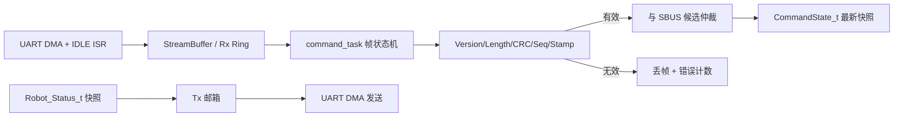

### 3.8 STM32F407 + FreeRTOS 内核调度模块

| 项目 | 内容 |
|---|---|
| 模块定位 | 下位机实时控制和任务调度核心 |
| 输入 | 上位机控制帧、遥控数据、IMU、CAN 电机反馈 |
| 输出 | 电机 CAN 电流命令、原始轮式观测、IMU/状态帧和错误状态 |
| 对应软件 | `main.c`、`freertos.c`、`Application/` |
| 核心硬件 | 大疆 C 板 STM32F407IGT6，Cortex-M4F 168 MHz |

具体实现步骤：

1. HAL 初始化系统时钟、GPIO、CAN、UART、SPI、I2C、DMA、定时器和 IWDG。
2. BSP 初始化电机总线、BMI088、IST8310、HT-10A SBUS 接收链路和上下位机链路。
3. 创建 IPC 对象和四个常驻任务：`monitor/chassis/imu/command`。
4. 周期任务使用 `vTaskDelayUntil()` 或硬件定时通知；ISR 只搬运数据和发通知。
5. 控制任务采用静态对象，运行期禁止不受控的 `malloc/free` 和阻塞打印。

异常处理：初始化失败保持零电流并进入故障态；HardFault 记录最小故障现场后等待 IWDG 复位。

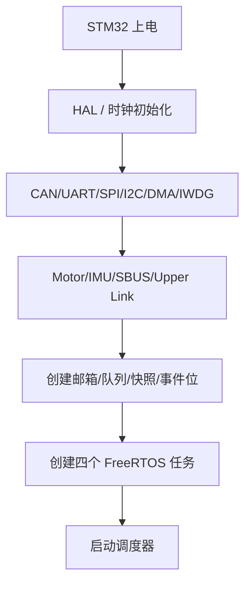

### 3.9 底盘运动控制模块

| 项目 | 内容 |
|---|---|
| 模块定位 | 将差速底盘目标转换为左右两侧四个 M3508 的实时电流命令 |
| 输入 | `CommandState_t`、4 路电机反馈、`Safety_State_t` |
| 输出 | 4 路 C620 电流命令、`Chassis_State_t`、原始轮式 `vx/wz` 观测 |
| 对应软件 | `chassis_task.c`、`diff_drive.c`、`pid.c`、`dev_motor.c` |
| 执行机构 | 4×M3508 + C620，CAN 总线 |

具体实现步骤：

1. `command_task` 输出唯一的 `CommandState_t`，包含 `vx/wz/source/enable/seq/stamp`，并强制 `vy=0`。
2. `chassis_task` 检查安全许可、目标新鲜度和四个电机在线状态。
3. 对目标执行速度限幅和加减速斜坡，再按轮距 `L` 计算左右轮线速度：`v_left=vx-wz·L/2`、`v_right=vx+wz·L/2`。
4. 左前/左后轮共享左侧目标，右前/右后轮共享右侧目标；四路速度 PID 分别根据 CAN 反馈计算电流。
5. 用同侧前后轮平均速度抑制单轮噪声，按差速正运动学计算原始轮式 `vx/wz`，连同独立采样时间戳、有效标志和协方差建议值写入 `Chassis_State_t`。STM32 不在此处融合 IMU，也不生成上位机最终 `x/y/yaw` 位姿。
6. 每个周期更新任务心跳和执行时间统计。

异常处理：任一关键底盘电机离线、CAN Bus-Off、命令超时或安全许可撤销时，四路目标全部清零并输出零电流，不允许三轮降级行驶；故障恢复由安全状态机决定。

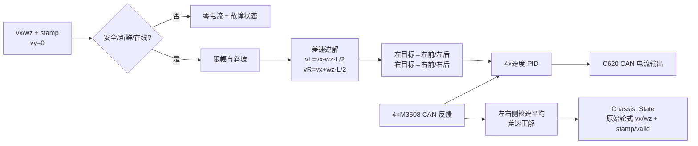

### 3.10 传感器与控制输入处理模块

| 项目 | 内容 |
|---|---|
| 模块定位 | 把原始 IMU、遥控、CAN 和上位机数据转换为三个最新状态快照 |
| 输入 | BMI088、IST8310、HT-10A SBUS、CAN 电机反馈、上位机字节流 |
| 输出 | `ImuSample_t`、`CommandState_t`、`MotorFeedback_t` |
| 对应软件 | `imu_task.c`、`command_task.c`、`mahony_ahrs.c`、设备驱动 |
| 数据机制 | DMA/ISR 通知、最新值双缓冲、序列号一致性检查 |

具体实现步骤：

1. `imu_task` 由 BMI088 DRDY/SPI DMA 完成通知唤醒，以 1 ms 兜底周期读取加速度和陀螺仪，完成轴向映射、单位换算、零偏/比例补偿和 Mahony 解算。
2. IST8310 首版按 100 Hz 读取，经硬铁/软铁补偿和机体系转换后参与九轴 Mahony；初始化失败、数据过期、模长异常或突变时停止磁校正，退化为六轴 Mahony 并设置 `mag_degraded=true`。
3. `command_task` 在同一任务内分别处理上位机 RingBuffer 和 SBUS 最新帧槽，校验后按“安全否决/急停 > 人工接管 > 上位机 > 零命令”仲裁，只发布一个 `CommandState_t`。
4. CAN ISR 按电机 ID 更新 `MotorFeedback_t` 双缓冲和时间戳，不在 ISR 中做 PID、运动学或安全状态跳转。
5. 消费者读取快照时复制完整结构体到本地变量，并核对序列号；不跨任务长期持有可能被生产者覆盖的裸指针。

异常处理：每类输入独立维护 `valid/seq/stamp/error_count`；消费者必须再次检查数据新鲜度。

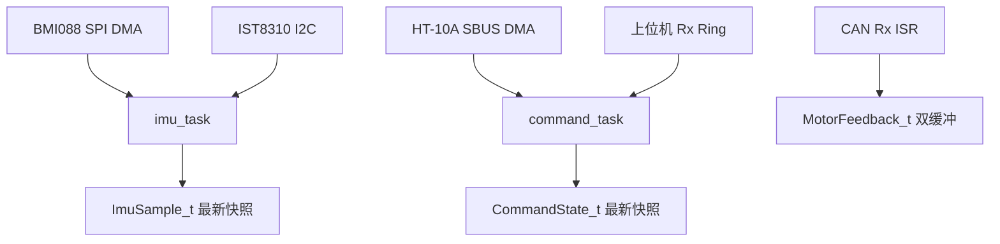

#### 3.10.1 `imu_task` 与 Mahony 下位机流程

`ImuSample_t` 是同一发布时刻的一组具体数据，不是数据队列或历史记录：

```c
typedef struct {
    uint32_t seq;
    uint32_t stamp_us;
    float accel_mps2[3];
    float gyro_rps[3];
    float quat_wxyz[4];
    float mag_uT[3];
    bool imu_valid;
    bool mag_valid;
    bool mag_degraded;
} ImuSample_t;
```

`accel/gyro/mag` 均为完成标定和轴向转换后的机体系数据。`quat_wxyz` 是 Mahony 输出；不定义独立 `mag_yaw`，避免与四元数中的航向信息重复。STM32 内部运行 Mahony，上位机仍使用轮式 `vx/wz`、`gyro_z` 和可选航向观测运行 EKF，STM32 不输出最终定位位姿。

初始化按以下顺序执行：检查 BMI088 芯片 ID、自检和 DRDY；初始化 IST8310，失败时直接进入磁力计降级；加载带 CRC 的标定参数；静止条件满足时采集 2 s 陀螺仪数据估计零偏，不满足时使用已保存零偏且不无限等待；最后用重力初始化 roll/pitch，磁场有效时同时初始化 yaw，否则 yaw 置 0 并进入六轴模式。

```mermaid
flowchart TD
  WAKE["BMI088 DRDY / 1 ms 兜底"] --> READ["SPI DMA 读取 accel + gyro"]
  READ --> CHECK{"读取成功且 dt 有效?"}
  CHECK -->|否| FAIL["错误计数；连续失败则 imu_valid=false"]
  CHECK -->|是| CAL["轴向映射、单位换算、零偏/比例补偿"]
  CAL --> MAGDUE{"到 10 ms 磁力计周期?"}
  MAGDUE -->|是| MAGREAD["IST8310 读取、硬铁/软铁补偿、转机体系"]
  MAGDUE -->|否| OBS
  MAGREAD --> MAGCHECK{"新鲜度、模长、跳变正常?"}
  MAGCHECK -->|否| DEG["mag_valid=false<br/>六轴降级"]
  MAGCHECK -->|是| MAGOK["mag_valid=true"]
  DEG --> OBS{"本周期有效观测?"}
  MAGOK --> OBS
  OBS -->|"accel + mag"| M9["Mahony 九轴误差"]
  OBS -->|"仅 accel"| M6["Mahony 六轴误差"]
  OBS -->|"均不可用"| GYRO["仅陀螺积分"]
  M9 --> ERR["实测方向 × 四元数估计方向"]
  M6 --> ERR
  ERR --> PI["Kp 比例 + Ki 有界积分修正"]
  PI --> OMEGA["修正 gyro_x/y/z"]
  OMEGA --> QDOT["q_dot = 0.5 × q ⊗ omega"]
  GYRO --> QDOT
  QDOT --> Q["按实测 dt 积分并归一化四元数"]
  Q --> SNAP["发布 ImuSample_t + 心跳/WCET"]
  FAIL --> RETRY{"达到限次重试条件?"}
  RETRY -->|是| REINIT["后台重新初始化 BMI088"]
  RETRY -->|否| SNAP
  REINIT --> WAKE
```

Mahony 每周期具体执行：有效加速度和磁场向量归一化；根据当前四元数估计重力和地磁方向；用实测方向与估计方向的叉积形成误差；执行 `Kp` 比例和 `Ki` 有界积分修正；用修正后的三轴角速度计算 `q_dot`；按实际采样间隔积分并归一化四元数。动态加速度过大时本周期暂停重力修正，磁场异常时暂停磁修正，二者均不得直接重置 yaw 或四元数。四元数出现非有限值或归一化失败时丢弃本次结果，连续发生才触发重初始化。

首版 BMI088 采样/解算周期为 1 kHz，IST8310 为 100 Hz。Mahony `Kp/Ki`、BMI088 带宽、磁场模长/跳变门限、磁恢复连续有效样本数和标定矩阵必须通过台架与实车数据冻结，不直接照搬 OpenCTR 参数。

#### 3.10.2 HT-10A 推荐通道映射（待实测冻结）

亚博智能资料给出的 HT-10A 默认物理映射为 CH1/CH2 对应右摇杆、CH3/CH4 对应左摇杆、CH5～CH8 对应四个拨杆、CH9/CH10 对应两个旋钮。本项目在不改变发射机默认通道顺序的前提下，推荐映射如下；所有通道的最小值、中值、最大值、方向和死区必须以实物标定结果冻结。

| 通道 | 物理输入 | 推荐项目功能 | 安全约束 |
|---|---|---|---|
| CH1 | 右摇杆左右 | 底盘角速度 `wz` | 回中死区内强制为 0，方向经原地转向试验冻结 |
| CH2 | 右摇杆上下 | 底盘前向速度 `vx` | 回中死区内强制为 0，前后方向经离地轮测冻结 |
| CH3 | 左摇杆上下 | 预留 | 未使用时忽略，不参与运动控制 |
| CH4 | 左摇杆左右 | 预留 | 未使用时忽略，不参与运动控制 |
| CH5 | SWA | 自动/人工接管选择 | 进入人工位置立即使自动目标失效；退出人工不得自动恢复旧任务 |
| CH6 | SWB | 软件急停请求 | 急停位置锁存零输出；不能替代独立硬件急停和安全门 |
| CH7 | SWC | 预留模式选择 | 当前不改变控制权；后续启用必须重新评审 |
| CH8 | SWD | 故障清除请求或预留 | 只能发送请求，`monitor_task` 在故障条件消失且满足恢复条件后决定是否清除 |
| CH9 | VRA | 人工底盘速度比例 | 限制在已冻结的最小/最大比例内，不得提高系统硬限速 |
| CH10 | VRB | 预留 | 未使用时忽略 |

`command_task` 必须同时检查完整有效 SBUS 帧、接收时间戳、失控/帧丢失标志、拨杆合法组合和摇杆回中条件。任何接收超时、接收机断电、发射机关闭、非法帧或通道越界都使遥控候选无效；若当时处于人工接管，立即发布零 `CommandState_t` 并保持人工安全态，禁止保持最后一帧命令或自动回退上位机控制。

### 3.11 状态反馈与安全监控模块

| 项目 | 内容 |
|---|---|
| 模块定位 | 汇总系统健康状态、执行安全动作并向 RK3588 反馈 |
| 输入 | `command/chassis/imu` 三个被监控任务心跳、电机/IMU/通信状态、原始轮式观测、遥控状态、错误计数 |
| 输出 | `Safety_State_t`、`Robot_Status_t`、故障码、IWDG 刷新或停止刷新 |
| 对应软件 | `monitor_task.c`、`protocol_tx.c`、`iwdg.c` |
| 作用 | 安全保护、状态上传、故障诊断和最后复位保护 |

具体实现步骤：

1. `monitor_task` 每 10 ms 检查任务心跳、周期超限、栈余量和关键中断活动。
2. 检查上位机、遥控器、BMI088 和 M3508 是否在线。
3. 运行安全状态机，决定底盘 `control_enable` 和故障锁存。
4. 每 20 ms 从一致性快照组装快速状态帧；每 100 ms 组装诊断状态帧。
5. 状态帧写入 Tx 邮箱后由 UART DMA 异步发送，`monitor_task` 不等待串口完成。
6. 仅当关键软件存活门满足时刷新 IWDG，并记录上次复位原因。

异常处理：可诊断外设故障撤销控制许可但继续运行和上报；关键任务/调度执行流失活且无法维持安全输出时停止喂狗，等待硬件复位。

```mermaid
flowchart TD
  MON["monitor_task 10 ms"] --> SNAP["读取心跳/设备/通信/状态快照"]
  SNAP --> CTRL{"控制许可门通过?"}
  CTRL -->|否| STOP["撤销许可 + 零目标 + 锁存故障"]
  CTRL -->|是| ENABLE["维持 control_enable"]
  STOP --> WDG{"软件存活门通过?"}
  ENABLE --> WDG
  WDG -->|是| FEED["刷新 IWDG"]
  WDG -->|否| RESET["保持安全输出并停止喂狗"]
  FEED --> STATUS["组 Robot_Status_t → Tx 邮箱"]
  STOP --> STATUS
```

---

## 四、下位机 FreeRTOS 四任务划分

### 4.1 精简后的任务清单

参考 OpenCTR 的“最新命令 → 固定周期底盘控制 → 最新状态上报”主链，下位机收敛为 **四个常驻任务**。原 `remote_task` 与 `nav_task` 合并为 `command_task`，在一个执行上下文中完成两个输入源的校验和仲裁；电机闭环、Mahony 和安全监控仍保持独立，避免通信突发或姿态计算破坏 1 kHz 底盘周期。

| 任务 | 建议周期/触发 | FreeRTOS 优先级 | 逻辑优先级 | 合并后的职责 | 主要输出 |
|---|---:|---:|---|---|---|
| `monitor_task` | 10 ms，含 20 ms/100 ms 子周期 | 5 | 最高且短小 | 安全状态机、心跳/设备检查、状态打包、诊断子周期、IWDG 门控 | `Safety_State_t`、Tx 邮箱、故障码 |
| `chassis_task` | 1 ms 绝对周期 | 4 | 很高 | 物理速度/加减速度限制、差速逆解、4×速度 PID、CAN 限流输出和轮速正解 | 电机 Tx 槽、原始轮式 `Chassis_State_t`、心跳 |
| `imu_task` | BMI088 DRDY/SPI DMA 通知，兜底 1 ms | 3 | 高 | BMI088 采样标定、Mahony 六/九轴解算；100 Hz IST8310 与磁异常降级 | `ImuSample_t` 快照、心跳 |
| `command_task` | Rx 通知 + 5 ms 固定发布 | 2 | 高 | 上位机协议、SBUS 解码、命令新鲜度、控制源切换与最终命令选择 | `CommandState_t` 快照、心跳 |

`configMAX_PRIORITIES` 不小于 6：`0` 保留给 idle，`1` 保留给后续非关键后台任务，四个常驻业务任务使用 `2~5`。`app_init` 只负责 BSP/设备基础初始化、静态 IPC 和四任务创建，完成后删除启动任务；IMU 标定在 `imu_task` 初始化状态中限时完成。CAN Rx、UART/SBUS IDLE、SPI DMA 完成处理属于 ISR，不计入任务数量。

### 4.2 合并规则与边界

| 原独立功能 | 合并位置 | 不产生强耦合的条件 |
|---|---|---|
| 上位机接收 + SBUS 解码 + 命令仲裁 | `command_task` | 两个 DMA 接收区保持独立；parser、SBUS decoder 与 arbiter 仍为独立函数；每次解析有固定字节预算 |
| 原始轮式观测 | `chassis_task` | 在 PID 输出后执行固定时长正解；只输出 `vx/wz + stamp/valid`，不融合 IMU、不调用 ROS 或通信代码 |
| 状态上报 + 诊断 | `monitor_task` | 只组装快照并投递 Tx 邮箱，严禁等待 UART/CAN 发送完成 |
| LED/蜂鸣器 | `monitor_task` 的 100 ms 子周期 | 非阻塞状态机，不使用 `delay` |

不建议继续合并：

- `imu_task` 不并入 `chassis_task`，避免 IMU 驱动或姿态解算异常破坏电机控制周期。
- `command_task` 不并入 `chassis_task`，避免协议突发、CRC 校验或 SBUS 状态切换影响 1 kHz 电机闭环。
- `monitor_task` 必须独立且短小，否则无法可靠判断其他任务是否失活。

### 4.3 四任务关系图

```mermaid
flowchart LR
  UPPER["上位机 Rx Ring"] --> CMD["command_task<br/>5 ms + Rx事件"]
  REM["HT-10A SBUS 最新帧槽"] --> CMD
  CMD -->|"CommandState_t"| CH["chassis_task<br/>1 ms"]
  CH -->|"状态/心跳"| MON["monitor_task<br/>10 ms"]
  IMU["imu_task<br/>1 ms"] -->|"ImuSample_t/心跳"| MON
  CMD -->|"链路/控制源状态/心跳"| MON
  MON -->|"Safety_State"| CH
  MON -->|"Robot_Status Tx 邮箱<br/>发送快照槽"| TXDMA["USB-UART Tx DMA"]
```

### 4.4 调度建议

优先级编排遵循“短安全检查优先、底盘闭环优先于姿态解算、姿态解算优先于通信解析”的原则。`monitor_task` 逻辑优先级最高但必须短小；`chassis_task` 与 `imu_task` 保持 1 kHz 级节拍；`command_task` 可以由任一 Rx 事件提前唤醒解析，但最终命令仍按 5 ms 固定节拍发布。

1. `monitor_task` 优先级最高，每 10 ms 只完成快照读取、安全状态机、心跳/deadline 检查和 IWDG 门控；`STATE_FAST`、`STATE_SLOW`、`FAULT_EVENT` 只投递 Tx 邮箱或事件队列，不等待 UART DMA 完成。
2. `chassis_task` 固定执行底盘控制主循环。它不读取或融合 IMU，首版按 1 ms 设计；若实测 WCET 或 CAN 总线占用超限，必须重新评审，不能通过降低安全优先级解决。
3. `imu_task` 使用 BMI088 DRDY/SPI DMA 通知并保留 1 ms 兜底；IST8310 每 10 个 IMU 周期读取一次。Mahony 的执行时间、数值异常和重初始化次数纳入监控。
4. `command_task` 的上位机 RingBuffer 与 SBUS 最新帧槽互相独立；单次唤醒只处理固定字节预算，遥控链路不因上位机错误帧或串口突发失效。遥控仍受 `monitor_task` 安全否决。
5. 所有周期任务使用 `vTaskDelayUntil()` 或硬件定时/外设完成通知；控制相关任务单次 WCET 初始目标小于周期的 30%，并将平均/最大执行时间、抖动和 deadline miss 纳入验收。
6. 运行期采用静态队列和静态任务栈；互斥锁不得覆盖日志、协议发送、外设发送等待或其他不可控耗时路径。

---

## 五、任务间低耦合设计

### 5.1 数据交换机制

`Tx 邮箱` 是下位机内部的发送快照槽，用于把 `monitor_task` 已组装好的状态帧交给 USB-UART 发送侧。它不是 ROS Topic，也不是上下位机协议字段；实现上可采用长度为 1 的覆盖邮箱/队列或双缓冲快照。周期状态帧允许被新快照覆盖，故障事件必须走不可覆盖的事件队列或确认重发机制。

| 数据 | 生产者 → 消费者 | 机制 | 原因 |
|---|---|---|---|
| 上位机字节流 | UART ISR → `command_task` | StreamBuffer/RingBuffer + TaskNotify | 支持 DMA 分块和跨帧拼接 |
| SBUS 字节流 | UART ISR → `command_task` | 独立 DMA/RingBuffer + TaskNotify | 与上位机协议互不阻塞 |
| 控制命令 | `command_task` → `chassis_task`/`monitor_task` | `CommandState_t` 双缓冲只读快照 | 上位机和遥控器只在一个任务内仲裁 |
| IMU 状态 | `imu_task` → `monitor_task`/上行状态组包 | `ImuSample_t` 序列锁或双缓冲快照 | 高频一致性读取，包含 accel/gyro/quat/mag |
| 电机状态 | CAN ISR → `chassis_task`/`monitor_task` | `MotorFeedback_t` 序列锁或双缓冲快照 | ISR 只更新时间戳和反馈，不执行控制策略 |
| 故障事件 | 任意模块 → `monitor_task` | Queue | 事件不可被覆盖，保留首故障 |
| 安全许可 | `monitor_task` → `chassis_task`/`command_task` | 原子位图/快照 | 快速读取，不允许反向写入 |
| 状态发送 | `monitor_task` → Tx DMA | 长度 1 快照邮箱 + 事件队列 | 周期状态可覆盖，故障事件不可覆盖 |

### 5.2 强制规则

1. `CommandState_t` 只能由 `command_task` 写；`chassis_task` 只读取并执行其中的 `vx/wz/enable/source/seq/stamp`。
2. `Safety_State_t` 只能由 `monitor_task` 写；控制任务只能读取并执行。
3. ISR 不执行 PID、运动学、Mahony、完整 CRC 校验或日志格式化。
4. 模块不得直接读写另一个模块的内部变量，只能访问公开快照或邮箱。
5. 每个跨任务数据包含 `valid/source/seq/stamp_ms`，消费者自行判断新鲜度。
6. 队列满、CRC 错、序号跳变、快照过期和 deadline miss 都必须计数。

```mermaid
flowchart LR
  PRODUCER["唯一生产者"] -->|"Mailbox / Snapshot / EventQueue"| CONTRACT["带 valid/seq/stamp 的数据契约"]
  CONTRACT --> FRESH{"消费者检查新鲜度"}
  FRESH -->|有效| USE["使用数据"]
  FRESH -->|过期/无效| SAFE["使用安全默认值 + 上报"]
```

---

## 六、状态反馈、安全监控与看门狗

### 6.1 状态反馈是否包含看门狗

**状态反馈包含看门狗健康信息；`monitor_task` 同时拥有 IWDG 门控职责，但状态发送动作本身不能决定是否喂狗。**

- 上报字段包括 `watchdog_gate_ok`、任务健康位图、deadline miss、最近故障和 MCU `reset_cause`。
- `monitor_task` 先独立完成安全判断，再组装状态快照；UART DMA 成功与否不影响本周期安全判断。
- IWDG 处理软件执行流卡死；上位机命令超时处理“强制零命令并等待新 Seq”，两者必须并存。

### 6.2 两道安全门

| 安全门 | 检查对象 | 失败动作 | IWDG 行为 |
|---|---|---|---|
| 控制许可门 | 命令新鲜度、控制模式、控制源优先级、电机/IMU 在线、数值和机械限位 | 撤销许可、目标归零、锁存故障并上报 | 软件仍健康时继续喂狗，避免外设故障反复复位 |
| 软件存活门 | `command/chassis/imu` 三个被监控任务心跳、`monitor_task` 周期自检、关键 ISR 活动、栈余量、调度周期、内存完整性 | 保持安全输出并停止喂狗 | IWDG 超时复位 |

控制许可门先执行安全否决，再执行控制源仲裁；HT-10A 遥控器是最高优先级运动控制源，但不能覆盖 `safe_stop`、硬件急停、机械限位、电流限幅或锁存安全故障。

### 6.3 `monitor_task` 子周期

| 子周期 | 内容 |
|---:|---|
| 10 ms | 任务心跳、设备在线、控制许可、安全状态机、IWDG 门控 |
| 20 ms | 组装 `STATE_FAST`：原始轮式 `vx/wz`、轮式时间戳/有效标志、IMU `accel[3]/gyro[3]/quat[4]/mag[3]`、IMU 时间戳/有效与磁力计有效/降级状态、模式、安全状态 |
| 100 ms | 组装 `STATE_SLOW`：电机在线、栈余量、错误计数、复位原因、LED/蜂鸣器 |
| 事件触发 | 组装 `FAULT_EVENT`，保存首故障来源和时间戳 |

### 6.4 建议 `Robot_Status_t`

```text
Robot_Status_t
  protocol_version, seq, mcu_time_ms
  mode, control_source, safety_state
  wheel_vx, wheel_wz, wheel_stamp_ms, wheel_valid
  imu_accel[3], imu_gyro[3], imu_quat[4], imu_mag[3], imu_stamp_ms, imu_valid
  mag_valid, mag_degraded
  chassis_motor_online_bits
  upper_link_ok, remote_link_ok, imu_ok
  task_health_bits, deadline_miss_bits, isr_health_bits
  watchdog_gate_ok, reset_cause
  active_fault, latched_fault_bits
  crc_error_count, rx_drop_count, can_error_count
  battery_voltage  # 仅在具备可靠采样通道时启用
```

---

## 七、主架构完整数据流时序

### 7.1 导航与底盘闭环时序

```mermaid
sequenceDiagram
  autonumber
  participant Env as 家庭环境
  participant Lidar as RPLIDAR
  participant Nav as RK3588 SLAM/Nav2
  participant Collision as collision_monitor
  participant Bridge as hr_bridge
  participant EKF as robot_localization EKF
  participant Command as STM32 command_task
  participant Monitor as monitor_task
  participant Chassis as chassis_task
  participant Motor as M3508/C620

  Env->>Lidar: 障碍物距离
  Lidar->>Nav: /scan
  Motor-->>Chassis: CAN 转速/角度/电流反馈
  Chassis-->>Bridge: 原始轮式 vx/wz + stamp/valid
  Bridge-->>EKF: /wheel/odom_raw
  Bridge-->>EKF: /imu/data（gyro_z/姿态/有效状态）
  EKF-->>Nav: /odometry/filtered + odom→base_link
  Nav->>Nav: 定位、全局规划、DWB 局部避障
  Nav->>Collision: /cmd_vel_auto(vx,wz)，linear.y=0
  Lidar->>Collision: /scan
  Collision->>Collision: 单激光停止区检查
  Collision->>Bridge: 最终 /cmd_vel(vx,wz)，触发时请求零速
  Bridge->>Command: CMD_MOTION + Seq + Stamp + CRC
  Command->>Command: 校验、控制源仲裁、限幅/斜坡
  Command->>Monitor: 命令新鲜度与模式状态
  Monitor-->>Chassis: control_enable / fault
  Command->>Chassis: CommandState_t
  Chassis->>Chassis: 差速逆解 + 4×速度 PID
  Chassis->>Motor: CAN 电流命令
  Motor-->>Chassis: 新一周期反馈
  Chassis->>Chassis: 正运动学，更新原始轮式观测
```

### 7.2 UVC 图像、目标识别与局部跟随时序

```mermaid
sequenceDiagram
  autonumber
  participant Scene as 家庭场景
  participant Sensor as SC4336P
  participant Hi as Hi3516CV610 UVC Gadget
  participant Cam as 鲁班猫 usb_cam
  participant Per as RK3588 RKNN YOLO
  participant Lidar as RPLIDAR A1
  participant Track as hr_target_tracker
  participant Nav as Nav2
  participant Collision as collision_monitor
  participant Task as hr_task_manager
  participant Web as hr_web_ui

  Scene->>Sensor: 彩色光学图像
  Sensor->>Hi: MIPI Raw Bayer
  Hi->>Hi: ISP/VPSS + UVC 帧输出
  Hi->>Cam: USB UVC（YUYV 或 MJPEG）
  Cam->>Per: /camera/image_raw + stamp
  Per->>Per: 二维检测、类别过滤、连续帧门控
  Per->>Track: /detections
  Lidar->>Track: /scan
  Track->>Track: 检测框方位 + 雷达距离/聚类关联
  alt 关联成功且任务模式允许跟随
    Track->>Task: /follow_target + 推荐跟随位姿
    Task->>Nav: 更新 Nav2 跟随目标
    Nav->>Collision: /cmd_vel_auto
    Collision->>Collision: 最新 /scan 停止区检查
    Collision->>Task: 跟随可用/受阻状态
    Task->>Web: 目标锁定、距离、方位和跟随状态
  else 仅识别或关联失败
    Track->>Task: 目标事件/关联失败原因
    Task->>Web: 识别事件与状态
  end
  alt USB 断开、帧冻结或图像过期
    Cam-->>Per: 图像源无效
    Per->>Task: 视觉离线/无有效检测
    Task->>Nav: Cancel Goal 或更新为零速保持
    Task->>Web: 视觉任务降级或失败
    Note over Task: 基础导航仍由 RPLIDAR A1 提供环境观测
  end
```

### 7.3 状态反馈与安全时序

```mermaid
sequenceDiagram
  autonumber
  participant Tasks as imu/chassis/command
  participant Monitor as monitor_task
  participant WDG as STM32 IWDG
  participant DMA as USB-UART Tx DMA
  participant Bridge as hr_bridge
  participant Host as RK3588 业务/诊断

  loop 每个任务周期
    Tasks-->>Monitor: 心跳、状态快照、deadline 统计
  end
  loop 每 10 ms
    Monitor->>Monitor: 检查控制许可门
    Monitor->>Monitor: 检查软件存活门
    alt 软件存活门通过
      Monitor->>WDG: Refresh
    else 软件失活
      Monitor-->>Tasks: 撤销 control_enable / 安全输出
      Note over Monitor,WDG: 停止喂狗，等待硬件复位
    end
  end
  loop 每 20/100 ms
    Monitor->>DMA: STATE_FAST / STATE_SLOW 快照
    DMA->>Bridge: 异步上行帧
    Bridge->>Host: /wheel/odom_raw /imu/data /robot_status /diagnostics
  end
  alt 故障事件
    Monitor->>DMA: FAULT_EVENT（首故障快照）
    DMA->>Bridge: 事件帧
    Bridge->>Host: FaultEvent
  end
```

---

## 八、上下位机接口契约

参考 PDF 使用自定义协议，但未给出可直接冻结的数据字典。本项目不沿用此前不适用的 OpenCTR `0x50/0x10` 帧号，建议在编码前冻结以下协议。

### 8.1 建议帧格式

```text
SOF(2) | Version(1) | MsgId(1) | Length(2) | Seq(2) |
TimestampMs(4) | Payload(N) | CRC16(2)
```

| MsgId | 方向 | 载荷 | 建议频率 | 超时策略 |
|---|---|---|---:|---|
| `CMD_MOTION` | RK3588 → STM32 | `vx,wz,enable`；不定义横向速度 | 50~100 Hz | 100~200 ms 未更新，自动底盘目标归零 |
| `CMD_MODE` | RK3588 → STM32 | 模式、控制权、清故障请求 | 事件 + 周期重发 | 非法状态跳转拒绝并上报 |
| `HEARTBEAT` | 双向 | 端状态、协议版本 | 10 Hz | 只证明链路存活，不替代命令超时 |
| `STATE_FAST` | STM32 → RK3588 | 原始轮式 `vx/wz` 及独立时间戳/有效标志；IMU `accel[3]/gyro[3]/quat[4]/mag[3]` 及独立时间戳/有效/磁力计有效/降级状态；模式 | 50 Hz | 上位机分别判断轮式和 IMU 数据新鲜度，禁止用整帧到达掩盖单一传感源过期 |
| `STATE_SLOW` | STM32 → RK3588 | 电机、任务、看门狗、错误统计 | 10 Hz | 不阻塞快速状态帧 |
| `FAULT_EVENT` | STM32 → RK3588 | 首故障码、来源、时间、快照 | 事件触发 + 确认重发 | 必须可去重且不可静默丢失 |

所有多字节字段固定端序；浮点或定点格式二选一后冻结。接收端必须依次检查 `Version/Length/MsgId/CRC/Seq/Timestamp`，完整有效后才覆盖命令邮箱。

---

## 九、项目目录与代码分层

以下目录是本项目上、下位机的目标工程基线。目录名称体现已冻结的模块职责；业务层统一采用任务状态机，Nav2 导航层继续采用 `bt_navigator` 行为树。尚未冻结的编程语言、编译工具链和具体参数值，不通过目录结构提前作出决定。仓库根目录只保存项目公共文档、接口契约和跨端测试，上、下位机分别独立构建。

### 9.1 项目根目录

```text
home_robot/
├─ README.md                           # 环境、构建、部署和首次运行入口
├─ 家庭服务机器人技术方案.md          # 项目权威技术基线
├─ docs/                               # 接口评审、接线、调试和验收说明
│  ├─ protocol/                        # 协议数据字典、版本兼容和错误码
│  ├─ hardware/                        # 接线、CAN ID、轮序、坐标系和急停
│  └─ acceptance/                      # 分阶段验收步骤与判定标准
├─ tools/                              # 跨端协议生成、日志解析和数据检查工具
├─ tests/
│  ├─ protocol/                        # 上下位机帧向量、CRC、异常帧一致性测试
│  └─ integration/                     # 串口回环、断链、超时和端到端测试
├─ upper/                              # RK3588 / Ubuntu 22.04 / ROS 2 Humble
└─ lower/                              # 大疆 C 板 / STM32F407IGT6 / FreeRTOS
```

`docs/protocol/` 是上下位机共享接口的人类可读权威说明；上位机 `hr_bridge` 与下位机 `Protocol` 中不得各自维护一份含义不同的数据字典。若后续引入消息代码生成器，生成输入放在 `docs/protocol/` 或 `tools/` 的唯一源文件中，生成结果分别进入两端工程。

### 9.2 上位机项目目录

```text
upper/                                 # ROS 2 workspace 根目录
├─ src/
│  ├─ hr_bringup/                      # 全系统启动、模式选择和生命周期编排
│  │  ├─ launch/
│  │  │  ├─ robot_bringup.launch.py    # 实机总入口
│  │  │  ├─ mapping.launch.py          # 建图模式；不得同时启动 AMCL
│  │  │  └─ navigation.launch.py       # 静态地图 + AMCL + Nav2 模式
│  │  ├─ config/
│  │  │  ├─ system.yaml                # 设备名、模式和全局非算法参数
│  │  │  └─ diagnostics.yaml           # 诊断聚合与过期阈值
│  │  ├─ systemd/                      # 开机启动和进程拉起配置
│  │  ├─ package.xml
│  │  └─ CMakeLists.txt 或 setup.py
│  │
│  ├─ hr_description/                  # 机器人几何、固定 TF 和可视化模型
│  │  ├─ urdf/                         # base_link、laser、camera、imu 等坐标系
│  │  ├─ meshes/
│  │  ├─ rviz/
│  │  ├─ launch/
│  │  └─ package.xml
│  │
│  ├─ hr_interfaces/                   # 项目自定义 ROS 2 接口唯一来源
│  │  ├─ msg/
│  │  │  ├─ RobotStatus.msg
│  │  │  ├─ FaultEvent.msg
│  │  │  ├─ TaskStatus.msg
│  │  │  ├─ FollowTarget.msg           # 目标类别、距离、方位、局部坐标和跟踪状态
│  │  │  ├─ PerceptionControl.msg      # 目标类别、识别启停和搜索/观察阶段门控
│  │  │  ├─ TrackerPolicy.msg          # 搜索区域、关联窗口、跳变门限和丢失策略
│  │  │  ├─ FollowPolicy.msg           # 跟随使能、期望距离、安全距离、目标更新和超时
│  │  │  └─ MotionPhase.msg            # NAVIGATING/FOLLOWING/ZERO 阶段和切换原因
│  │  ├─ action/
│  │  │  └─ ExecuteTask.action         # task_id/source/type/map_id/area_id/location_or_route/target_class/mode
│  │  ├─ srv/                          # 仅存放接口评审后确需的短事务服务
│  │  ├─ CMakeLists.txt
│  │  └─ package.xml
│  │
│  ├─ hr_camera/                       # Hi3516 UVC 相机接入；不承担识别
│  │  ├─ launch/
│  │  ├─ config/                       # usb_cam、分辨率、帧率和设备路径
│  │  ├─ calibration/                  # CameraInfo 标定结果
│  │  ├─ udev/                         # 稳定设备名规则
│  │  └─ package.xml
│  │
│  ├─ hr_perception/                   # RKNN YOLO 二维识别与事件门控
│  │  ├─ include/hr_perception/        # 若采用 C++ 时的公开头文件
│  │  ├─ src/                          # 预处理、RKNN 推理、后处理和 ROS 节点
│  │  ├─ config/                       # 类别、阈值、识别开关和事件门控
│  │  ├─ models/                       # 经版本标记的 RKNN 模型及标签
│  │  ├─ launch/
│  │  ├─ test/
│  │  └─ package.xml
│  │
│  ├─ hr_target_tracker/               # 相机检测与 2D 雷达距离关联；输出目标观测和推荐跟随位姿
│  │  ├─ include/hr_target_tracker/
│  │  ├─ src/                          # bbox 方位换算、scan 角度窗口/聚类、短时跟踪、推荐跟随位姿
│  │  ├─ config/                       # 角度窗口、关联门限、丢失超时、可跟随类别和跟随距离
│  │  ├─ launch/
│  │  ├─ test/
│  │  └─ package.xml
│  │
│  ├─ hr_localization/                 # EKF、雷达、SLAM Toolbox、地图与 AMCL
│  │  ├─ launch/
│  │  ├─ config/
│  │  │  ├─ sllidar_a1.yaml
│  │  │  ├─ ekf.yaml                   # two_d_mode；轮式 vx/wz + IMU gyro_z/可选 yaw
│  │  │  ├─ slam_toolbox.yaml
│  │  │  └─ amcl.yaml
│  │  ├─ maps/                         # 已验收地图 yaml/pgm 及版本说明
│  │  └─ package.xml
│  │
│  ├─ hr_navigation/                   # Nav2 规划、控制和上位机速度安全链
│  │  ├─ launch/
│  │  ├─ config/
│  │  │  ├─ nav2_params.yaml           # planner/controller/BT/lifecycle 主参数
│  │  │  └─ collision_monitor.yaml
│  │  ├─ behavior_trees/               # Nav2 bt_navigator 使用的 XML
│  │  │  ├─ navigate_to_pose.xml
│  │  │  └─ navigate_through_poses.xml
│  │  ├─ test/                         # 路径、窄道、取消和恢复行为测试
│  │  └─ package.xml
│  │
│  ├─ hr_task_manager/                 # 唯一业务任务仲裁器
│  │  ├─ include/hr_task_manager/
│  │  ├─ src/
│  │  │  ├─ scheduler/                 # 定时计划读取、触发和错过策略
│  │  │  ├─ state_machine/             # 业务任务状态、事件、转移和进入/退出动作
│  │  │  │  ├─ task_state.*            # 状态与阶段定义
│  │  │  │  ├─ task_event.*            # 网页、计划、Nav2、感知和安全事件
│  │  │  │  └─ task_state_machine.*    # 转移规则、守卫条件和动作执行
│  │  │  ├─ navigation_client/         # Nav2 Action 发送、反馈、结果和取消
│  │  │  ├─ perception_gate/           # 识别类别、启停和事件结果协调
│  │  │  └─ task_manager_node.*        # task_id 去重、互斥和状态发布
│  │  ├─ config/
│  │  │  ├─ locations.yaml             # map 坐标系下的命名地点
│  │  │  ├─ search_areas.yaml          # 地图、区域、多边形边界和搜索点集合
│  │  │  ├─ routes.yaml                # 有序巡检点和到点动作
│  │  │  ├─ schedules.yaml             # 时区、计划和冲突策略
│  │  │  ├─ motion_phase.yaml          # NAVIGATING/FOLLOWING/ZERO 阶段切换和归零时限
│  │  │  └─ task_policy.yaml           # 超时、取消、接管、目标丢失和恢复策略
│  │  ├─ launch/
│  │  ├─ test/
│  │  └─ package.xml
│  │
│  ├─ hr_web_ui/                       # 局域网任务入口；禁止发布速度
│  │  ├─ backend/                      # HTTP/WebSocket、鉴权和 ROS 2 适配
│  │  ├─ frontend/                     # 地图/区域/目标/模式选择、开始/取消、状态和故障页面
│  │  ├─ config/
│  │  ├─ launch/
│  │  ├─ test/
│  │  └─ package.xml
│  │
│  └─ hr_bridge/                       # ROS 2 与 STM32 的唯一业务通信边界
│     ├─ include/hr_bridge/
│     ├─ src/
│     │  ├─ transport/                 # USB-UART 打开、异步收发和重连
│     │  ├─ protocol/                  # 帧解析/封装、CRC、Seq、Stamp、版本
│     │  ├─ ros_mapping/               # cmd_vel/wheel_odom_raw/imu/status 映射；不发布 TF
│     │  └─ bridge_node.*
│     ├─ config/                       # 串口、超时、限值和诊断参数
│     ├─ launch/
│     ├─ test/                         # 回环、半帧、粘包、乱序、超时和重连
│     └─ package.xml
│
├─ scripts/                            # 部署、环境检查、地图保存和日志采集
└─ README.md                           # colcon 构建、依赖安装和运行方式
```

上位机目录必须遵守以下边界：

1. `hr_task_manager` 只能通过 Nav2 Action、感知/跟踪接口、跟随策略和任务接口编排任务，不得发布 `/cmd_vel` 或任何绕过 Collision Monitor 的速度。
2. 业务任务状态机统一放在 `hr_task_manager/src/state_machine/`，负责任务互斥、搜索区域导航、目标识别/跟踪、跟随阶段切换、取消、超时、接管和结果归档。Nav2 专用行为树统一放在 `hr_navigation/behavior_trees/`，由 `config/nav2_params.yaml` 的 `bt_navigator` 参数选择；Nav2 行为树不得承担业务任务状态机职责。
3. `hr_localization/maps/` 中每张地图必须同时保存地图文件、分辨率/原点配置和版本说明；`search_areas.yaml` 只能引用已验收地图和 `map` 坐标系下的区域/搜索点，不能把可移动目标写成固定障碍物位置；建图模式与 AMCL 导航模式不得共同发布 `map→odom`。
4. `hr_perception/models/` 中模型、标签和预处理参数必须成套版本化；`hr_target_tracker` 的关联参数、推荐跟随位姿参数和 Nav2 跟随限速参数必须按地图/场景验收保存。视觉和跟随结果不得进入 `hr_bridge` 或下位机控制链，只能通过 `Nav2 /cmd_vel_auto → Collision Monitor → /cmd_vel` 的安全链间接影响自动运动。
5. `build/`、`install/`、`log/`、运行期 rosbag 和网页依赖缓存均为生成物，不纳入上述源码目录，也不得提交大容量临时数据。

### 9.3 下位机项目目录

```text
lower/
├─ Core/                               # MCU 启动、时钟、中断和 HAL 入口
│  ├─ Inc/
│  │  ├─ main.h
│  │  ├─ stm32f4xx_it.h
│  │  └─ freertos.h
│  └─ Src/
│     ├─ main.c                        # 硬件初始化后进入 app_init
│     ├─ stm32f4xx_it.c                # ISR 仅做采集、清标志和通知
│     ├─ stm32f4xx_hal_msp.c
│     ├─ system_stm32f4xx.c
│     └─ freertos.c                    # RTOS 内核接入，不放业务任务逻辑
│
├─ Drivers/                            # 芯片厂商代码，原则上不直接修改
│  ├─ CMSIS/
│  └─ STM32F4xx_HAL_Driver/
│
├─ Middlewares/
│  └─ Third_Party/
│     └─ FreeRTOS/                     # FreeRTOS 内核及 portable 层
│
├─ BSP/                                # 板级外设与 DMA/中断适配
│  ├─ Inc/
│  │  ├─ bsp_can.h
│  │  ├─ bsp_uart.h
│  │  ├─ bsp_spi.h
│  │  ├─ bsp_i2c.h
│  │  ├─ bsp_timer.h
│  │  ├─ bsp_dma.h
│  │  └─ bsp_iwdg.h
│  └─ Src/                             # 与上述头文件一一对应
│
├─ Devices/                            # 外部器件驱动，不包含业务策略
│  ├─ Inc/
│  │  ├─ dji_motor.h                   # M3508/C620 反馈与电流命令
│  │  ├─ bmi088.h
│  │  ├─ ist8310.h
│  │  └─ sbus_receiver.h               # HT-10A 接收与帧有效性
│  └─ Src/                             # 与上述头文件一一对应
│
├─ Components/                         # 与硬件解耦的算法和通用组件
│  ├─ Inc/
│  │  ├─ pid.h
│  │  ├─ differential_drive.h
│  │  ├─ mahony_ahrs.h
│  │  ├─ filter.h
│  │  ├─ ramp_limiter.h
│  │  ├─ crc16.h
│  │  └─ endian_codec.h
│  └─ Src/                             # 与上述头文件一一对应
│
├─ Protocol/                           # 上下位机协议的 MCU 实现
│  ├─ Inc/
│  │  ├─ protocol_types.h              # Version、MsgId、公共帧头
│  │  ├─ protocol_messages.h           # CMD/STATE/FAULT 载荷定义
│  │  ├─ protocol_parser.h             # 流式接收状态机
│  │  └─ protocol_serializer.h
│  └─ Src/
│     ├─ protocol_parser.c
│     ├─ protocol_serializer.c
│     └─ protocol_validate.c           # 长度、CRC、Seq、Stamp 和版本检查
│
├─ Application/                        # FreeRTOS 业务层和唯一共享状态所有者
│  ├─ Inc/
│  │  ├─ app_init.h
│  │  ├─ ipc_objects.h
│  │  ├─ app_types.h                   # Command/Chassis/Imu/Safety/RobotStatus
│  │  ├─ imu_task.h
│  │  ├─ chassis_task.h
│  │  ├─ command_task.h
│  │  └─ monitor_task.h
│  └─ Src/
│     ├─ app_init.c                    # 静态 IPC、校准和四任务创建
│     ├─ ipc_objects.c                 # 邮箱、快照、队列和事件位
│     ├─ imu_task.c                    # BMI088 DRDY/SPI DMA + 1 ms fallback，Mahony 与 ImuSample_t
│     ├─ chassis_task.c                # 1 ms，物理限幅、运动学、PID 和原始轮式观测
│     ├─ command_task.c                # Rx 通知 + 5 ms 发布，上位机/SBUS 解析、仲裁和 CommandState_t
│     ├─ monitor_task.c                # 10 ms，安全、诊断和 IWDG 门控
│     ├─ control_arbiter.c             # 安全 > 遥控 > 自动控制
│     ├─ safety_state_machine.c        # 安全许可、锁存和恢复
│     └─ status_snapshot.c             # 快慢状态帧的一致性快照
│
├─ Config/                             # 编译期板级和应用配置
│  ├─ board_config.h                   # CAN、UART、SPI、I2C 和引脚映射
│  ├─ chassis_config.h                 # 轮径、轮距、轮序、减速比和限值
│  ├─ task_config.h                    # 周期、优先级、栈、超时和心跳
│  └─ protocol_config.h                # 版本、最大帧长和链路超时
│
├─ Tests/
│  ├─ Unit/                            # PID、运动学、CRC、parser、状态机主机测试
│  ├─ HIL/                             # CAN/UART/传感器/电机硬件在环测试
│  └─ Vectors/                         # 与上位机共享的协议输入和期望输出
│
├─ Project/                            # Keil/CMake/CubeIDE 等工程入口；工具链待冻结
├─ HomeRobot.ioc                       # 若采用 CubeMX，作为引脚/时钟生成输入
└─ README.md                           # 烧录、调试、板级自检和验收入口
```

下位机目录必须遵守以下边界：

1. 依赖主方向为 `Application → Protocol / Components / Devices → BSP → HAL/CMSIS`；`Protocol` 只允许复用 CRC、端序等无硬件组件，`Components` 不得依赖 FreeRTOS 任务或具体外设。
2. `Core` 和 ISR 不实现控制策略；ISR 只完成收数、时间戳、清中断标志、写缓冲或通知任务，复杂解析和状态跳转放入任务上下文。
3. 四个 FreeRTOS 任务只能在 `Application/Src/` 各自文件中实现；不得再创建隐含的第五个业务任务。UART/CAN/SPI DMA 完成处理仍属于 ISR。
4. `Safety_State_t` 只能由 `monitor_task` 和其安全状态机写入，其他任务只读；底盘目标和状态继续通过邮箱、快照、队列或事件位交接，禁止跨任务直接修改内部变量。
5. CubeMX、Keil、CMake 或 CubeIDE 的最终组合尚未冻结；`Project/` 只承载构建入口，工具生成文件不得反向覆盖 `BSP/Devices/Components/Protocol/Application` 中的项目代码。

---

## 十、实施与验收

### 10.1 实施顺序

1. 冻结实物 BOM、底盘 CAN ID、坐标系、轮序、减速比、拨杆模式和急停策略。
2. 冻结上下位机协议、错误码、超时时间、恢复条件和版本兼容策略。
3. 完成 C 板 BSP、设备驱动和单电机闭环，再创建四任务与 IPC。
4. 在无上位机情况下验证遥控接管、通信超时、任务失活和 IWDG 复位。
5. 开发 `hr_bridge`，完成回环、丢帧、乱序、CRC 错误、断线和重连测试。
6. 配置 `robot_localization` 平面 EKF，验证 `/wheel/odom_raw + /imu/data → /odometry/filtered + odom→base_link`，并确认原始观测超时或降级可被独立识别。
7. 完成 Hi3516 UVC Gadget、鲁班猫 `usb_cam`、RKNN YOLO 二维识别，并接入目标搜索链路；视觉检测结果只作为 `hr_target_tracker` 和任务管理器输入，不直接进入下位机控制链。
8. 完成 `hr_target_tracker` 的检测框方位换算、RPLIDAR 角度窗口/聚类距离关联和 `/follow_target` 发布；按可跟随类别分别保存锁定、丢失、误关联和雷达关联失败证据。
9. 完成 `hr_target_tracker` 推荐跟随位姿与 `hr_task_manager` Nav2 动态目标更新，验证搜索导航、目标锁定、跟随目标更新、目标丢失取消和切换先归零；所有自动速度统一由 Nav2 进入 Collision Monitor。
10. 配置首版单激光停止区 Collision Monitor，按实测总延迟、STM32 制动距离和安全余量冻结停止区，再接入 `hr_task_manager`、`hr_web_ui` 和 HT-10A 最高优先级接管，联调完整业务任务。

### 10.2 下位机验收项

| 类别 | 验收项 |
|---|---|
| 实时性 | 四任务平均/最大执行时间、抖动、deadline miss；连续满负载不越限 |
| 任务隔离 | 状态发送堵塞不影响监控；协议错误和视觉节点故障不破坏下位机控制周期 |
| 通信安全 | 断开上位机、停止 `/cmd_vel`、CRC 连续错误、序号冻结后按规定停车 |
| 设备安全 | M3508、IMU 或遥控器离线时进入对应降级态并上报错误码 |
| IMU/Mahony | BMI088 1 kHz、IST8310 100 Hz 数据有效；Mahony 四元数归一化且无 NaN/Inf；磁力计异常时降级 6 轴并置位 `mag_degraded`；`STATE_FAST` 包含 `accel/gyro/quat/mag` 且不输出独立 `mag_yaw` |
| SBUS 遥控链路 | 实测 HT-10A 全部使用通道的范围、中值、方向、拨杆状态、帧率、失控标志和断帧超时；接收机断电或发射机关闭后不得保持最后运动命令 |
| 看门狗 | 分别挂起 `command/chassis/imu` 三个被监控任务，并单独阻塞 `monitor_task`、制造关键 ISR 停止和调度死锁，验证安全输出、IWDG 复位及 `reset_cause` |
| 控制性能 | 差速直行、转弯、原地旋转、速度阶跃和负载变化 |
| 状态闭环 | `/wheel/odom_raw` 与 `/imu/data` 各自时间戳、有效标志和 RobotStatus 一致；任一源过期可被 RK3588 独立识别，不能因另一源仍更新而掩盖 |
| UVC 视觉链 | Hi3516 上电自动枚举；YUYV/MJPEG 至少冻结一个稳定档位；USB 拔插 20 次可恢复；连续 24 小时无不可恢复断流；相机断流后旧检测不得继续触发事件 |
| 目标识别 | `/camera/image_raw` 帧率与时间戳可监控；RKNN YOLO 发布 `Detection2DArray`；保存目标类别、置信度、二维框、端到端延迟和误检/漏检原始证据 |
| 目标跟踪 | 对人、箱子、垃圾桶等可被 2D 雷达观测的目标，`hr_target_tracker` 能发布含距离、方位、局部坐标和状态的 `/follow_target`；对桌面杯子、墙上开关、高处门牌等雷达不可关联目标，必须输出关联失败或仅观察结果，不得进入跟随 |

### 10.3 任务触发与接管验收项

| 类别 | 验收项 |
|---|---|
| 节点拓扑 | 通过 ROS 2 graph/接口检查确认节点、Topic、Action 和 TF 与 §3.1.2 一致；建图与 AMCL 导航模式不得同时发布 `map→odom` |
| 状态估计与 TF | EKF 是 `/odometry/filtered` 和 `odom→base_link` 的唯一发布者；`hr_bridge` 不发布 TF；当前定位模式是 `map→odom` 的唯一发布者；项目中不存在最终 `/odom` 话题 |
| 速度单通道 | 搜索、巡检和目标跟随速度链只能是 `Nav2 /cmd_vel_auto → Collision Monitor → /cmd_vel → hr_bridge`；项目不启动 `hr_motion_mux`、`hr_follow_controller`、Velocity Smoother，且不存在 `/cmd_vel_smoothed`；STM32 是速度、加速度、减速度和电流限制的唯一物理执行权威 |
| 碰撞停止区 | 首版仅启用一个基于最新 `/scan` 的停止区；障碍进入时 Collision Monitor 请求零速，STM32 按安全斜坡执行；停止区尺寸覆盖机器人轮廓、总延迟行程、实测制动距离和安全余量 |
| 碰撞链失效 | 注入 `/scan` 过期以及 Collision Monitor 未启动、未激活和异常退出，自动任务均须在冻结时限内取消，Nav2 与 `hr_bridge` 不得继续下发最后一个非零命令，ROS graph 不得出现绕过 Collision Monitor 的最终 `/cmd_vel` 发布者；恢复后旧任务不得自行续跑 |
| 启动依赖 | 定位、Nav2、雷达、轮式观测、IMU、EKF 或 STM32 状态任一未就绪时，`hr_task_manager` 拒绝定时/网页运动任务并返回明确原因；恢复后需重新提交任务 |
| 定时巡检 | 在有效地图、定位和安全状态下，计划到时只创建一个带唯一 `task_id` 的巡检任务；重复触发不得生成重复导航目标；前置条件不满足时记录明确的拒绝原因 |
| 网页任务 | 手机和电脑在局域网内可选择已验收地图、区域、目标类别和任务模式，开始/取消巡检、搜索、跟随或仅观察任务并查看活动任务、控制源和故障；刷新或断开页面不得重复创建任务，也不得绕过 Nav2、Collision Monitor 和下位机仲裁直接控制电机 |
| 指定区域搜索 | 在有效地图、定位和安全状态下，Web 提交 `map_id/area_id/target_class/mode` 后，`hr_task_manager` 只在该地图和区域的搜索点内调度 Nav2；目标出现在区域外、地图不匹配、区域未验收或目标类别不支持时必须拒绝或降级为仅观察 |
| 局部目标跟随 | 搜索区域内目标连续锁定后，`hr_target_tracker` 输出推荐跟随位姿，`hr_task_manager` 限频更新 Nav2 动态目标并保持冻结的期望距离；目标丢失、雷达关联失败、距离低于最小安全距离、目标跳变超限或人工接管时取消 Nav2 跟随目标并上报原因 |
| 任务互斥 | 定时与网页任务同一时刻只允许一个活动运动任务；冲突请求返回“忙”，任务取消后 Nav2 目标失效且旧 `/cmd_vel` 不再执行 |
| 遥控接管 | 自动任务运行中切换 HT-10A 接管拨杆，自动目标立即失效，控制源状态切换为遥控，RK3588 收到状态后取消 Nav2 Action；接管响应上限作为待实测冻结参数 |
| 遥控失联 | 人工接管期间制造 SBUS 超时，底盘按冻结时限归零并进入安全状态，不得自动恢复被中断的定时或网页任务 |
| 安全优先级 | 同时施加遥控命令与 `safe_stop`/急停/限位条件，安全输出必须覆盖遥控器；解除安全条件后仍按锁存和人工确认策略恢复，不得自行运动 |
| 可追溯性 | 每次任务记录 `task_id`、来源、计划/网页参数、地图/区域/目标类别/模式、开始/结束时间、Nav2 结果、跟随目标锁定/丢失/关联失败证据、接管和取消原因；验收保存日志或 rosbag 原始证据 |
| 低电量处理 | 在具备可靠电量采样后，低电量拒绝新任务并告警，严重低电量取消自动任务并停车；不得生成自主回充目标，人工充电后按确认策略恢复 |

### 10.4 当前必须冻结的参数

- 上下位机 USB-UART 转换器型号、波特率、线缆长度、供电/隔离方式和 `/dev/robot_mcu` udev 规则；
- 差速轮半径、有效轮距、左右轮序、正方向和 M3508 减速比；
- 底盘 CAN 总线分配和 M3508/C620 电机 ID；
- 自动、遥控、安全、故障锁存和故障恢复状态机；
- HT-10A 的 SBUS 电气兼容、帧格式、通道映射、失控保护、接管拨杆组合、摇杆回中范围、接管响应上限、遥控失联超时和退出人工模式的确认条件；
- 网页任务接口、访问控制、`task_id` 去重期限，以及页面断开后活动任务的继续/取消策略；
- 巡检计划的时区、错过计划后的跳过/补执行策略、任务冲突策略和持久化格式；
- 命令超时、设备离线超时、任务心跳期限和 IWDG 周期；
- Hi3516 USB Device 端口、UVC 描述符、像素格式、分辨率、帧率、缓冲数、时间戳来源、掉线重枚举和独立供电/反向供电策略；
- 鲁班猫 5 的 Wi-Fi 模块具体型号、驱动、天线和局域网掉线恢复策略；
- 电池/BMS/充电器、电量采样来源、低电量与严重低电量阈值、停车和人工恢复条件；自主回充不在当前范围；
- 状态估计边界：STM32 只输出轮速正解 `vx/wz` 与 IMU/Mahony 原始观测及各自时间戳/有效状态；RK3588 EKF 融合并唯一输出 `/odometry/filtered` 与 `odom→base_link`，当前 SLAM/AMCL 模式唯一输出 `map→odom`；
- EKF 的过程噪声、各观测协方差、IST8310 磁场异常门限，以及是否使用磁修正后的姿态航向作为可选观测；
- Collision Monitor 停止区几何尺寸、扫描超时、系统总延迟、STM32 最大允许减速度、实测制动距离与安全余量。首版不配置减速区；
- `hr_target_tracker` 的可跟随目标类别、检测置信度、连续帧确认数、相机-雷达外参、雷达角度窗口、聚类门限、最大目标跳变、目标丢失超时和关联失败降级策略；
- Nav2 跟随模式的期望跟随距离、最小安全距离、最大线速度、最大角速度、加减速限制、原地搜索策略、目标更新周期、目标居中误差阈值和跟随区域边界；
- `/task/motion_phase` 的导航/跟随切换条件、切换归零时限、命令新鲜度和状态记录字段；
- STM32 的最大速度、加速度、减速度、速度斜坡和电流限制参数，它是这些物理约束的唯一执行权威。

---

## 结论

本项目采用 **野火鲁班猫 5（RK3588 8 GB + 64 GB）+ STM32F407** 分层架构。SC4336P 经 Hi3516CV610 配置为 USB UVC 固定 RGB 相机，RK3588 运行 ROS 2、RKNN YOLO、`robot_localization` EKF、SLAM/AMCL、Nav2 和目标跟踪；RPLIDAR A1 是建图、定位、DWB 避障、目标距离关联和 Collision Monitor 停止区的唯一环境观测源。网页或定时任务可指定已验收地图、区域、目标类别和任务模式，由 `hr_task_manager` 编排“搜索区导航→目标识别/雷达关联→Nav2 目标跟随或观察”。BMI088 与 IST8310 均确认安装。STM32 只上传轮速正解 `vx/wz` 和 IMU/Mahony 观测，RK3588 EKF 唯一输出 `/odometry/filtered` 与 `odom→base_link`，当前 SLAM/AMCL 模式唯一输出 `map→odom`。速度链固定为 `Nav2 /cmd_vel_auto → Collision Monitor → /cmd_vel → hr_bridge`，不设置独立 `hr_motion_mux`、`hr_follow_controller` 或 Velocity Smoother；Collision Monitor 首版仅配置一个激光停止区，STM32 是速度、加速度、减速度和电流限制的唯一物理执行权威。下位机采用 **四任务架构**：`monitor_task`、`chassis_task`、`imu_task`、`command_task`，其中 `command_task` 合并上位机协议、SBUS 解码和控制源仲裁，不包含云台和视觉控制。上下位机通过 USB-UART 自定义协议通信，不采用 micro-ROS。状态反馈包含看门狗健康信息；IWDG 由 `monitor_task` 的软件存活门统一控制，但普通外设故障只撤销控制许可，不应导致 MCU 反复复位。


